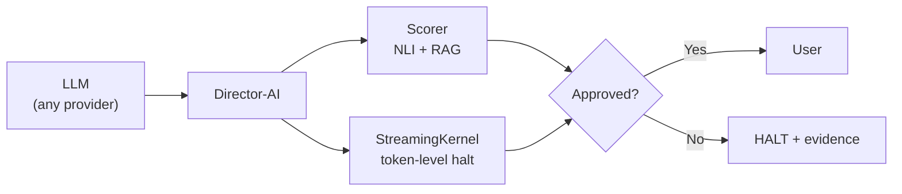

<p align="center">
  
</p>

<h1 align="center">Director-AI</h1>

<p align="center">
  <strong>Real-time LLM hallucination guardrail — NLI + RAG fact-checking with token-level streaming halt</strong>
</p>

<p align="center">
  <a href="https://github.com/anulum/director-ai/actions/workflows/ci.yml"></a>
  
  <a href="https://pypi.org/project/director-ai/"></a>
  <a href="https://codecov.io/gh/anulum/director-ai"></a>
  <a href="https://www.python.org/downloads/"></a>
  <a href="https://hub.docker.com/r/anulum/director-ai"></a>
  <a href="https://www.gnu.org/licenses/agpl-3.0"></a>
  <a href="https://huggingface.co/spaces/anulum/director-ai-guardrail"></a>
  <a href="https://doi.org/10.5281/zenodo.18822167"></a>
  <a href="https://anulum.github.io/director-ai"></a>
</p>

---

## What It Does

Director-AI sits between your LLM and the user. It scores every output for
hallucination before it reaches anyone — and can halt generation mid-stream if
coherence drops below threshold.



**Three things make it different:**

1. **Token-level streaming halt** — not post-hoc review. Severs output the moment coherence degrades.
2. **Dual-entropy scoring** — NLI contradiction detection (DeBERTa) + RAG fact-checking against your knowledge base.
3. **Your data, your rules** — ingest your own documents. The scorer checks against *your* ground truth.

## Quickstart

| Method | Command |
|--------|---------|
| **pip install** | `pip install director-ai` |
| **CLI scaffold** | `director-ai quickstart --profile medical` |
| **Colab** | [](https://colab.research.google.com/github/anulum/director-ai/blob/main/notebooks/quickstart.ipynb) |
| **HF Spaces** | [Try it live](https://huggingface.co/spaces/anulum/director-ai-guardrail) |
| **Docker** | `docker run -p 8080:8080 ghcr.io/anulum/director-ai:latest` |

### 6-line guard

```python
from director_ai import guard
from openai import OpenAI

client = guard(
    OpenAI(),
    facts={"refund_policy": "Refunds within 30 days only"},
    threshold=0.6,
)

response = client.chat.completions.create(
    model="gpt-4o-mini",
    messages=[{"role": "user", "content": "What is the refund policy?"}],
)
```

### Score a response

```python
from director_ai.core import CoherenceScorer, GroundTruthStore

store = GroundTruthStore()
store.add("sky color", "The sky is blue due to Rayleigh scattering.")

scorer = CoherenceScorer(threshold=0.6, ground_truth_store=store)
approved, score = scorer.review("What color is the sky?", "The sky is green.")

print(approved)     # False
print(score.score)  # 0.42
```

### Streaming halt

```python
from director_ai.core import StreamingKernel

kernel = StreamingKernel(hard_limit=0.4, window_size=5)
session = kernel.stream_tokens(token_generator, lambda tok: my_scorer(tok))

if session.halted:
    print(f"Halted at token {session.halt_index}: {session.halt_reason}")
```

## Installation

```bash
pip install director-ai                      # heuristic scoring
pip install director-ai[nli]                 # NLI model (DeBERTa)
pip install director-ai[vector]              # ChromaDB knowledge base
pip install "director-ai[nli,vector,server]" # production stack
```

Framework integrations: `[langchain]`, `[llamaindex]`, `[langgraph]`, `[haystack]`, `[crewai]`.

Full installation guide: [docs](https://anulum.github.io/director-ai/installation/).

## Docker

```bash
docker run -p 8080:8080 ghcr.io/anulum/director-ai:latest        # CPU
docker run --gpus all -p 8080:8080 ghcr.io/anulum/director-ai:gpu # GPU
```

## Benchmarks

### Accuracy — LLM-AggreFact (29,320 samples)

| Model | Balanced Acc | Params | Latency | Streaming |
|-------|-------------|--------|---------|-----------|
| Bespoke-MiniCheck-7B | **77.4%** | 7B | ~100 ms | No |
| **Director-AI (FactCG)** | **75.8%** | 0.4B | **14.6 ms** | **Yes** |
| MiniCheck-Flan-T5-L | 75.0% | 0.8B | ~120 ms | No |
| MiniCheck-DeBERTa-L | 72.6% | 0.4B | ~120 ms | No |

75.8% balanced accuracy at 17x fewer params than the leader. 14.6 ms/pair with
ONNX GPU batching — faster than every competitor at this accuracy tier.
Director-AI's unique value is the *system*: NLI + KB + streaming halt.

Full results: [`benchmarks/comparison/COMPETITOR_COMPARISON.md`](benchmarks/comparison/COMPETITOR_COMPARISON.md).

## Domain Presets

8 built-in profiles with tuned thresholds:

```bash
director-ai config --profile medical   # threshold=0.75, NLI on, reranker on
director-ai config --profile finance   # threshold=0.70, w_fact=0.6
director-ai config --profile legal     # threshold=0.68, w_logic=0.6
director-ai config --profile creative  # threshold=0.40, permissive
```

## Known Limitations

1. **Heuristic fallback is weak**: Without `[nli]`, scoring uses word-overlap heuristics (~55% accuracy). Use `strict_mode=True` to return neutral 0.5 instead.
2. **Summarisation is a weak spot**: NLI models under-perform on summarisation (AggreFact-CNN: 68.8%, ExpertQA: 59.1%).
3. **ONNX CPU is slow**: 383 ms/pair without GPU. Use `onnxruntime-gpu` for production.
4. **Weights are domain-dependent**: Default `w_logic=0.6, w_fact=0.4` suits general QA. Adjust for your domain.
5. **Chunked NLI**: Very short chunks (<3 sentences) may lose context.

## Citation

```bibtex
@software{sotek2026director,
  author    = {Sotek, Miroslav},
  title     = {Director-AI: Real-time LLM Hallucination Guardrail},
  year      = {2026},
  url       = {https://github.com/anulum/director-ai},
  version   = {1.8.0},
  license   = {AGPL-3.0-or-later}
}
```

## License

Dual-licensed:

1. **Open-Source**: [GNU AGPL v3.0](LICENSE) — research, personal use, open-source projects.
2. **Commercial**: [Proprietary license](https://www.anulum.li/licensing) — removes copyleft for closed-source and SaaS.

See [Licensing](docs-site/licensing.md) for pricing tiers and FAQ.

Contact: [anulum.li/contact](https://www.anulum.li/contact.html) | invest@anulum.li

## Contributing

See [CONTRIBUTING.md](CONTRIBUTING.md). By contributing, you agree to AGPL v3 terms.
