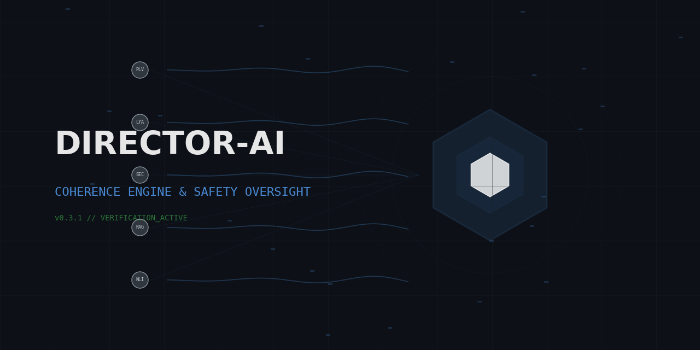

<p align="center">
  
</p>

<h1 align="center">Director-AI</h1>

<p align="center">
  <strong>Real-time LLM hallucination guardrail — NLI + RAG fact-checking with token-level streaming halt</strong>
</p>

<p align="center">
  <a href="https://github.com/anulum/director-ai/actions/workflows/ci.yml"></a>
  <a href="https://pypi.org/project/director-ai/"></a>
  <a href="https://codecov.io/gh/anulum/director-ai"></a>
  <a href="https://www.python.org/downloads/"></a>
  <a href="https://img.shields.io/badge/mypy-checked-blue"></a>
  <a href="https://hub.docker.com/r/anulum/director-ai"></a>
  <a href="https://www.gnu.org/licenses/agpl-3.0"></a>
</p>

---

## What It Does

Director-AI sits between your LLM and the user. It scores every output for
hallucination before it reaches anyone — and can halt generation mid-stream if
coherence drops below threshold.

```python
from director_ai import CoherenceAgent

agent = CoherenceAgent()
result = agent.process("What color is the sky?")

print(result.coherence.score)      # 0.94 — high coherence
print(result.coherence.approved)   # True
print(result.coherence.h_logical)  # 0.10 — low contradiction probability
print(result.coherence.h_factual)  # 0.10 — low factual deviation
```

**Three things make it different:**

1. **Token-level streaming halt** — not post-hoc review. The safety kernel
   monitors coherence token-by-token and severs output the moment it degrades.
2. **Dual-entropy scoring** — NLI contradiction detection (DeBERTa) + RAG
   fact-checking against your own knowledge base. Both must pass.
3. **Your data, your rules** — ingest PDFs, directories, or any text into a
   ChromaDB-backed knowledge base. The scorer checks LLM output against *your*
   ground truth, not a generic model.

## Architecture

```
          ┌──────────────────────────┐
          │    Coherence Agent       │
          │    (Orchestrator)        │
          └─────────┬────────────────┘
                    │
       ┌────────────┼────────────────┐
       │            │                │
┌──────▼──────┐ ┌───▼──────────┐ ┌───▼────────────┐
│  Generator  │ │  Coherence   │ │  Safety        │
│  (LLM       │ │  Scorer      │ │  Kernel        │
│   backend)  │ │              │ │  (streaming    │
│             │ │  NLI + RAG   │ │   interlock)   │
└─────────────┘ └───┬──────────┘ └────────────────┘
                    │
          ┌─────────▼─────────┐
          │  Ground Truth     │
          │  Store            │
          │  (ChromaDB / RAM) │
          └───────────────────┘
```

## Installation

```bash
# Basic install (heuristic scoring, no GPU needed)
pip install director-ai

# With NLI model (DeBERTa-based contradiction detection)
pip install director-ai[nli]

# With vector store (ChromaDB for custom knowledge bases)
pip install director-ai[vector]

# Everything
pip install "director-ai[nli,vector]"

# Development
git clone https://github.com/anulum/director-ai.git
cd director-ai
pip install -e ".[dev,research]"
```

## Usage

### Score a single response

```python
from director_ai.core import CoherenceScorer, GroundTruthStore

store = GroundTruthStore()
store.add("sky color", "The sky is blue due to Rayleigh scattering.")

scorer = CoherenceScorer(threshold=0.6, ground_truth_store=store)
approved, score = scorer.review("What color is the sky?", "The sky is green.")

print(approved)     # False — contradicts ground truth
print(score.score)  # 0.42
```

### With a real LLM backend

```python
from director_ai import CoherenceAgent

# Works with any OpenAI-compatible endpoint (llama.cpp, vLLM, Ollama, etc.)
agent = CoherenceAgent(llm_api_url="http://localhost:8080/completion")
result = agent.process("Explain quantum entanglement")

if result.halted:
    print("Output blocked — coherence too low")
else:
    print(result.output)
```

### Token-level streaming with halt

```python
from director_ai.core import StreamingKernel

kernel = StreamingKernel(halt_threshold=0.4)
session = kernel.stream_tokens(prompt="...", tokens=token_iterator)

for event in session:
    if event.halted:
        print("[HALTED — coherence dropped]")
        break
    print(event.token, end="")
```

### NLI-based scoring (requires torch)

```python
from director_ai.core import CoherenceScorer

scorer = CoherenceScorer(use_nli=True, threshold=0.6)
approved, score = scorer.review(
    "The Earth orbits the Sun.",
    "The Sun orbits the Earth."
)
print(score.h_logical)  # High — NLI detects contradiction
```

### Custom knowledge base with ChromaDB

```python
from director_ai.core import VectorGroundTruthStore

store = VectorGroundTruthStore()  # Uses ChromaDB
store.add("company policy", "Refunds are available within 30 days.")
store.add("pricing", "Enterprise plan starts at $99/month.")

scorer = CoherenceScorer(ground_truth_store=store)
approved, score = scorer.review(
    "What is the refund policy?",
    "We offer full refunds within 90 days."  # Wrong
)
# approved = False — contradicts your KB
```

## Scoring Formula

```
Coherence = 1 - (0.6 * H_logical + 0.4 * H_factual)
```

| Component | Source | Range | Meaning |
|-----------|--------|-------|---------|
| H_logical | NLI model (DeBERTa) | 0-1 | Contradiction probability |
| H_factual | RAG retrieval | 0-1 | Ground truth deviation |

- **Score >= 0.6** → approved (configurable)
- **Score < 0.5** → safety kernel emergency halt

## Benchmarks

Evaluated on [LLM-AggreFact](https://github.com/lytang/LLM-AggreFact) (29,320 samples across 11 datasets):

| Model | AggreFact Balanced Acc | Latency (avg) |
|-------|----------------------|---------------|
| DeBERTa-v3-base (baseline) | 66.2% | 220 ms |
| Fine-tuned DeBERTa-v3-large | 64.7% | 223 ms |
| Fine-tuned DeBERTa-v3-base | 59.0% | 220 ms |

**Per-dataset highlights:**

| Dataset | Balanced Accuracy | Notes |
|---------|------------------|-------|
| Reveal | 80.7% | Strong on factual claims |
| FactCheck-GPT | 71.7% | Good on GPT-generated text |
| Lfqa | 64.8% | Long-form QA |
| RAGTruth | 58.9% | RAG-specific hallucination |
| AggreFact-CNN | 53.0% | Summarization (known weak spot) |

**Honest assessment**: The NLI model alone is not state-of-the-art on summarization
hallucination. Director-AI's value is in the *system* — combining NLI with your
own KB facts, streaming token-level gating, and configurable halt thresholds.
The NLI component is a pluggable scorer; swap in any model that improves on
these numbers.

Benchmark scripts and results are in `benchmarks/`. Fine-tuning pipeline is in
`training/`.

## Package Structure

```
src/director_ai/
├── core/                           # Production API
│   ├── agent.py                    # CoherenceAgent — main orchestrator
│   ├── scorer.py                   # Dual-entropy coherence scorer
│   ├── kernel.py                   # Safety kernel (streaming interlock)
│   ├── nli.py                      # NLI scorer (DeBERTa)
│   ├── streaming.py                # Token-level streaming oversight
│   ├── actor.py                    # LLM generator interface
│   ├── knowledge.py                # Ground truth store (in-memory)
│   ├── vector_store.py             # Vector store (ChromaDB backend)
│   ├── bridge.py                   # Physics-backed scorer (optional)
│   └── types.py                    # CoherenceScore, ReviewResult
├── research/                       # Experimental extensions (optional)
│   ├── physics/                    #   Phase dynamics, stability proofs
│   ├── consciousness/              #   Topological observables
│   └── consilium/                  #   Ethical functional optimizer
benchmarks/                         # AggreFact evaluation suite
training/                           # DeBERTa fine-tuning pipeline
```

## Research Extensions

> **Experimental.** These modules implement physics-inspired coherence
> dynamics from an academic research programme. They are *not* required for
> production use and are not part of the stable API. Install with
> `pip install director-ai[research]`.

See [docs/RESEARCH.md](docs/RESEARCH.md) for details on the research modules,
including phase dynamics, topological observables, and stability proofs.

## Testing

```bash
# Run all tests (375 total)
pytest tests/ -v

# Consumer API tests only
pytest tests/ -v -m consumer

# Research module tests only
pytest tests/ -v -m physics
```

## License

Dual-licensed:

1. **Open-Source**: [GNU AGPL v3.0](LICENSE) — academic research, personal use,
   open-source projects
2. **Commercial**: Proprietary license from [ANULUM](https://www.anulum.li/licensing)
   — closed-source and commercial use

See [NOTICE](NOTICE) for full terms and third-party acknowledgements.

## Citation

```bibtex
@software{sotek2026director,
  author    = {Sotek, Miroslav},
  title     = {Director-AI: Real-time LLM Hallucination Guardrail},
  year      = {2026},
  url       = {https://github.com/anulum/director-ai},
  version   = {0.9.0},
  license   = {AGPL-3.0-or-later}
}
```

## Contributing

See [CONTRIBUTING.md](CONTRIBUTING.md) for guidelines. By contributing, you agree
to the [Code of Conduct](CODE_OF_CONDUCT.md) and AGPL v3 licensing terms.

## Security

See [SECURITY.md](SECURITY.md) for reporting vulnerabilities.
