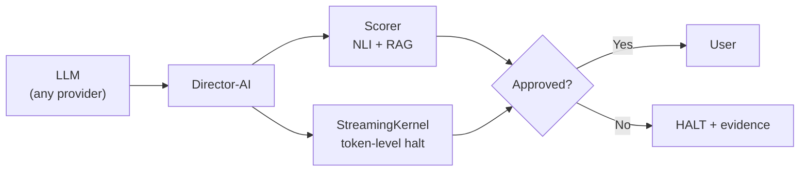

<p align="center">
  
</p>

<h1 align="center">Director-AI</h1>

<p align="center">
  <strong>Real-time LLM hallucination guardrail — NLI + RAG fact-checking with token-level streaming halt</strong>
</p>

<p align="center">
  <a href="https://github.com/anulum/director-ai/actions/workflows/ci.yml"></a>
  <a href="https://github.com/anulum/director-ai/actions/workflows/pre-commit.yml"></a>
  <a href="https://github.com/anulum/director-ai/actions/workflows/codeql.yml"></a>
  <a href="https://pypi.org/project/director-ai/"></a>
  <a href="https://pypi.org/project/director-ai/"></a>
  <a href="https://codecov.io/gh/anulum/director-ai"></a>
  <a href="https://www.python.org/downloads/"></a>
  <a href="https://www.gnu.org/licenses/agpl-3.0"></a>
  <a href="https://doi.org/10.5281/zenodo.18822167"></a>
  <a href="https://anulum.github.io/director-ai"></a>
  <a href="https://www.bestpractices.dev/projects/12102"></a>
  <a href="https://securityscorecards.dev/viewer/?uri=github.com/anulum/director-ai"></a>
  <a href="https://api.reuse.software/info/github.com/anulum/director-ai"></a>
</p>

---

## About

Director-AI is an internal research tool developed at [ANULUM Institute](https://www.anulum.li) as part of the [God of the Math Collection](https://www.anulum.li) (GOTM) — a multi-project scientific computing ecosystem spanning neuroscience, plasma physics, stochastic computing, and AI safety.

The system was built to solve a specific internal need: **real-time hallucination detection for LLM outputs used in scientific pipelines**, where a single fabricated number or citation can invalidate downstream analysis. It is now commercially offered under dual licensing.

**Team:** ANULUM maintains a research team (intentionally undisclosed). GitHub automation and repository maintenance are handled by the owner. Contributions are welcome under AGPL v3 terms.

> **Active Development** — APIs may evolve. The core guardrail engine, 5-tier scoring (rules → embeddings → NLI), 7-SDK guard, FastAPI middleware, REST/gRPC servers, injection detection, SaaS middleware (API keys + rate limiting), advanced RAG (6 pluggable retrieval backends), multi-agent swarm guardian (4 framework adapters), config wizard, and compliance reports are functional and tested (5300+ passing tests). Rust-accelerated compute paths ship as of v3.12.0.

---

## What It Does

Director-AI sits between your LLM and the user. It scores every output for hallucination — and can halt generation mid-stream when coherence drops.


```mermaid
graph LR
    LLM["LLM<br/>(any provider)"] --> D["Director-AI"]
    D --> S["Scorer<br/>NLI + RAG"]
    D --> K["StreamingKernel<br/>token-level halt"]
    S --> V{Approved?}
    K --> V
    V -->|Yes| U["User"]
    V -->|No| H["HALT + evidence"]
```

### Core capabilities

- **Token-level streaming halt** — severs output mid-generation when coherence degrades. Not post-hoc review.
- **Dual-entropy scoring** — NLI contradiction detection (0.4B DeBERTa) + RAG fact-checking against your knowledge base.
- **Structured output verification** — JSON schema validation, numeric consistency, reasoning chain verification, temporal freshness scoring. Stdlib-only, zero dependencies.
- **Intent-grounded injection detection** — two-stage pipeline: regex pattern matching (fast) + bidirectional NLI divergence scoring (semantic). Detects the *effect* of injection in the output.
- **12 Rust-accelerated compute functions** — 9.4× geometric mean speedup over Python paths. Transparent fallback when Rust kernel is not installed.

### Advanced RAG (6 pluggable retrieval strategies)

All independently toggleable via config, composable as a decorator stack:

| Strategy | What it does | Config field |
|----------|-------------|--------------|
| **Parent-child chunking** | Index small chunks, return large parents for context | `parent_child_enabled` |
| **Adaptive retrieval** | Skip KB lookup for creative/conversational queries | `adaptive_retrieval_enabled` |
| **HyDE** | LLM generates pseudo-answer, embeds that for retrieval | `hyde_enabled` |
| **Query decomposition** | Split compound queries, retrieve for each, merge via RRF | `query_decomposition_enabled` |
| **Contextual compression** | Keep only query-relevant sentences from retrieved passages | `contextual_compression_enabled` |
| **Multi-vector** | Index content + summary + title representations per doc | `multi_vector_enabled` |

On top of the existing hybrid (BM25+dense), cross-encoder reranking, ColBERT, and 11 vector backends (Chroma, Pinecone, Qdrant, FAISS, Weaviate, Elasticsearch, etc.).

### Multi-agent swarm guardian

Guard entire agent swarms — not just individual LLM calls:

- **SwarmGuardian**: central registry with cross-agent contradiction detection + cascade halt
- **AgentProfile**: per-agent thresholds (researcher vs summariser vs coder)
- **HandoffScorer**: score inter-agent messages before handoff
- **Framework adapters**: LangGraph, CrewAI, OpenAI Swarm, AutoGen — zero framework deps

### Additional modules

Meta-confidence estimation, online calibration from feedback, contradiction tracking across turns, agentic loop monitoring, adversarial robustness testing (25 patterns), EU AI Act audit trails, domain presets (medical/finance/legal/creative), cross-model consensus, conformal prediction intervals, token cost analyser, compliance report templates (HTML/Markdown), config wizard (Gradio UI + CLI).

### Multi-language components (all optional)

| Component | Path | Purpose |
|-----------|------|---------|
| **Rust `backfire-kernel`** | `backfire-kernel/` | 12 hot-path compute functions via PyO3 (9.4× geomean speedup) |
| **Go gateway** | `gateway/go/` | High-concurrency HTTP front door with auth, rate limit, audit, optional scoring sidecar |
| **`director.v1` wire schema** | `schemas/proto/` | Frozen protobuf messages shared by Python and Go |
| **CoherenceScoring gRPC** | `src/director_ai/grpc_scoring.py` | `ScoreClaim` unary + `ScoreStream` bidi RPCs over `director.v1` |
| **Julia threshold tuner** | `tools/julia_tuner/` | Offline bootstrap + Bayesian threshold analysis with uncertainty bands |
| **Lean 4 formal proof** | `formal/HaltMonitor/` | Machine-checked guarantee that sub-threshold tokens cannot be emitted |

Python stands on its own — every non-Python component is additive and
toggled by an env var, flag, or optional dependency. See
[`ARCHITECTURE.md`](ARCHITECTURE.md) for the full layout and
[`gateway/go/README.md`](gateway/go/README.md),
[`tools/julia_tuner/README.md`](tools/julia_tuner/README.md),
[`formal/README.md`](formal/README.md),
[`schemas/README.md`](schemas/README.md) for per-component details.

Full documentation: [anulum.github.io/director-ai](https://anulum.github.io/director-ai)

---

## Quick Start

### Wrap your SDK (6 lines)

```python
from director_ai import guard
from openai import OpenAI

client = guard(
    OpenAI(),
    facts={"refund_policy": "Refunds within 30 days only"},
)
response = client.chat.completions.create(
    model="gpt-4o-mini",
    messages=[{"role": "user", "content": "What is the refund policy?"}],
)
```

### One-shot check (4 lines)

```python
from director_ai import score

cs = score("What is the refund policy?", response_text,
           facts={"refund": "Refunds within 30 days only"},
           threshold=0.3)
print(f"Coherence: {cs.score:.3f}  Approved: {cs.approved}")
```

### Proxy (2 lines, zero code changes)

```bash
pip install director-ai[server]
director-ai proxy --port 8080 --facts kb.txt --threshold 0.3
```

Set `OPENAI_BASE_URL=http://localhost:8080/v1` in your app. Every response gets scored.

### FastAPI middleware (3 lines)

```python
from director_ai.integrations.fastapi_guard import DirectorGuard

app.add_middleware(DirectorGuard,
    facts={"policy": "Refunds within 30 days only"},
    on_fail="reject",
)
```

Also available: LangChain, LlamaIndex, LangGraph, Haystack, CrewAI, Semantic Kernel, DSPy integrations.

---

## Installation

```bash
pip install "director-ai[nli]"                    # recommended — NLI model scoring (75.6% BA)
pip install "director-ai[embed]"                   # embedding scorer (~65% BA, CPU-only, 3ms)
pip install director-ai                            # rule-based + heuristic (zero ML deps, <1ms)
pip install "director-ai[nli,vector,server]"       # production stack with RAG + REST API
pip install "director-ai[ui]"                      # config wizard (Gradio web UI)
pip install "director-ai[reports]"                 # PDF/HTML compliance reports
```

For reproducible installs the repo ships a `uv.lock` at the root;
`uv sync` installs the exact resolved versions.

The MiniCheck backend is opt-in and not on PyPI — install it manually
alongside any other extras:

```bash
pip install "minicheck @ git+https://github.com/Liyan06/MiniCheck.git"
```

### 5-tier scoring backends

| Tier | Backend | Accuracy | Latency | Install |
|------|---------|----------|---------|---------|
| **5** | NLI (FactCG) | **75.6% BA** | 14.6 ms | `[nli]` |
| **4** | Distilled NLI (preview) | ~70% BA | 5 ms | `[nli-lite]` |
| **3** | Embedding (bge-small) | ~65% BA | 3 ms | `[embed]` |
| **2** | Rules engine (8 rules) | rule-based | <1 ms | — (base) |
| **1** | Heuristic (lite) | ~55% BA | <1 ms | — (base) |

Select via config: `scorer_backend="rules"`, `"embed"`, `"deberta"`, or `"lite"`.

| Layer | What you get | Install extra |
|-------|-------------|---------------|
| **Core** (zero heavy deps) | `CoherenceScorer`, `StreamingKernel`, `GroundTruthStore`, rules engine | — |
| **Embeddings** | Sentence-transformer cosine-similarity scorer | `[embed]` |
| **NLI models** | DeBERTa, FactCG, MiniCheck, ONNX Runtime | `[nli]` |
| **Vector DBs** | Chroma, Pinecone, Weaviate, Qdrant | `[vector]` / `[pinecone]` / etc. |
| **Server** | FastAPI + Uvicorn REST/gRPC | `[server]` |
| **Rust kernel** | 12 accelerated compute functions | `[rust]` (requires maturin) |
| **Voice** | ElevenLabs, OpenAI TTS, Deepgram adapters | `[voice]` |

Python 3.11+. Full guide: [docs/installation](https://anulum.github.io/director-ai/installation/).

---

## Benchmarks

### Accuracy — LLM-AggreFact (29,320 samples)

Two judges ship with this release.

**Default — `yaxili96/FactCG-DeBERTa-v3-Large`** (0.4B params, MIT). The fast NLI baseline.

| Rank | Model | Per-dataset mean BA | Params | Latency | Streaming |
|------|-------|---------------------|--------|---------|-----------|
| #1 | Bespoke-MiniCheck-7B | **77.4%** | 7B | ~100 ms | No |
| **#6** | **Director-AI (FactCG)** | **75.6%** | 0.4B | **14.6 ms** | **Yes** |
| #8 | MiniCheck-Flan-T5-L | 75.0% | 0.8B | ~120 ms | No |

With per-dataset threshold tuning (no retraining), FactCG reaches **77.76%** — ahead of Bespoke-MiniCheck-7B (#1 at 77.4%). This is the same 0.4B model, single `pip install`, 14.6 ms latency.

Latency: 14.6 ms/pair on GTX 1060 6GB (ONNX GPU, 16-pair batch). Full comparison: [`benchmarks/comparison/COMPETITOR_COMPARISON.md`](benchmarks/comparison/COMPETITOR_COMPARISON.md).

> **Note on metrics.** The numbers in the table above use the
> AggreFact leaderboard convention — **per-dataset mean balanced
> accuracy across the 11 datasets** ([source: llm-aggrefact.github.io](https://llm-aggrefact.github.io/)).
> Sample-pooled balanced accuracy is a different metric and is
> systematically higher on heterogeneous benchmarks. Both numbers
> are reported in `training/EXPERIMENT_RESULTS.md` for
> traceability.

**Optional — Gemma 4 E4B Q6 with per-task-family routing.** A zero-training LLM-as-judge alternative for users who prefer LLM-as-judge architectures over NLI. Per-task-family prompts (`summ` / `rag` / `claim`) bring the routed Gemma judge to 75.55% per-dataset mean BA on the AggreFact 29K test set, comparable to the FactCG default. The routed judge is opt-in (`--backend llama-cpp`); FactCG remains the default.

### Rust compute acceleration (v3.12.0)

12 functions, 5000 iterations each. Geometric mean: **9.4× speedup**.

| Function | Python (µs) | Rust (µs) | Speedup |
|----------|------------|-----------|---------|
| sanitizer_score | 57 | 2.1 | 27× |
| temporal_freshness | 53 | 2.5 | 21× |
| probs_to_confidence (200×3) | 486 | 15 | 33× |
| lite_score | 47 | 26 | 1.8× |

Full results: [`benchmarks/results/rust_compute_bench.json`](benchmarks/results/rust_compute_bench.json).

### Cross-platform NLI latency (p99, 16-pair batch)

| Platform | Type | Per-pair p99 | Batch p99 (16p) | Notes |
|----------|------|-------------|-----------------|-------|
| GTX 1060 6GB | CUDA 12.6 | **17.9 ms** | 287 ms | PyTorch FP32, 100 iterations |
| RX 6600 XT 8GB | ROCm 6.2 | 80.1 ms | 1,282 ms | hipBLAS fallback |
| EPYC 9575F 4C | CPU | 118.9 ms | 1,903 ms | UpCloud cloud, Zen 5 |
| Xeon E5-2640 2×6C | CPU | 207.3 ms | 3,317 ms | ML350 Gen8, 128 GB RAM |

Heuristic-only (no NLI): p99 < 0.5 ms on all platforms.
Raw data: [`benchmarks/results/`](benchmarks/results/).

---

## Known Limitations

Be aware of these before deploying:

- **Heuristic fallback is weak**: Without `[nli]`, scoring uses word-overlap (~55% accuracy). Not recommended for production.
- **Summarisation FPR is 10.5%**: Reduced from 95% via bidirectional NLI + baseline calibration (v3.5). Still too high for some use cases — tune thresholds per domain.
- **NLI needs KB grounding**: Without a knowledge base, domain accuracy drops significantly (PubMedQA F1=62.1%, FinanceBench 80%+ FPR).
- **ONNX CPU is slow**: 383 ms/pair without GPU. Use `onnxruntime-gpu` for production.
- **Long documents need ≥16 GB VRAM**: Chunked NLI on legal/financial docs exceeds 6 GB.
- **LLM-as-judge sends data externally**: When enabled, truncated prompt+response (500 chars) go to the configured provider. Off by default.
- **Domain presets are starting points**: Default thresholds need tuning for your data. Domain benchmark scripts exist but results are not yet validated.

---

## Docker

```bash
docker build -t director-ai .                          # CPU
docker build -f Dockerfile.gpu -t director-ai:gpu .    # GPU
docker run -p 8080:8080 director-ai                    # run
```

Kubernetes: [Helm chart](deploy/helm/director-ai/) with GPU toggle, HPA, Sigstore-signed releases.

---

## Citation

```bibtex
@software{sotek2026director,
  author    = {Sotek, Miroslav},
  title     = {Director-AI: Real-time LLM Hallucination Guardrail},
  year      = {2026},
  url       = {https://github.com/anulum/director-ai},
  version   = {3.14.0},
  license   = {AGPL-3.0-or-later}
}
```

## License

Dual-licensed:

1. **Open-Source**: [GNU AGPL v3.0](LICENSE) — research, personal use, open-source projects.
2. **Commercial**: [Proprietary license](https://www.anulum.li/licensing) — removes copyleft for closed-source and SaaS.

Contact: [anulum.li](https://www.anulum.li) | [director.class.ai@anulum.li](mailto:director.class.ai@anulum.li)

## Contributing

See [CONTRIBUTING.md](CONTRIBUTING.md). By contributing, you agree to AGPL v3 terms.

---

<p align="center">
  <a href="https://www.anulum.li">
    
  </a>
  &nbsp;&nbsp;&nbsp;&nbsp;
  <a href="https://www.anulum.li">
    
  </a>
  <br>
  <em>Developed by <a href="https://www.anulum.li">ANULUM Institute</a> / Fortis Studio — Marbach SG, Switzerland</em>
</p>
