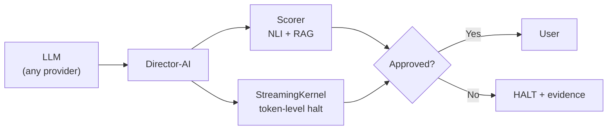

<p align="center">
  
</p>

<h1 align="center">Director-AI</h1>

<p align="center">
  <strong>Real-time LLM hallucination guardrail — NLI + RAG fact-checking with token-level streaming halt</strong>
</p>

<p align="center">
  <a href="https://github.com/anulum/director-ai/actions/workflows/ci.yml"></a>
  
  <a href="https://pypi.org/project/director-ai/"></a>
  <a href="https://codecov.io/gh/anulum/director-ai"></a>
  <a href="https://www.python.org/downloads/"></a>
  <a href="https://hub.docker.com/r/anulum/director-ai"></a>
  <a href="https://www.gnu.org/licenses/agpl-3.0"></a>
  <a href="https://huggingface.co/spaces/anulum/director-ai-guardrail"></a>
  <a href="https://doi.org/10.5281/zenodo.18822167"></a>
  <a href="https://anulum.github.io/director-ai"></a>
  <a href="https://www.bestpractices.dev/projects/12102"></a>
  <a href="https://securityscorecards.dev/viewer/?uri=github.com/anulum/director-ai"></a>
  <a href="https://api.reuse.software/info/github.com/anulum/director-ai"></a>
</p>

---

## What It Does

Director-AI sits between your LLM and the user. It scores every output for
hallucination before it reaches anyone — and can halt generation mid-stream if
coherence drops below threshold.


```mermaid
graph LR
    LLM["LLM<br/>(any provider)"] --> D["Director-AI"]
    D --> S["Scorer<br/>NLI + RAG"]
    D --> K["StreamingKernel<br/>token-level halt"]
    S --> V{Approved?}
    K --> V
    V -->|Yes| U["User"]
    V -->|No| H["HALT + evidence"]
```

**Four things make it different:**

1. **Token-level streaming halt** — not post-hoc review. Severs output the moment coherence degrades.
2. **Dual-entropy scoring** — NLI contradiction detection (DeBERTa) + RAG fact-checking against your knowledge base.
3. **Continuous batching** — server-level request queue coalesces NLI calls (2 GPU kernels per flush, not 2*N per request).
4. **Your data, your rules** — ingest your own documents. The scorer checks against *your* ground truth.

### Scope

Pure Python core — no compiled extensions required. Optional Rust kernel (`pip install director-ai[rust]`) for SIMD-accelerated scoring. Works on any platform with Python 3.11+.

| Layer | Packages | Install |
|-------|----------|---------|
| **Core** (zero heavy deps) | `CoherenceScorer`, `StreamingKernel`, `GroundTruthStore`, `SafetyKernel` | `pip install director-ai` |
| **NLI models** | DeBERTa, FactCG, MiniCheck, ONNX Runtime | `pip install director-ai[nli]` |
| **Vector DBs** | ChromaDB, Pinecone, Weaviate, Qdrant | `pip install director-ai[vector]` |
| **LLM judge** | OpenAI, Anthropic escalation | `pip install director-ai[openai]` |
| **Observability** | OpenTelemetry spans | `pip install director-ai[otel]` |
| **Server** | FastAPI + Uvicorn | `pip install director-ai[server]` |

## Four Ways to Add Guardrails

### A: Wrap your SDK (6 lines)

Works with OpenAI, Anthropic, Bedrock, Gemini, Cohere, vLLM, Groq, LiteLLM, Ollama.

```python
from director_ai import guard
from openai import OpenAI

client = guard(
    OpenAI(),
    facts={"refund_policy": "Refunds within 30 days only"},
    threshold=0.6,
)
response = client.chat.completions.create(
    model="gpt-4o-mini",
    messages=[{"role": "user", "content": "What is the refund policy?"}],
)
```

### B: One-shot check (4 lines)

Score a single prompt/response pair without an SDK client:

```python
from director_ai import score

cs = score("What is the refund policy?", response_text,
           facts={"refund": "Refunds within 30 days only"})
print(f"Coherence: {cs.score:.3f}")
```

### C: Zero code changes (2 lines)

Point any OpenAI-compatible client at the proxy:

```bash
pip install director-ai[server]
director-ai proxy --port 8080 --facts kb.txt --threshold 0.6
```

Then set `OPENAI_BASE_URL=http://localhost:8080/v1` in your app. Every response
gets scored; hallucinations are rejected (or flagged with `--on-fail warn`).

### D: FastAPI middleware (3 lines)

Guard your own API endpoints:

```python
from director_ai.integrations.fastapi_guard import DirectorGuard

app.add_middleware(DirectorGuard,
    facts={"policy": "Refunds within 30 days only"},
    on_fail="reject",
)
```

Responses on POST endpoints get `X-Director-Score` and `X-Director-Approved`
headers. Set `paths=["/api/chat"]` to limit which endpoints are scored.

## Installation

```bash
pip install director-ai                      # heuristic scoring
pip install director-ai[nli]                 # NLI model (DeBERTa)
pip install director-ai[vector]              # ChromaDB knowledge base
pip install director-ai[finetune]            # domain adaptation
pip install "director-ai[nli,vector,server]" # production stack
```

Framework integrations: `[langchain]`, `[llamaindex]`, `[langgraph]`, `[haystack]`, `[crewai]`.

Full installation guide: [docs](https://anulum.github.io/director-ai/installation/).

## Docker

```bash
docker run -p 8080:8080 ghcr.io/anulum/director-ai:latest        # CPU
docker run --gpus all -p 8080:8080 ghcr.io/anulum/director-ai:gpu # GPU
```

## Benchmarks

### Accuracy — LLM-AggreFact (29,320 samples)

| Model | Balanced Acc | Params | Latency | Streaming |
|-------|-------------|--------|---------|-----------|
| Bespoke-MiniCheck-7B | **77.4%** | 7B | ~100 ms | No |
| **Director-AI (FactCG)** | **75.8%** | 0.4B | **14.6 ms** | **Yes** |
| MiniCheck-Flan-T5-L | 75.0% | 0.8B | ~120 ms | No |
| MiniCheck-DeBERTa-L | 72.6% | 0.4B | ~120 ms | No |

75.8% balanced accuracy at 17x fewer params than the leader. 14.6 ms/pair with
ONNX GPU batching — faster than every competitor at this accuracy tier.
Director-AI's unique value is the *system*: NLI + KB + streaming halt.

Full results: [`benchmarks/comparison/COMPETITOR_COMPARISON.md`](benchmarks/comparison/COMPETITOR_COMPARISON.md).
Performance trade-offs and E2E pipeline metrics: [docs](https://anulum.github.io/director-ai/guide/streaming/).

## Domain Presets

10 built-in profiles with tuned thresholds:

```bash
director-ai config --profile medical   # threshold=0.75, NLI on, reranker on
director-ai config --profile finance   # threshold=0.70, w_fact=0.6
director-ai config --profile legal     # threshold=0.68, w_logic=0.6
director-ai config --profile creative  # threshold=0.40, permissive
```

Domain-specific benchmarks validate each profile against real datasets:

```bash
python -m benchmarks.medical_eval   # MedNLI + PubMedQA
python -m benchmarks.legal_eval     # ContractNLI + CUAD (RAGBench)
python -m benchmarks.finance_eval   # FinanceBench + Financial PhraseBank
```

## Known Limitations

1. **Heuristic fallback is weak**: Without `[nli]`, scoring uses word-overlap heuristics (~55% accuracy). Use `strict_mode=True` to reject (0.9) instead of guessing.
2. **Summarisation FPR at 2.0%**: Reduced from 95% via bidirectional NLI + Layer C claim decomposition. AggreFact-CNN: 68.8%, ExpertQA: 59.1% (structurally expected at 0.4B params).
3. **ONNX CPU is slow**: 383 ms/pair without GPU. Use `onnxruntime-gpu` for production.
4. **Weights are domain-dependent**: Default `w_logic=0.6, w_fact=0.4` suits general QA. Adjust for your domain or use a built-in profile.
5. **LLM-as-judge sends data externally**: When `llm_judge_enabled=True`, truncated prompt+response (500 chars) are sent to the configured provider. Do not enable in privacy-sensitive deployments without user consent.

## Citation

```bibtex
@software{sotek2026director,
  author    = {Sotek, Miroslav},
  title     = {Director-AI: Real-time LLM Hallucination Guardrail},
  year      = {2026},
  url       = {https://github.com/anulum/director-ai},
  version   = {3.9.0},
  license   = {AGPL-3.0-or-later}
}
```

## License

Dual-licensed:

1. **Open-Source**: [GNU AGPL v3.0](LICENSE) — research, personal use, open-source projects.
2. **Commercial**: [Proprietary license](https://www.anulum.li/licensing) — removes copyleft for closed-source and SaaS.

See [Licensing](docs-site/licensing.md) for pricing tiers and FAQ.

Contact: [anulum.li/contact](https://www.anulum.li/contact.html) | invest@anulum.li

## Community

Join the [Director-AI Discord](https://discord.gg/JvMdKv49) for CI notifications, release announcements, and support. The Discord bot also provides `/version`, `/docs`, `/install`, `/status`, and `/quickstart` slash commands.

## Contributing

See [CONTRIBUTING.md](CONTRIBUTING.md). By contributing, you agree to AGPL v3 terms.
