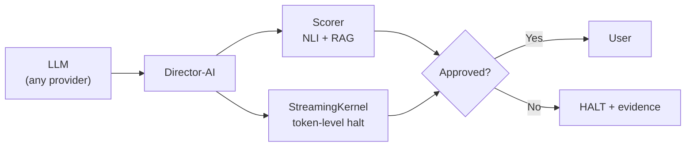

<p align="center">
  
</p>

<h1 align="center">Director-AI</h1>

<p align="center">
  <strong>Real-time LLM hallucination guardrail — NLI + RAG fact-checking with token-level streaming halt</strong>
</p>

<p align="center">
  <a href="https://github.com/anulum/director-ai/actions/workflows/ci.yml"></a>
  <a href="https://github.com/anulum/director-ai/actions/workflows/pre-commit.yml"></a>
  <a href="https://github.com/anulum/director-ai/actions/workflows/codeql.yml"></a>
  
  <a href="https://pypi.org/project/director-ai/"></a>
  <a href="https://pypi.org/project/director-ai/"></a>
  <a href="https://codecov.io/gh/anulum/director-ai"></a>
  <a href="https://www.python.org/downloads/"></a>
  
  
  
  <a href="https://www.gnu.org/licenses/agpl-3.0"></a>
  <a href="https://huggingface.co/spaces/anulum/director-ai-guardrail"></a>
  <a href="https://doi.org/10.5281/zenodo.18822167"></a>
  <a href="https://anulum.github.io/director-ai"></a>
  <a href="https://www.bestpractices.dev/projects/12102"></a>
  <a href="https://securityscorecards.dev/viewer/?uri=github.com/anulum/director-ai"></a>
  <a href="https://api.reuse.software/info/github.com/anulum/director-ai"></a>
</p>

---

## What It Does

Director-AI sits between your LLM and the user. It scores every output for
hallucination before it reaches anyone — and can halt generation mid-stream if
coherence drops below threshold.


```mermaid
graph LR
    LLM["LLM<br/>(any provider)"] --> D["Director-AI"]
    D --> S["Scorer<br/>NLI + RAG"]
    D --> K["StreamingKernel<br/>token-level halt"]
    S --> V{Approved?}
    K --> V
    V -->|Yes| U["User"]
    V -->|No| H["HALT + evidence"]
```

**Ten things make it different:**

1. **Token-level streaming halt** — not post-hoc review. Severs output the moment coherence degrades.
2. **Dual-entropy scoring** — NLI contradiction detection (DeBERTa) + RAG fact-checking against your knowledge base.
3. **Meta-confidence** — the guardrail tells you how confident it is in its own verdict. Route low-confidence results to human review.
4. **Structured output verification** — JSON schema validation, tool call fabrication detection, code hallucinated API detection. Zero dependencies (stdlib only).
5. **Online calibration** — collects human feedback, automatically adjusts thresholds for your deployment. The longer you use it, the better it gets.
6. **Contradiction tracking** — detects when an AI contradicts itself across conversation turns.
7. **EU AI Act compliance** — automated Article 15 documentation. Accuracy metrics, drift detection, feedback loop detection, audit trails, per-model breakdown with confidence intervals. Ready for August 2026 enforcement.
8. **Verification gems** — numeric consistency checks, reasoning chain verification, temporal freshness scoring, cross-model consensus, conformal prediction intervals. All stdlib-only, zero dependencies.
9. **Agentic loop monitor** — detects circular tool calls, goal drift, and budget exhaustion in AI agent loops. The first guardrail that monitors agent execution, not just individual calls.
10. **Adversarial self-test** — 25-pattern robustness suite tests your guardrail against zero-width chars, homoglyphs, encoding tricks, and prompt injection.
11. **Intent-grounded injection detection** — two-stage pipeline: regex pattern matching (fast) + bidirectional NLI divergence scoring (semantic). Detects the *effect* of injection in the output — works regardless of how the attack was encoded. Per-claim attribution with grounded/drifted/injected verdicts.

### Scope

Pure Python core — no compiled extensions required. Optional Rust kernel (`pip install director-ai[rust]`) for SIMD-accelerated scoring. Works on any platform with Python 3.11+.

| Layer | Packages | Install |
|-------|----------|---------|
| **Core** (zero heavy deps) | `CoherenceScorer`, `StreamingKernel`, `GroundTruthStore`, `HaltMonitor` | `pip install director-ai` |
| **NLI models** | DeBERTa, FactCG, MiniCheck, ONNX Runtime | `pip install director-ai[nli]` |
| **Vector DBs** | ChromaDB (`[vector]`), Pinecone (`[pinecone]`), Weaviate (`[weaviate]`), Qdrant (`[qdrant]`) | `pip install director-ai[vector]` |
| **LLM judge** | OpenAI, Anthropic escalation | `pip install director-ai[openai]` |
| **Observability** | OpenTelemetry spans | `pip install director-ai[otel]` |
| **Server** | FastAPI + Uvicorn | `pip install director-ai[server]` |

## Four Ways to Add Guardrails

### A: Wrap your SDK (6 lines)

Duck-type detection for five SDK shapes: OpenAI-compatible (OpenAI, vLLM, Groq,
LiteLLM, Ollama), Anthropic, AWS Bedrock, Google Gemini, and Cohere.

```python
from director_ai import guard
from openai import OpenAI

client = guard(
    OpenAI(),
    facts={"refund_policy": "Refunds within 30 days only"},
)
response = client.chat.completions.create(
    model="gpt-4o-mini",
    messages=[{"role": "user", "content": "What is the refund policy?"}],
)
```

### B: One-shot check (4 lines)

Score a single prompt/response pair without an SDK client:

```python
from director_ai import score

cs = score("What is the refund policy?", response_text,
           facts={"refund": "Refunds within 30 days only"},
           threshold=0.3)
print(f"Coherence: {cs.score:.3f}  Approved: {cs.approved}")
```

### C: Zero code changes (2 lines)

Point any OpenAI-compatible client at the proxy:

```bash
pip install director-ai[server]
director-ai proxy --port 8080 --facts kb.txt --threshold 0.3
```

Then set `OPENAI_BASE_URL=http://localhost:8080/v1` in your app. Every response
gets scored; hallucinations are rejected (or flagged with `--on-fail warn`).

### D: FastAPI middleware (3 lines)

Guard your own API endpoints:

```python
from director_ai.integrations.fastapi_guard import DirectorGuard

app.add_middleware(DirectorGuard,
    facts={"policy": "Refunds within 30 days only"},
    on_fail="reject",
)
```

Responses on POST endpoints get `X-Director-Score` and `X-Director-Approved`
headers. Set `paths=["/api/chat"]` to limit which endpoints are scored.

## Installation

```bash
pip install "director-ai[nli]"                    # recommended — NLI model scoring
pip install "director-ai[nli,vector,server]"       # production stack with RAG + REST API
pip install "director-ai[nli,voice]"               # voice AI with TTS adapters
pip install director-ai                            # heuristic-only (limited accuracy)
```

Extras: `[vector]` (ChromaDB), `[voice]` (ElevenLabs, OpenAI TTS, Deepgram), `[finetune]` (domain adaptation), `[ingestion]` (PDF/DOCX parsing), `[colbert]` (late-interaction retrieval).
Framework integrations: `[langchain]`, `[llamaindex]`, `[langgraph]`, `[haystack]`, `[crewai]`, Semantic Kernel, DSPy/Instructor.
Kubernetes: [Helm chart](deploy/helm/director-ai/) with GPU toggle, HPA, Sigstore-signed releases.
Voice AI: `VoiceGuard` (sync) and `AsyncVoiceGuard` + `voice_pipeline()` (async) — real-time token filter for TTS pipelines with ElevenLabs, OpenAI TTS, and Deepgram adapters ([guide](https://anulum.github.io/director-ai/guide/voice-ai/)).

Full installation guide: [docs](https://anulum.github.io/director-ai/installation/).

## Docker

Dockerfile included for self-hosted builds. Pre-built images not yet published to a registry.

```bash
docker build -t director-ai .                                      # build locally
docker run -p 8080:8080 director-ai                                # CPU
docker build -f Dockerfile.gpu -t director-ai:gpu .                # GPU build
docker run --gpus all -p 8080:8080 director-ai:gpu                 # GPU
```

## Benchmarks

### Accuracy — LLM-AggreFact (29,320 samples)

Scoring model: [`yaxili96/FactCG-DeBERTa-v3-Large`](https://huggingface.co/yaxili96/FactCG-DeBERTa-v3-Large) (0.4B params, MIT license).

| Model | Balanced Acc | Params | Latency | Streaming |
|-------|-------------|--------|---------|-----------|
| Bespoke-MiniCheck-7B | **77.4%** | 7B | ~100 ms | No |
| **Director-AI (FactCG)** | **75.8%** | 0.4B | **14.6 ms** | **Yes** |
| MiniCheck-Flan-T5-L | 75.0% | 0.8B | ~120 ms | No |
| MiniCheck-DeBERTa-L | 72.6% | 0.4B | ~120 ms | No |

75.8% balanced accuracy comes from the FactCG-DeBERTa-v3-Large model (77.2% in
the [NAACL 2025 paper](https://arxiv.org/abs/2501.17144); our eval yields 75.86%
due to threshold tuning and data split version). Latency: 14.6 ms/pair measured
on GTX 1060 6GB with ONNX GPU batching (16-pair batch, 30 iterations, 5 warmup).
Director-AI's unique value is the *system*: NLI + KB + streaming halt.

Full results: [`benchmarks/comparison/COMPETITOR_COMPARISON.md`](benchmarks/comparison/COMPETITOR_COMPARISON.md).
Performance trade-offs and E2E pipeline metrics: [docs](https://anulum.github.io/director-ai/guide/streaming/).

## Domain Presets

10 built-in profiles with preset thresholds (starting points — adjust for your data):

```bash
director-ai config --profile medical   # threshold=0.30, NLI on, reranker on
director-ai config --profile finance   # threshold=0.30, w_fact=0.6
director-ai config --profile legal     # threshold=0.30, w_logic=0.6
director-ai config --profile creative  # threshold=0.40, permissive
```

Domain-specific benchmark scripts exist but have not yet been validated with measured results.
Run them yourself (requires GPU + HuggingFace datasets):

```bash
python -m benchmarks.medical_eval   # MedNLI + PubMedQA
python -m benchmarks.legal_eval     # ContractNLI + CUAD (RAGBench)
python -m benchmarks.finance_eval   # FinanceBench + Financial PhraseBank
```

<details>
<summary><strong>Known Limitations & When Not to Use</strong></summary>

#### Accuracy

- **Heuristic fallback is weak**: Without `[nli]`, scoring uses word-overlap heuristics (~55% accuracy). Use `strict_mode=True` to reject (0.9) instead of guessing.
- **Summarisation FPR at 10.5%**: Reduced from 95% via bidirectional NLI + baseline calibration (v3.5). AggreFact-CNN: 68.8%, ExpertQA: 59.1% (structurally expected at 0.4B params).
- **NLI-only scoring needs KB grounding**: Without a knowledge base, PubMedQA F1=62.1%, FinanceBench 80%+ FPR. Load your domain facts into the vector store.

#### Performance

- **ONNX CPU is slow**: 383 ms/pair without GPU. Use `onnxruntime-gpu` for production.
- **Long documents need ≥16GB VRAM**: Legal contracts and SEC filings exceed 6GB during chunked NLI inference.

#### Configuration

- **Weights are domain-dependent**: Default `w_logic=0.6, w_fact=0.4` suits general QA. Adjust for your domain or use a built-in profile.
- **Threshold defaults differ by API surface**: `guard()`/`score()` default to `threshold=0.3` (permissive). `DirectorConfig` defaults to `coherence_threshold=0.6` (conservative). Always set the threshold explicitly.

#### Privacy

- **LLM-as-judge sends data externally**: When `llm_judge_enabled=True`, truncated prompt+response (500 chars) are sent to the configured provider. Do not enable in privacy-sensitive deployments without user consent. The default NLI-only mode runs entirely locally with no external calls.

</details>

## Citation

```bibtex
@software{sotek2026director,
  author    = {Sotek, Miroslav},
  title     = {Director-AI: Real-time LLM Hallucination Guardrail},
  year      = {2026},
  url       = {https://github.com/anulum/director-ai},
  version   = {3.11.1},
  license   = {AGPL-3.0-or-later}
}
```

## License

Dual-licensed:

1. **Open-Source**: [GNU AGPL v3.0](LICENSE) — research, personal use, open-source projects.
2. **Commercial**: [Proprietary license](https://www.anulum.li/licensing) — removes copyleft for closed-source and SaaS.

See [Licensing](docs-site/licensing.md) for pricing tiers and FAQ.

Contact: [anulum.li](https://www.anulum.li) | [director.class.ai@anulum.li](mailto:director.class.ai@anulum.li)

## Community

Join the [Director-AI Discord](https://discord.gg/JvMdKv49) for CI notifications, release announcements, and support. The Discord bot also provides `/version`, `/docs`, `/install`, `/status`, and `/quickstart` slash commands.

## Contributing

See [CONTRIBUTING.md](CONTRIBUTING.md). By contributing, you agree to AGPL v3 terms.

---

<p align="center">
  <a href="https://www.anulum.li">
    
  </a>
  &nbsp;&nbsp;&nbsp;&nbsp;
  <a href="https://www.anulum.li">
    
  </a>
  <br>
  <em>Developed by <a href="https://www.anulum.li">ANULUM</a> / Fortis Studio</em>
</p>
