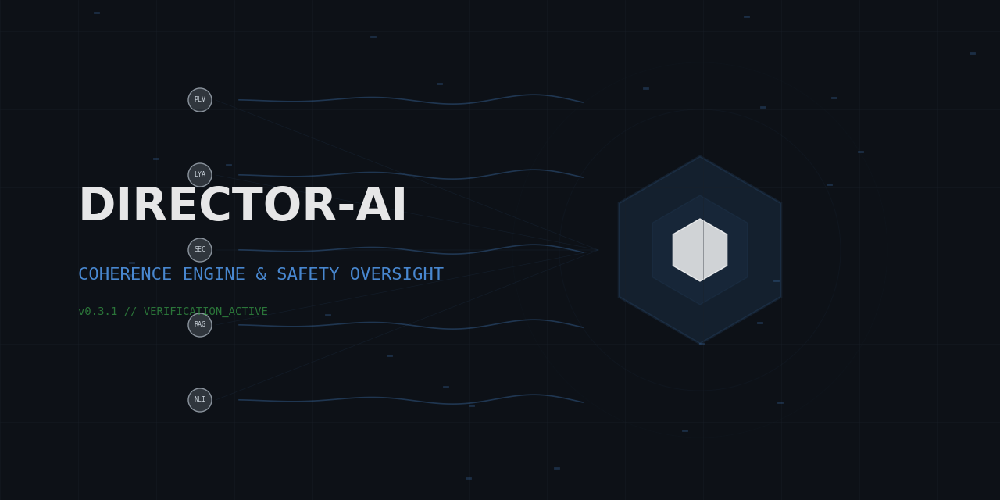
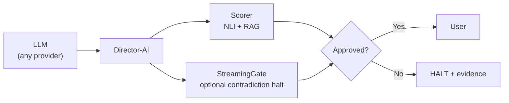
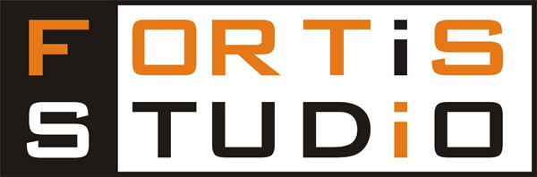

<!--
SPDX-License-Identifier: Apache-2.0
Commercial license available
© Concepts 1996–2026 Miroslav Šotek. All rights reserved.
© Code 2020–2026 Miroslav Šotek. All rights reserved.
ORCID: 0009-0009-3560-0851
Contact: www.anulum.li | protoscience@anulum.li
Director-Class AI — Repository overview
-->

<p align="center">
  
</p>

<h1 align="center">Director-AI</h1>

<p align="center">
  <strong>Response-level LLM hallucination guardrail — NLI + RAG grounding, sealed audit evidence, and opt-in streaming contradiction checks</strong>
</p>

<p align="center">
  <a href="https://github.com/anulum/director-ai/actions/workflows/ci.yml"></a>
  <a href="https://github.com/anulum/director-ai/actions/workflows/pre-commit.yml"></a>
  <a href="https://github.com/anulum/director-ai/actions/workflows/codeql.yml"></a>
  <a href="https://pypi.org/project/director-ai/"></a>
  <a href="https://pypi.org/project/director-ai/"></a>
  <a href="https://pepy.tech/projects/director-ai"></a>
  <a href="https://codecov.io/gh/anulum/director-ai"></a>
  <a href="https://www.python.org/downloads/"></a>
  <a href="https://www.apache.org/licenses/LICENSE-2.0"></a>
  <a href="https://mariadb.com/bsl11/"></a>
  <a href="https://doi.org/10.5281/zenodo.18822167"></a>
  <a href="https://anulum.github.io/director-ai"></a>
  <a href="https://www.bestpractices.dev/projects/12102"></a>
  <a href="https://securityscorecards.dev/viewer/?uri=github.com/anulum/director-ai"></a>
  <a href="https://api.reuse.software/info/github.com/anulum/director-ai"></a>
</p>

---

## Product Ladder

| Tier | Install / delivery | Price | Ships |
|---|---|---:|---|
| **Director-Lite** | `pip install director-ai-lite` | USD 0 | Three-line guard facade, model-free heuristic default, facts/RAG handoff, optional NLI upgrade |
| **Director-AI** | `pip install director-ai` | USD 0 | Open-core runtime: `guard()`, 5-tier scoring, REST/gRPC server, SDK and framework integrations, evidence packets, opt-in streaming contradiction halt |
| **Director-AI Pro** | `pip install director-ai-pro` (private index) | USD 199/mo | Adds the BUSL-1.1 Advanced modules: compliance, enterprise, streaming repair, multimodal, routing, threat intel, and more |
| **Director-AI Full** | `pip install director-ai-full` (private index) | Contact | Pro plus the Labs/Research modules (neuro-symbolic, self-evolving, swarm economics, emergence oracle, …) |
| **Director-Class AI** | Commercial engagement | Custom | Premium category: managed deployment, customer-specific sector packs, tuning/evaluation, evidence reviews, SLA, procurement support |

**→ [Full pricing &amp; plans](https://anulum.github.io/director-ai/pricing/)** — Pro
self-host, Founding Member, and the Director-Class engagement, with a free 30-day
pilot.

PyPI is the adoption front door. `director-ai-lite` is the free package we
publish and promote first for the smallest useful experience; `director-ai`
remains the full open-core package and the technical base for paid Pro
self-hosting. Director-Class AI is promoted from PyPI and the docs, but it is
not a separate wheel: it is the premium implementation and evidence programme
around the software.

## The one-command demo

The narrow thing Director-AI does, end to end — load a small policy knowledge
base, approve a grounded answer, block a hallucinated one, and emit a
tamper-evident record of every decision:

```bash
pip install "director-ai[nli]"
director-ai evidence --emit evidence/        # runs the 7-step demo, writes a sealed packet
director-ai verify-evidence evidence/        # re-checks the packet's integrity + outcomes
```

The seven steps the packet records:

1. Load ~20 policy facts into the knowledge base.
2. Ask the LLM a policy question.
3. A **grounded** answer is approved.
4. A **hallucinated** answer is blocked.
5. (Experimental) streaming oversight is exercised on the token stream.
6. An evidence JSON (Answer Bill of Materials + OpenTelemetry eval record) is emitted.
7. The decision is written to the audit log.

`evidence_packet.json` is sealed with a SHA-256 digest, so a reviewer can verify
it without re-running the guard. (Clear separation of grounded vs hallucinated
needs the model-backed scorer from the `[nli]` extra.)

---

## About

Director-AI is an internal research tool developed at [ANULUM Institute](https://www.anulum.li) as part of the [God of the Math Collection](https://www.anulum.li) (GOTM) — a multi-project scientific computing ecosystem spanning neuroscience, plasma physics, stochastic computing, and AI safety.

The system was built to solve a specific internal need: **response-level hallucination detection for LLM outputs used in scientific pipelines**, where a single fabricated number or citation can invalidate downstream analysis. The core is open source under Apache-2.0; the advanced and labs capabilities are source-available under BUSL-1.1.

**Team:** ANULUM maintains a research team (intentionally undisclosed). GitHub automation and repository maintenance are handled by the owner. Contributions to the Apache-2.0 core are welcome under the Apache-2.0 terms.

**Distribution boundary:** this public repository contains the open core,
public SDKs, public integrations, baseline evaluation surfaces, and general
documentation. The complete Director-AI product also includes proprietary
commercial extensions that are not published here, including customer-specific
implementation packages, sector-specific tuning/evaluation packs, private
deployment recipes, and customer-owned knowledge-base adaptation work. Those
materials are provided only under separate commercial agreements and must be
validated against the customer's own governed data, controls, and acceptance
criteria before any customer-specific performance claim is made.

> **Active Development** — APIs may evolve. The production-validated core is response-level scoring: the guardrail engine and 5-tier scoring (rules → embeddings → NLI), the SDK guard, FastAPI middleware, REST server, injection detection, and the agent/MCP preflight guard. Response-level hallucination accuracy is benchmarked on LLM-AggreFact and HaluEval-style end-to-end traces. The streaming contradiction halt is opt-in and evidence-bound; current local evidence is recorded in `benchmarks/results/streaming_contradiction_halt_base.json` and should not be used as the sole production gate. Deeper capabilities live under **Advanced & Labs** in the docs. Rust-accelerated compute paths shipped in the v3.12 line and remain part of the current release surface.

---

## What It Does

Director-AI sits between your LLM and the user. It scores completed outputs for hallucination against governed facts before the answer ships. The optional streaming path can halt completed streamed claims when they contradict retrieved grounding facts, but response-level scoring remains the primary production gate.


```mermaid
graph LR
    LLM["LLM<br/>(any provider)"] --> D["Director-AI"]
    D --> S["Scorer<br/>NLI + RAG"]
    D --> K["StreamingGate<br/>optional contradiction halt"]
    S --> V{Approved?}
    K --> V
    V -->|Yes| U["User"]
    V -->|No| H["HALT + evidence"]
```

## What It Is For

Director-AI is a factual-coherence control plane for teams that need LLM output
to remain tied to governed facts before the answer is displayed, streamed,
stored, handed to another agent, or used in a business workflow.

## Executive Snapshot

Director-AI is not a prompt template, chatbot UI, or generic moderation filter.
It is a guardrail runtime for factual-risk control:

- **Before output reaches users:** score a candidate answer against governed
  facts, NLI contradiction signals, retrieval evidence, and structured checks.
- **While output is streaming:** contradiction-driven streaming halt can stop a
  token stream when a completed claim contradicts governed facts.
- **Inside agent workflows:** inspect tool outputs, handoffs, and trajectory
  steps before downstream action.
- **For operators:** emit tenant-safe evidence, metrics, halt reasons, and
  compliance packets that can be reviewed without exposing raw customer data.

The strongest open-core value is the combination of response-level RAG/NLI
verification, contradiction-driven streaming halt, local low-latency execution,
Rust acceleration, REST/gRPC deployment surfaces, and evidence-first documentation.
The commercial value is
reducing factual incidents in high-consequence workflows while giving teams a
portable control layer across models, providers, and deployment targets.

| Application | Protected surface | Value |
|-------------|-------------------|-------|
| Customer support | Policy, refund, warranty, and account answers | Reduce unsupported customer-facing claims |
| Regulated research | Scientific, medical, legal, and finance summaries | Reject unsupported claims with evidence |
| RAG assistants | Private knowledge-base answers | Link verdicts to retrieved facts |
| Streaming chat | Partial token streams | Halt bad output before completion |
| Agent workflows | Tool outputs and handoffs | Check each step before downstream action |
| Evaluation pipelines | Prompt/response datasets | Build regression gates and threshold evidence |
| Enterprise governance | Tenant-safe audit events | Provide reviewable risk and compliance evidence |

The open repository is the public core: SDK guard, scoring, retrieval,
verification, APIs, integrations, and operator documentation. Customer-specific
sector packs, deployment recipes, tuning data, and acceptance evidence belong
to commercial implementation work and must be validated against the customer's
own governed data.

Start with the [Applications and Market Map](docs-site/guide/applications-and-market-map.md)
for a plain-language explanation of what the software is, who uses it, and where
it creates commercial value. Then read the
[Product Overview](docs-site/guide/product-overview.md) and use
[Evaluation Onboarding](docs-site/guide/onboarding.md) to run a scoped pilot.

## Choose Your Path

| Reader | First 30 minutes | Evidence to produce |
|---|---|---|
| Product or market evaluator | Read [Applications and Market Map](docs-site/guide/applications-and-market-map.md), [Product Overview](docs-site/guide/product-overview.md), [Market Value](docs-site/guide/market-value-and-positioning.md), and [Guardrail Landscape](docs-site/guide/guardrail-landscape.md) | One-page use case, risk surface, and competing control options |
| Developer | Run [Quickstart](docs-site/quickstart.md), then wrap an SDK client with [`guard()`](docs-site/api/guard.md) | One known-good answer approved and one known-bad answer rejected |
| RAG engineer | Run [KB Ingestion](docs-site/guide/kb-ingestion.md) and [Vector Store](docs-site/api/vector-store.md) | Retrieval chunks tied to a rejection or approval |
| Platform operator | Read [Production Guide](docs-site/deployment/production.md), [Metrics](docs-site/deployment/metrics.md), and [Runbooks](docs-site/deployment/runbooks.md) | Authenticated service, metrics scrape, and rollback/escalation path |
| Enterprise pilot owner | Use [Evaluation Onboarding](docs-site/guide/onboarding.md) and [Notebook Gallery](docs-site/notebook-gallery.md) | Labelled sample, threshold decision, false-positive examples, owner sign-off |

## Evidence-first deployment surfaces

The public core is not only a scorer. It ships the surfaces operators need to
prove what happened, where the guard ran, and which boundary stopped or allowed
an output.

| Surface | What it gives operators | Start here |
|---|---|---|
| Evidence packet CLI | A sealed local demo packet that approves one grounded answer, rejects one hallucinated answer, and verifies the packet digest | `director-ai evidence --emit evidence/` then `director-ai verify-evidence evidence/` |
| Voice Guard | Token filtering and guarded TTS/STT pipeline adapters for voice AI flows | [Voice AI](docs-site/guide/voice-ai.md) |
| Inference-server hooks | Pre-sampling reject/mask hooks for vLLM, TGI, and llama.cpp deployments | [Inference-server hooks](docs-site/integrations/inference-server-hooks.md) |
| Supply-chain controls | Model/dependency provenance, SBOM/ML-BOM surfaces, and deployment pinning guidance | [Supply chain](docs-site/deployment/supply-chain.md) |
| Guardrail forensics | Tenant-safe missed-case reports for score, evidence, model revision, and operator action review | [Guardrail forensics](docs-site/api/guardrail-forensics.md) |

### Core capabilities

- **Response-level grounding** — scores a candidate answer against governed facts with NLI contradiction signals and retrieval evidence; benchmarked on LLM-AggreFact. This is the production-validated path.
- **Opt-in streaming contradiction halt** — scores completed streamed claims against retrieved facts and can sever output when a claim contradicts governed knowledge. Current local evidence is `benchmarks/results/streaming_contradiction_halt_base.json` (`non_isolated_local_regression`, 135 good / 3 bad cases); unsupported-but-not-contradictory additions remain a response-review concern, and this path is not the sole production gate.
- **Dual-entropy scoring** — NLI contradiction detection (0.4B DeBERTa) + RAG fact-checking against your knowledge base.
- **Selectable scorer models** — choose a benchmarked local scorer profile for the latency/accuracy trade-off you need, without changing the guarded LLM provider.
- **Customer Model Factory primitives** — validate customer-owned guardrail
  traces, bind training/benchmark/deployment evidence, and export runtime
  package manifests. Customer-specific sector packs, tuning recipes, and
  implementation packages are proprietary commercial extensions and are not
  published in this repository.
- **Structured output verification** — JSON schema validation, numeric consistency, reasoning chain verification, temporal freshness scoring. Stdlib-only, zero dependencies.
- **Intent-grounded injection detection** — two-stage pipeline: regex pattern matching (fast) + bidirectional NLI divergence scoring (semantic). Detects the *effect* of injection in the output.
- **20 benchmarked Rust compute functions** — 7.23× geometric mean speedup over Python paths in the committed local benchmark packet. Transparent fallback when Rust kernel is not installed.

## Business outcomes

- reduce factual-incident risk in customer-facing and decision-support workflows;
- reduce manual rework from unsupported claims;
- provide clear evidence and audit trails for tenant review, compliance mapping, and model changes;
- compare and switch models with deterministic scoring gates instead of opaque heuristics.

For a buyer-facing positioning, start from [Market Value and Positioning](docs-site/guide/market-value-and-positioning.md).

The shipped core is the **Core capabilities** above; the full module-by-module
inventory below is reference for the deeper surface, navigable under
**Advanced & Labs** in the docs.

<details>
<summary><strong>Full capability catalogue</strong> — expand for the complete module inventory (advanced reference)</summary>

<!-- capability-snapshot:start -->
<!-- SPDX-License-Identifier: Apache-2.0 -->
<!-- Generated by tools/capability_manifest.py; do not edit counts by hand. -->

### Director-AI Capability Inventory

| Surface | Current inventory |
|---|---:|
| Package version | 3.16.0 |
| Public API exports | 226 |
| Python capability source modules | 460 |
| Python capability classes | 1001 |
| API documentation pages | 89 |
| Rust PyO3 bindings | 83 |
| Optional extras | 59 |
| Python test files | 623 |
| Public documentation pages | 203 |
| GitHub Actions workflows | 14 |

Evidence boundary: this snapshot is a static inventory. Performance, coverage, hardware, and scientific-fidelity claims require their own committed evidence artefacts.
<!-- capability-snapshot:end -->

### Selectable scorer models

Director-AI guards any upstream LLM, but the guardrail scorer itself is
configurable. Stable runtime choices are exposed through
`GET /v1/scorer/models` and selected with `DIRECTOR_SCORER_MODEL`:

| Alias | Runtime source | Status | General BA | Use when |
|-------|----------------|--------|-----------:|----------|
| `balanced-default` | managed FactCG DeBERTa v3 large artefact | stable | 0.752 | default balanced accuracy/latency profile |
| `deberta-small` | managed DeBERTa v3 small artefact | stable | 0.747 | lower-cost deployments close to default accuracy |
| `deberta-large-nli` | managed DeBERTa v3 large NLI artefact | stable | 0.740 | alternate large-NLI baseline |

```bash
DIRECTOR_SCORER_MODEL=balanced-default director-ai serve
DIRECTOR_SCORER_MODEL=deberta-small director-ai serve
```

Domain-only and custom scorer models require explicit operator opt-in:
`DIRECTOR_ALLOW_DOMAIN_ONLY_SCORER_MODEL=true` or
`DIRECTOR_ALLOW_CUSTOM_SCORER_MODEL=true`. Each selectable scorer has a
per-model benchmark package plan in
[`benchmarks/model_benchmark_packages.toml`](benchmarks/model_benchmark_packages.toml);
full external benchmark packages are required before public model-specific claims.

### Customer Model Factory Public Core

Director-AI exposes the public core primitives needed to package guardrail
scorers without changing the guarded application provider. The implemented
public factory primitives cover:

- customer trace validation with split, leakage, tenant-boundary, severity,
  reference, and secrets/redaction checks;
- training manifests with immutable base-model provenance and Vertex,
  customer-cloud, on-prem, or local-pilot lanes;
- benchmark selection with conservative, balanced, low-latency, high-recall,
  and zero silent unsafe passes objective profiles;
- deployment, evidence-pack, and runtime-package manifests with deterministic
  hashes, audit-log URIs, rollback URIs, customer-controlled telemetry, and no
  external callback by default.

Sector-specific packages, customer database-class mappings, customer-private
retrieval schemas, tuning recipes, and customer-specific benchmark packages are
commercial extensions outside the public repository. The public repository
documents the interfaces and evidence boundaries; customer-specific packages
must be built and measured against the customer's own governed knowledge base
and approval criteria.

Customer examples are local helpers that consume the generated runtime package
shape without opening network connections:

```bash
python examples/customer_model_factory_runtime.py
python examples/customer_model_factory_rest_payload.py
```

The runtime package schema is
[`schemas/customer-model-factory-runtime-package.schema.json`](schemas/customer-model-factory-runtime-package.schema.json).
Customer-specific accuracy claims require package-specific benchmark evidence;
the factory exposes the controls needed to pursue high-assurance deployments
without making unscoped accuracy promises.

### Advanced RAG (6 pluggable retrieval strategies)

All independently toggleable via config, composable as a decorator stack:

| Strategy | What it does | Config field |
|----------|-------------|--------------|
| **Parent-child chunking** | Index small chunks, return large parents for context | `parent_child_enabled` |
| **Adaptive retrieval** | Skip KB lookup for creative/conversational queries | `adaptive_retrieval_enabled` |
| **HyDE** | LLM generates pseudo-answer, embeds that for retrieval | `hyde_enabled` |
| **Query decomposition** | Split compound queries, retrieve for each, merge via RRF | `query_decomposition_enabled` |
| **Contextual compression** | Keep only query-relevant sentences from retrieved passages | `contextual_compression_enabled` |
| **Multi-vector** | Index content + summary + title representations per doc | `multi_vector_enabled` |

On top of the existing hybrid (BM25+dense), cross-encoder reranking, ColBERT, and 11 vector backends (Chroma, Pinecone, Qdrant, FAISS, Weaviate, Elasticsearch, etc.).

### Multi-agent swarm guardian

Guard entire agent swarms — not just individual LLM calls:

- **SwarmGuardian**: central registry with cross-agent contradiction detection + cascade halt
- **AgentProfile**: per-agent thresholds (researcher vs summariser vs coder)
- **HandoffScorer**: score inter-agent messages before handoff
- **Framework adapters**: LangGraph, CrewAI, OpenAI Swarm, AutoGen — zero framework deps

### Additional modules

Meta-confidence estimation, online calibration from feedback, contradiction tracking across turns, agentic loop monitoring, adversarial robustness testing (25 patterns), EU AI Act audit trails, domain presets (medical/finance/legal/creative), cross-model consensus, conformal prediction intervals and uncertainty routing, token cost analyser, compliance report templates (HTML/Markdown), config wizard (Gradio UI + CLI).

### Agent safety hooks

Opt-in modules that plug into `CoherenceAgent` without changing
existing behaviour — configured together or not at all.

- **Cyber-physical grounding** (`core.cyber_physical`) — pre-action
  AABB / sphere collision and two-link analytical IK; lazy-loaded
  ROS 2 / MuJoCo / CARLA adapters.
- **Simulation containment** (`core.containment`) — HMAC-signed
  `RealityAnchor` binding a session to a `sandbox` / `simulator` /
  `shadow` / `production` scope, with a rule-based breakout
  detector (production-host calls, anti-anchor prompt injection,
  scope mismatch).
- **Cross-org passports** (`core.zk_attestation`) — `PassportIssuer`
  and `PassportVerifier` with an HMAC Merkle commitment backend
  plus a `ZkSnarkBackend` plug-in Protocol for real zero-knowledge
  adapters.

See the [API reference](docs-site/api/cyber-physical.md) pages for
the full surface.

### Multi-language components (all optional)

| Component | Path | Purpose |
|-----------|------|---------|
| **Rust `backfire-kernel`** | `backfire-kernel/` | 83 PyO3 bindings, including 20 compute functions measured in the committed Rust-vs-Python benchmark |
| **Go gateway** _(experimental)_ | `gateway/go/` | High-concurrency HTTP front door (auth, rate limit, audit). A passthrough proxy today; Python scoring integration is in progress (Phase 3) |
| **`director.v1` wire schema** | `schemas/proto/` | Frozen protobuf messages shared by Python and Go |
| **CoherenceScoring gRPC** | `src/director_ai/grpc_scoring.py` | `ScoreClaim` unary + `ScoreStream` bidi RPCs over `director.v1` |
| **Julia threshold tuner** | `tools/julia_tuner/` | Offline bootstrap + Bayesian threshold analysis with uncertainty bands |
| **Lean 4 formal proof** | `formal/HaltMonitor/` | Machine-checked guarantee that sub-threshold tokens cannot be emitted |

Python stands on its own — every non-Python component is additive and
toggled by an env var, flag, or optional dependency. See
[`ARCHITECTURE.md`](ARCHITECTURE.md) for the full layout and
[`gateway/go/README.md`](gateway/go/README.md),
[`tools/julia_tuner/README.md`](tools/julia_tuner/README.md),
[`formal/README.md`](formal/README.md),
[`schemas/README.md`](schemas/README.md) for per-component details.

</details>

Full documentation: [anulum.github.io/director-ai](https://anulum.github.io/director-ai)

---

## Quick Start

### Wrap your SDK (6 lines)

```python
from director_ai import guard
from openai import OpenAI

client = guard(
    OpenAI(),
    facts={"refund_policy": "Refunds within 30 days only"},
)
response = client.chat.completions.create(
    model="gpt-4o-mini",
    messages=[{"role": "user", "content": "What is the refund policy?"}],
)
```

### One-shot check (4 lines)

```python
from director_ai import score

cs = score("What is the refund policy?", response_text,
           facts={"refund": "Refunds within 30 days only"},
           threshold=0.3)
print(f"Coherence: {cs.score:.3f}  Approved: {cs.approved}")
```

### Proxy (2 lines, zero code changes)

```bash
pip install director-ai[server]
director-ai proxy --port 8080 --facts kb.txt --threshold 0.3
```

Set `OPENAI_BASE_URL=http://localhost:8080/v1` in your app. Every response gets scored.

### FastAPI middleware (3 lines)

```python
from director_ai.integrations.fastapi_guard import DirectorGuard

app.add_middleware(DirectorGuard,
    facts={"policy": "Refunds within 30 days only"},
    on_fail="reject",
)
```

Also available: LangChain, LlamaIndex, LangGraph, Haystack, CrewAI, Semantic Kernel, DSPy integrations.

---

## Installation

Three buyer-facing bundles cover most needs — no need to assemble extras by hand:

```bash
pip install director-ai                            # core: rule-based + heuristic scoring (zero ML deps)
pip install "director-ai[recommended]"             # production guardrail: NLI scoring + RAG + REST API
pip install "director-ai[integrations]"            # framework adapters (LangChain, LlamaIndex, LangGraph, …)
pip install "director-ai[all]"                     # the common capability set in one shot
```

Or pick granular extras for fine control:

```bash
pip install "director-ai[nli]"                     # NLI model scoring (77.8% BA in committed AggreFact packet)
pip install "director-ai[embed]"                   # embedding scorer (~65% BA, CPU-only, 3ms)
pip install director-ai-lite                       # 3-line guard facade
pip install "director-ai[nli,vector,server]"       # equivalent to [recommended]
pip install "director-ai[ui]"                      # config wizard (Gradio web UI)
pip install "director-ai[reports]"                 # PDF/HTML compliance reports
pip install "director-ai[physical]"                # MuJoCo physical adapter runtime
```

For reproducible installs the repo ships a `uv.lock` at the root;
`uv sync` installs the exact resolved versions.
Heavy optional extras use the policy in
`requirements/OPTIONAL_EXTRA_LOCKS.md`.
ROS 2 and CARLA are vendor/distribution installs; keep them in the same
isolated runtime as `[physical]`, not in the default quickstart environment.
ZK prover adapters are also isolated operator runtimes: pin the prover,
verifier, circuit artefacts, and proving key by immutable release or digest,
and keep `CommitmentBackend` enabled as the fallback.

The MiniCheck backend is opt-in and not on PyPI — install it manually
alongside any other extras:

```bash
pip install "minicheck @ git+https://github.com/Liyan06/MiniCheck.git"
```

### 5-tier scoring backends

| Tier | Backend | Accuracy | Latency | Install |
|------|---------|----------|---------|---------|
| **5** | NLI (FactCG) | **77.8% BA** | see latency table | `[nli]` |
| **4** | Distilled NLI (preview) | validation required | measured per artefact | `[nli-lite]` |
| **3** | Embedding (bge-small) | ~65% BA | 3 ms | `[embed]` |
| **2** | Rules engine (8 rules) | rule-based | <1 ms | — (base) |
| **1** | Heuristic (lite) | ~55% BA | <1 ms | — (base) |

Select via config: `scorer_backend="rules"`, `"embed"`, `"deberta"`, or `"lite"`.

| Layer | What you get | Install extra |
|-------|-------------|---------------|
| **Core** (zero heavy deps) | `CoherenceScorer`, `StreamingKernel`, `GroundTruthStore`, rules engine | — |
| **Embeddings** | Sentence-transformer cosine-similarity scorer | `[embed]` |
| **NLI models** | DeBERTa, FactCG, MiniCheck, ONNX Runtime | `[nli]` |
| **Vector DBs** | Chroma, Pinecone, Weaviate, Qdrant | `[vector]` / `[pinecone]` / etc. |
| **Server** | FastAPI + Uvicorn REST/gRPC | `[server]` |
| **Rust kernel** | 20 benchmarked compute functions | `[rust]` (requires maturin) |
| **Voice** | ElevenLabs, OpenAI TTS, Deepgram adapters | `[voice]` |

Python 3.11+. Full guide: [docs/installation](https://anulum.github.io/director-ai/installation/).

---

## Benchmarks

### Accuracy — LLM-AggreFact (29,320 samples)

Two judges ship with this release.

**Default — `yaxili96/FactCG-DeBERTa-v3-Large`** (0.4B params, MIT). The fast NLI baseline.

| Rank | Model | Per-dataset mean BA | Params | Latency | Streaming |
|------|-------|---------------------|--------|---------|-----------|
| #1 | Bespoke-MiniCheck-7B | **77.4%** | 7B | ~100 ms | No |
| **#6** | **Director-AI (FactCG)** | **77.8%** | 0.4B | see latency table | **Yes** |
| #8 | MiniCheck-Flan-T5-L | 75.0% | 0.8B | ~120 ms | No |

With per-dataset threshold tuning (no retraining), FactCG reaches **78.0%** in the committed threshold packet. This is the same 0.4B model and single `pip install`; latency depends on backend and hardware.

Latency: the committed GTX 1060 6GB local packet reports 17.9 ms/pair p99 for a 16-pair batch. Full comparison: [`benchmarks/comparison/COMPETITOR_COMPARISON.md`](benchmarks/comparison/COMPETITOR_COMPARISON.md).

> **Note on metrics.** The numbers in the table above use the
> AggreFact leaderboard convention — **per-dataset mean balanced
> accuracy across the 11 datasets** ([source: llm-aggrefact.github.io](https://llm-aggrefact.github.io/)).
> Sample-pooled balanced accuracy is a different metric and is
> systematically higher on heterogeneous benchmarks. Both numbers
> are reported in `training/EXPERIMENT_RESULTS.md` for
> traceability.

**Optional — Gemma 4 E4B Q6 with per-task-family routing.** A zero-training LLM-as-judge alternative for users who prefer LLM-as-judge architectures over NLI. Per-task-family prompts (`summ` / `rag` / `claim`) bring the routed Gemma judge to 75.55% per-dataset mean BA on the AggreFact 29K test set, comparable to the FactCG default. The routed judge is opt-in (`--backend llama-cpp`); FactCG remains the default.

### Rust compute acceleration (shipped in v3.12, current in v3.16)

20 functions, 3000 iterations each. Geometric mean: **7.23× speedup**.

| Function | Python (µs) | Rust (µs) | Speedup |
|----------|------------|-----------|---------|
| sanitizer_score | 33.42 | 1.25 | 26.74× |
| score_temporal_freshness | 31.74 | 1.99 | 15.95× |
| probs_to_confidence (200×3) | 227.14 | 8.04 | 28.25× |
| lite_score | 20.15 | 13.12 | 1.54× |

Full results: [`benchmarks/results/rust_compute_bench.json`](benchmarks/results/rust_compute_bench.json).

### Cross-platform NLI latency (p99, 16-pair batch)

| Platform | Type | Per-pair p99 | Batch p99 (16p) | Notes |
|----------|------|-------------|-----------------|-------|
| GTX 1060 6GB | CUDA 12.6 | **17.9 ms** | 287 ms | PyTorch FP32, 100 iterations |
| RX 6600 XT 8GB | ROCm 6.2 | 80.1 ms | 1,282 ms | hipBLAS fallback |
| EPYC 9575F 4C | CPU | 118.9 ms | 1,903 ms | UpCloud cloud, Zen 5 |
| Xeon E5-2640 2×6C | CPU | 207.3 ms | 3,317 ms | ML350 Gen8, 128 GB RAM |

Heuristic-only (no NLI): p99 < 0.5 ms on all platforms.
Raw data: [`benchmarks/results/`](benchmarks/results/).
Reproduction manifest:
[`benchmarks/PUBLIC_BENCHMARKS.md`](benchmarks/PUBLIC_BENCHMARKS.md).

---

## Known Limitations

Be aware of these before deploying:

- **Default NLI-only end-to-end catch rate is 46.7% on the committed HaluEval-style trace set**: use this as a calibration baseline, not a finished enterprise claim. Hybrid judge mode reaches 90.7% catch rate on the same family but has 64.0% overall FPR and multi-second latency; it needs threshold tuning and task scoping before production use.
- **RAGTruth NLI-only performance is weak**: the committed L40S run reports 49.3% catch rate, 40.9% FPR, 39.3% precision, and 43.7% F1. Treat RAGTruth as an open accuracy lane, not a solved product claim.
- **FreshQA without grounding over-rejects**: the committed FreshQA run reports 98.6% catch rate but 97.8% FPR. Do not use ungrounded FreshQA catch rate as a buyer claim.
- **Fine-tuning is not a current sales capability**: the NLI fine-tuning survey shows 22/23 fine-tunes regressed against the FactCG baseline. Customer Model Factory work must start from evaluation, thresholds, packaging, and evidence review; any customer-specific tuning claim requires new held-out evidence.
- **Heuristic fallback is weak**: Without `[nli]`, scoring uses word-overlap (~55% accuracy). Not recommended for production.
- **Summarisation FPR is 10.5%**: Reduced from 95% via bidirectional NLI + baseline calibration (v3.5). Still too high for some use cases — tune thresholds per domain.
- **NLI needs KB grounding**: Without a knowledge base, stock regulated-domain profiles over-reject badly in checked artifacts (PubMedQA FPR=100%, FinanceBench FPR=100% at t=0.30). Treat them as calibration starting points.
- **Streaming halt is evidence-bound**: contradiction-driven streaming halt is opt-in. The current contradiction benchmark reports 1.48% false-halt rate on 135 known-good passages and 66.7% recall on a 3-case bad-passage smoke set under non-isolated local conditions. It is useful as a guarded contradiction interlock, not as a standalone hallucination-prevention claim.
- **ONNX CPU is slow**: 383 ms/pair without GPU. Use `onnxruntime-gpu` for production.
- **Long documents need ≥16 GB VRAM**: Chunked NLI on legal/financial docs exceeds 6 GB.
- **LLM-as-judge sends data externally**: When enabled, truncated prompt+response (500 chars) go to the configured provider. Off by default.
- **Domain presets are starting points**: Default thresholds need tuning for your data. Domain benchmark scripts exist but results are not yet validated.

---

## Docker

```bash
docker build -t director-ai .                          # CPU
docker build -f Dockerfile.gpu -t director-ai:gpu .    # GPU
docker run -p 8080:8080 director-ai                    # run
```

Kubernetes: [Helm chart](deploy/helm/director-ai/) with GPU toggle, HPA, Sigstore-signed releases.

---

## Citation

```bibtex
@software{sotek2026director,
  author    = {Sotek, Miroslav},
  title     = {Director-AI: Real-time LLM Hallucination Guardrail},
  year      = {2026},
  url       = {https://github.com/anulum/director-ai},
  version   = {3.16.0},
  license   = {Apache-2.0 AND BUSL-1.1}
}
```

## License

Open-core. Every source file carries an SPDX `SPDX-License-Identifier`, and the
repository is [REUSE](https://reuse.software/)-compliant — run `reuse lint` to
verify.

1. **Core — [Apache-2.0](LICENSES/Apache-2.0.txt).** The guardrail engine,
   5-tier scoring (rules → embeddings → NLI), SDK guard, FastAPI middleware,
   REST server, injection detection, streaming halt, and the agent/MCP preflight
   guard. Free for any use, including production and closed-source.
2. **Advanced & Labs — [BUSL-1.1](LICENSES/BUSL-1.1.txt).** The advanced
   capabilities under `core/<advanced>/`, `enterprise/`, `voice/`, `ui/`,
   `experimental/`, `compliance/`, and `agentic/`. Source-available: free for
   non-production and evaluation use; production and hosted/SaaS use require a
   commercial licence. Each file converts to Apache-2.0 on its change date.

Commercial licences for the advanced tier:
[anulum.li/licensing](https://www.anulum.li/licensing) ·
[director.class.ai@anulum.li](mailto:director.class.ai@anulum.li)

## Support and commercial paths

- **Start free:** `pip install director-ai-lite`.
- **Use the full open core:** `pip install director-ai`.
- **Buy Director-AI Pro:** production rights for Advanced & Labs, support, and a
  self-hosted deployment path via [pricing](https://anulum.github.io/director-ai/pricing/)
  or [licensing](https://www.anulum.li/licensing).
- **Engage Director-Class AI:** managed deployment, tuning, evidence reviews,
  procurement support, and SLA work.
- **Sponsor the public core:** [GitHub Sponsors](https://github.com/sponsors/anulum).

## Community

- **Chat** — [Discord](https://discord.gg/38HsXDYqy).
- **Questions, ideas, show-and-tell** —
  [GitHub Discussions](https://github.com/anulum/director-ai/discussions).
- **Bugs and feature requests** —
  [GitHub Issues](https://github.com/anulum/director-ai/issues).
- **Commercial and licensing enquiries** — protoscience@anulum.li.

## Contributing

See [CONTRIBUTING.md](CONTRIBUTING.md). Contributions to the Apache-2.0 core are
accepted under the Apache-2.0 licence.

---

<p align="center">
  <a href="https://www.anulum.li">
    
  </a>
  &nbsp;&nbsp;&nbsp;&nbsp;
  <a href="https://www.anulum.li">
    
  </a>
  <br>
  <em>Developed by <a href="https://www.anulum.li">ANULUM Institute</a> / Fortis Studio — Marbach SG, Switzerland</em>
</p>
