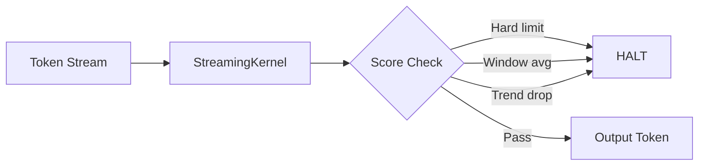

# StreamingKernel

Token-by-token streaming oversight. Monitors coherence on every token (or every N-th token) and halts generation when coherence degrades. Three independent halt mechanisms operate simultaneously.

## Usage

```python
from director_ai import StreamingKernel

kernel = StreamingKernel(
    hard_limit=0.4,
    window_size=10,
    window_threshold=0.55,
    trend_window=5,
    trend_threshold=0.15,
)

session = kernel.stream_tokens(token_generator, coherence_callback)

if session.halted:
    print(f"Halted at token {session.halt_index}: {session.halt_reason}")
    print(f"Safe output: {session.output}")
else:
    print(f"Approved: {session.output}")
```

## Halt Mechanisms

| Mechanism | Trigger | Parameter |
|-----------|---------|-----------|
| **Hard limit** | Any single score < threshold | `hard_limit` |
| **Sliding window** | Rolling average drops below threshold | `window_size`, `window_threshold` |
| **Downward trend** | Coherence drops by > delta over N tokens | `trend_window`, `trend_threshold` |



## Constructor Parameters

| Parameter | Type | Default | Description |
|-----------|------|---------|-------------|
| `hard_limit` | `float` | `0.5` | Absolute coherence floor |
| `window_size` | `int` | `10` | Sliding window width |
| `window_threshold` | `float` | `0.5` | Window average threshold |
| `trend_window` | `int` | `5` | Trend detection window |
| `trend_threshold` | `float` | `0.15` | Max allowed coherence drop |
| `soft_limit` | `float \| None` | `None` | Warning zone (warn but don't halt) |
| `on_halt` | `callable \| None` | `None` | Callback invoked on halt |
| `halt_mode` | `str` | `"hard"` | `"hard"` = stop, `"soft"` = warn + continue |
| `score_every_n` | `int` | `1` | Score every N-th token (latency tradeoff) |
| `streaming_debug` | `bool` | `False` | Emit per-token diagnostic snapshots |

## Methods

### stream_tokens()

```python
session = kernel.stream_tokens(
    token_generator,        # Iterable[str] — token source
    coherence_callback,     # Callable[[str], float] — returns coherence
    scorer=None,            # Optional CoherenceScorer for structured evidence
    top_k=3,                # Evidence chunks to include on halt
) -> StreamSession
```

### on_halt Callback

```python
def handle_halt(session):
    print(f"Halted at token {session.halt_index}")
    send_alert(session.halt_reason)

kernel = StreamingKernel(on_halt=handle_halt, hard_limit=0.4)
```

## Async Streaming {: #async }

```python
from director_ai import AsyncStreamingKernel

kernel = AsyncStreamingKernel(hard_limit=0.4, soft_limit=0.6)
session = await kernel.stream_to_session(async_token_gen, coherence_fn)
```

---

## StreamSession {: #streamsession }

Tracks the complete state of a streaming oversight session.

| Property | Type | Description |
|----------|------|-------------|
| `output` | `str` | Safe partial output (up to halt point) |
| `halted` | `bool` | Whether generation was stopped |
| `soft_halted` | `bool` | Whether soft halt was triggered |
| `halt_index` | `int` | Token index where halt occurred (-1 if none) |
| `halt_reason` | `str` | Which mechanism triggered halt |
| `halt_evidence_structured` | `HaltEvidence \| None` | Structured evidence with chunks |
| `token_count` | `int` | Total tokens processed |
| `warning_count` | `int` | Tokens in soft warning zone |
| `events` | `list[TokenEvent]` | Full event trace |
| `debug_log` | `list[dict]` | Debug snapshots (when `streaming_debug=True`) |

---

## TokenEvent {: #tokenevent }

A single token event in the stream.

| Field | Type | Description |
|-------|------|-------------|
| `token` | `str` | The token text |
| `index` | `int` | Position in stream |
| `coherence` | `float` | Coherence score at this position |
| `timestamp` | `float` | Unix timestamp |
| `halted` | `bool` | Whether this token triggered halt |
| `warning` | `bool` | Whether this token is in warning zone |
| `halt_evidence` | `HaltEvidence \| None` | Evidence if halt triggered |

---

## Full API

::: director_ai.core.runtime.streaming.StreamingKernel

::: director_ai.core.runtime.streaming.StreamSession

::: director_ai.core.runtime.streaming.TokenEvent

::: director_ai.core.runtime.async_streaming.AsyncStreamingKernel
