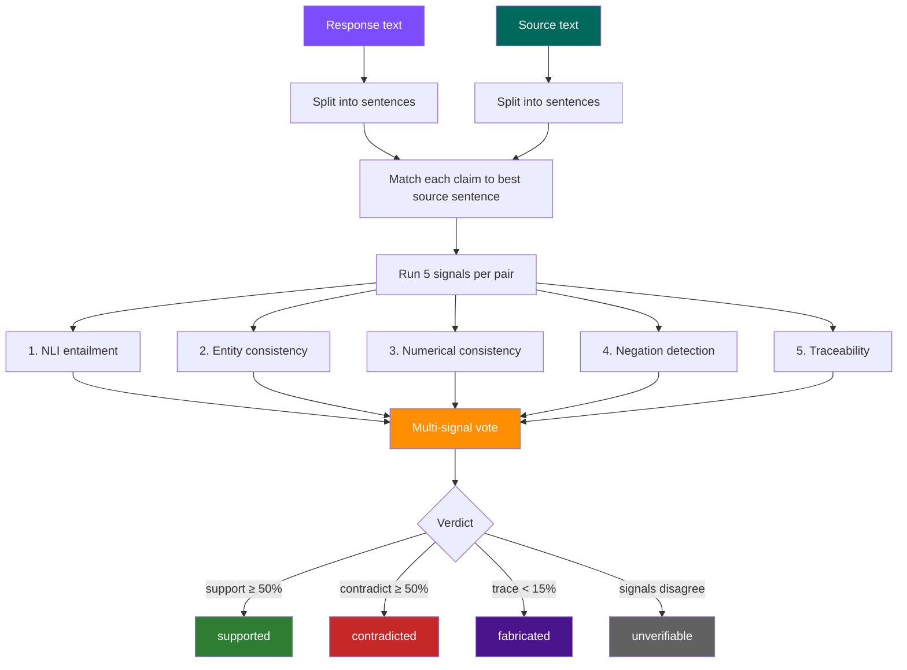
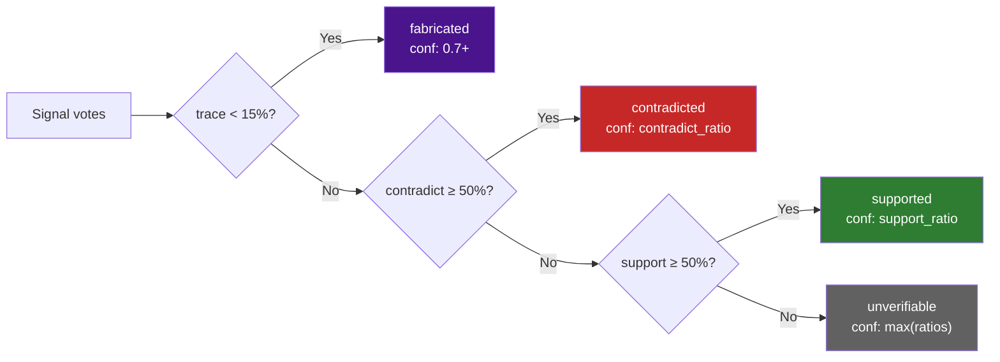

# VerifiedScorer

Sentence-level multi-signal fact verification. Decomposes both response and source into sentences, matches each response sentence to its best source sentence via NLI (or word overlap fallback), runs 5 independent signals, and reports per-claim verdicts with calibrated confidence.

```python
from director_ai import VerifiedScorer
```

## How It Works



## Usage

```python
from director_ai import VerifiedScorer

vs = VerifiedScorer()  # heuristic-only (no torch required)
result = vs.verify(
    response="The plan costs $99/month. Refunds within 60 days.",
    source="Pricing: $49/month. Refunds within 30 days only.",
)

print(result.approved)            # False
print(result.confidence)          # "high"
print(result.contradicted_count)  # 2
print(result.coverage)            # 0.0

for claim in result.claims:
    print(f"  [{claim.verdict}] {claim.claim}")
    print(f"    Source: {claim.matched_source}")
    print(f"    NLI divergence: {claim.nli_divergence:.2f}")
    print(f"    Entity match: {claim.entity_match:.2f}")
    print(f"    Numbers match: {claim.numerical_match}")
    print(f"    Negation flip: {claim.negation_flip}")
    print(f"    Traceability: {claim.traceability:.2f}")
    print(f"    Confidence: {claim.confidence:.2f}")
```

### With NLI Model

When an NLI scorer is provided, claim-to-source matching uses NLI divergence instead of word overlap, producing more accurate verdicts.

```python
from director_ai import NLIScorer, VerifiedScorer

nli = NLIScorer()  # requires director-ai[nli]
vs = VerifiedScorer(nli_scorer=nli)

result = vs.verify(
    response="Paris is the capital of Germany.",
    source="Paris is the capital of France.",
)
# contradicted: entity mismatch (Germany ≠ France) + NLI divergence
```

## The 5 Signals

Each claim-source pair is scored by 5 independent signals. Signals vote toward support, contradiction, or fabrication. The majority determines the verdict.

| # | Signal | Supports when | Contradicts when | Notes |
|---|--------|---------------|------------------|-------|
| 1 | **NLI entailment** | divergence < 0.35 | divergence > 0.65 | Primary signal when NLI model available. Falls back to word overlap. |
| 2 | **Entity consistency** | overlap ≥ 50% | overlap < 20% | Regex-based capitalized phrase extraction. Skipped when neither text has entities. |
| 3 | **Numerical consistency** | numbers match | numbers differ | Compares digit sequences. `None` (no vote) when neither text has numbers. |
| 4 | **Negation detection** | — | polarity flip detected | Requires ≥ 3 shared content words with opposite negation. Only votes to contradict. |
| 5 | **Traceability** | content overlap ≥ 50% | content overlap < 20% | Measures what fraction of claim's content words appear in source. Low = fabrication. |

### Signal Interaction Table

```
NLI  Entity  Number  Negation  Trace  → Verdict
───  ──────  ──────  ────────  ─────  ─────────
sup  sup     match   no flip   high   → supported (high conf)
sup  sup     —       no flip   high   → supported (high conf)
con  low     —       —         low    → fabricated (traceability override)
con  sup     mismatch flip    high   → contradicted (3 signals)
sup  —       mismatch —       high   → unverifiable (signals disagree)
—    —       —       —         <15%   → fabricated (hard override)
```

## Verdicts



| Verdict | Meaning | Confidence basis |
|---------|---------|-----------------|
| `supported` | Claim consistent with source | support_ratio (proportion of signals agreeing) |
| `contradicted` | Claim conflicts with source | contradict_ratio |
| `fabricated` | Claim content not traceable to source | Traceability < 15% triggers hard override (conf ≥ 0.7) |
| `unverifiable` | Insufficient signal agreement | max(support_ratio, contradict_ratio) |

### Approval Logic

A response is **approved** only if zero claims have a `contradicted` or `fabricated` verdict with confidence ≥ 0.6.

## REST API

```bash
curl -X POST http://localhost:8080/v1/verify \
  -H 'Content-Type: application/json' \
  -d '{
    "prompt": "What is the price?",
    "response": "The plan costs $99/month.",
    "source": "Pricing: $49/month."
  }'
```

Response:

```json
{
  "approved": false,
  "overall_score": 0.0,
  "confidence": "high",
  "supported": 0,
  "contradicted": 1,
  "fabricated": 0,
  "unverifiable": 0,
  "coverage": 0.0,
  "claims": [
    {
      "claim": "The plan costs $99/month.",
      "matched_source": "Pricing: $49/month.",
      "nli_divergence": 0.82,
      "entity_match": 1.0,
      "numerical_match": false,
      "negation_flip": false,
      "traceability": 0.67,
      "verdict": "contradicted",
      "confidence": 0.6
    }
  ]
}
```

## Parameters

| Parameter | Type | Default | Description |
|-----------|------|---------|-------------|
| `nli_scorer` | `NLIScorer \| None` | `None` | NLI model for primary entailment signal. `None` uses word-overlap fallback for sentence matching. |
| `nli_threshold` | `float` | `0.65` | NLI divergence above this counts as contradiction signal |
| `support_threshold` | `float` | `0.35` | NLI divergence below this counts as support signal |
| `min_confidence` | `float` | `0.4` | Below this threshold, verdict falls to `unverifiable` |

## Data Classes

### ClaimVerdict

Per-claim result from multi-signal analysis.

| Field | Type | Description |
|-------|------|-------------|
| `claim` | `str` | The response sentence being verified |
| `claim_index` | `int` | Position in the response |
| `matched_source` | `str` | Best-matching source sentence |
| `source_index` | `int` | Position in the source |
| `nli_divergence` | `float` | NLI divergence score (0 = entailed, 1 = contradicted) |
| `entity_match` | `float` | Jaccard overlap of named entities (0.0–1.0) |
| `numerical_match` | `bool \| None` | `True` if numbers match, `False` if mismatch, `None` if no numbers |
| `negation_flip` | `bool` | `True` if polarity differs between claim and source |
| `traceability` | `float` | Fraction of claim content words found in source (0.0–1.0) |
| `verdict` | `str` | `"supported"`, `"contradicted"`, `"fabricated"`, or `"unverifiable"` |
| `confidence` | `float` | Verdict confidence (0.0–1.0) |

### VerificationResult

Aggregate result across all claims.

| Field | Type | Description |
|-------|------|-------------|
| `approved` | `bool` | `True` if no high-confidence contradictions or fabrications |
| `overall_score` | `float` | Weighted average (supported=1.0, unverifiable=0.5, contradicted/fabricated=0.0) |
| `confidence` | `str` | `"high"` (avg ≥ 0.7), `"medium"` (avg ≥ 0.4), `"low"` (below 0.4) |
| `claims` | `list[ClaimVerdict]` | Per-claim verdicts |
| `supported_count` | `int` | Number of supported claims |
| `contradicted_count` | `int` | Number of contradicted claims |
| `fabricated_count` | `int` | Number of fabricated claims |
| `unverifiable_count` | `int` | Number of unverifiable claims |
| `coverage` | `float` | Fraction of claims that are supported |

`VerificationResult.to_dict()` returns a JSON-serialisable dictionary.

## Comparison with CoherenceScorer

| Aspect | CoherenceScorer | VerifiedScorer |
|--------|-----------------|----------------|
| Granularity | Whole response | Per-sentence |
| Output | Single score + approved/rejected | Per-claim verdicts with evidence |
| Signals | NLI + factual divergence (2) | NLI + entity + numeric + negation + traceability (5) |
| Fabrication detection | No | Yes (traceability signal) |
| Dependencies | Optional NLI model | Optional NLI model (works without) |
| Use case | Fast pass/fail gate | Detailed audit trail, compliance evidence |

## Full API

::: director_ai.core.scoring.verified_scorer.VerifiedScorer
