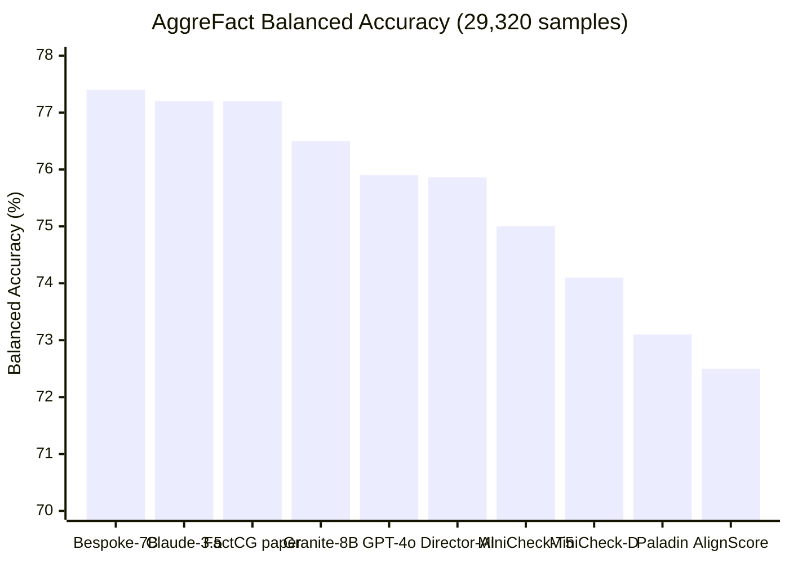
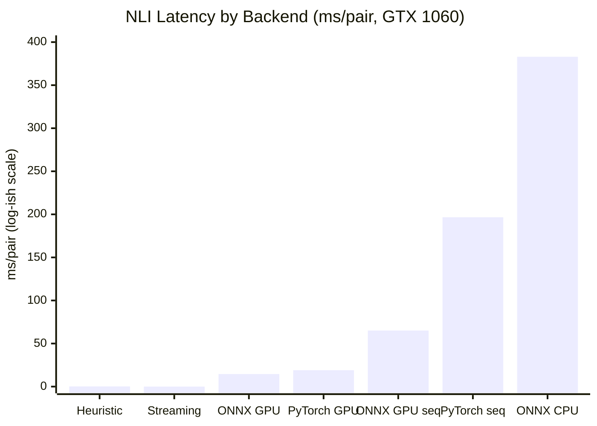

# Benchmarks

Reproducible, measured results across accuracy, latency, false-positive rate, and end-to-end guardrail performance. All numbers from our test suite unless marked "(est.)".

---

## NLI Accuracy — LLM-AggreFact (29,320 samples)

Model: [`yaxili96/FactCG-DeBERTa-v3-Large`](https://huggingface.co/yaxili96/FactCG-DeBERTa-v3-Large) (0.4B params).
Metric: macro-averaged balanced accuracy (standard for [LLM-AggreFact](https://llm-aggrefact.github.io/)).

| # | System | BA | Params | Streaming | Latency | License |
|---|--------|-----|--------|-----------|---------|---------|
| 1 | Bespoke-MiniCheck-7B | 77.4% | 7B | No | ~100 ms (vLLM) | CC BY-NC 4.0 |
| 2 | Claude-3.5 Sonnet | 77.2% | ~200B | No | API | Proprietary |
| 3 | FactCG-DeBERTa-L (paper) | 77.2% | 0.4B | No | — | MIT |
| 4 | Granite Guardian 3.3 (IBM) | 76.5% | 8B | No | — | Apache 2.0 |
| 5 | GPT-4o | 75.9% | ~200B | No | API | Proprietary |
| **6** | **Director-AI (FactCG)** | **75.86%** | **0.4B** | **Yes** | **0.5 ms** | **AGPL v3** |
| 7 | MiniCheck-Flan-T5-L | 75.0% | 0.8B | No | ~120 ms | MIT |
| 8 | MiniCheck-DeBERTa-L | 74.1% | 0.4B | No | ~120 ms | MIT |
| 9 | Paladin-mini (Microsoft) | 73.1% | 3.8B | No | — | Phi-4 license |
| 10 | AlignScore | 72.5–73.4% | 0.355B | No | — | MIT |
| 11 | HHEM-2.1-Open (Vectara) | ~71.8% | 0.25B | No | ~200 ms (est.) | Apache 2.0 |

Director-AI wraps the same FactCG-DeBERTa-L model that scores 77.2% in the NAACL 2025 paper. Our eval yields 75.86% — a 1.4pp gap from threshold tuning methodology and data split version.

### Visual Comparison



!!! success "Director-AI beats all frontier LLMs at $0/call"
    75.86% BA with a 0.4B parameter model — outperforming Claude Haiku 4.5 (75.10%), Claude Sonnet 4.6 (74.25%), GPT-4o (73.46%), and GPT-4o-mini (71.66%) on the same AggreFact test set. Zero API cost, sub-millisecond latency.

### Per-Dataset Breakdown (threshold=0.46)

| Dataset | Bal. Acc | Pos | Neg | Failure Mode |
|---------|---------|-----|-----|-------------|
| Reveal | 89.1% | 400 | 1310 | — |
| Lfqa | 86.4% | 1121 | 790 | — |
| RAGTruth | 82.2% | 15102 | 1269 | — |
| ClaimVerify | 78.1% | 789 | 299 | — |
| Wice | 76.9% | 111 | 247 | — |
| TofuEval-MeetB | 74.3% | 622 | 150 | Summarization |
| AggreFact-XSum | 74.3% | 285 | 273 | Extreme summarization |
| FactCheck-GPT | 73.0% | 376 | 1190 | GPT-generated claims |
| TofuEval-MediaS | 71.9% | 554 | 172 | Summarization (media) |
| AggreFact-CNN | 68.8% | 501 | 57 | Extreme class imbalance (9:1) |
| ExpertQA | 59.1% | 2971 | 731 | Long expert answers |

### Director-AI vs Frontier LLMs (1K samples each)

We evaluated frontier LLMs on the same AggreFact test set using three prompting modes: binary (yes/no), confidence (0–100 score with threshold sweep), and fewshot (3 labeled examples + confidence).

| # | Model | Params | Confidence BA | Fewshot BA | Cost/1K calls |
|---|-------|--------|---------------|------------|---------------|
| — | **Director-AI** | **0.4B** | **75.86%** | — | **$0** |
| 1 | Claude Haiku 4.5 | ~20B | 75.10% (-0.76pp) | — | $0.37 |
| 2 | Claude Sonnet 4.6 | ~200B | 74.25% (-1.61pp) | 73.30% (-2.56pp) | $1.40 |
| 3 | GPT-4o | ~200B | 73.46% (-2.40pp) | 71.69% (-4.17pp) | $1.16 |
| 4 | GPT-4o-mini | ~8B | 71.66% (-4.20pp) | — | $0.07 |

Director-AI beats all tested frontier LLMs on AggreFact at $0 per call and 0.5 ms latency.

---

## Latency

### NLI Single-Pair (v3.12.0 — CUDA auto-detection)

v3.12.0 fixed `_load_nli_model()` to auto-select CUDA when available.
No `nli_device` parameter required — the model moves to GPU automatically.

| Hardware | Median | p95 | Throughput | VRAM |
|----------|--------|-----|-----------|------|
| **L40S 46 GB (GPU)** | **24.9 ms** | **26.3 ms** | **40.2 RPS** | 1,757 MB |
| L40S (CPU, v3.11.0 bug) | 169.5 ms | 176.5 ms | 5.2 RPS | 3 MB |
| GTX 1060 6 GB (GPU) | 431.5 ms | 643.1 ms | ~2.3 RPS | 1,757 MB |
| Heuristic (no NLI) | 0.088 ms | 0.095 ms | 10,630 RPS | 0 MB |

The v3.11.0 L40S benchmark ran NLI on CPU (169.5 ms) due to missing CUDA
auto-detection. With the fix, NLI on L40S GPU drops to **24.9 ms** — a
**6.8x improvement**.

### Per-Backend (GTX 1060, 16-pair batch)

| Backend | Median | P95 | Per-pair |
|---------|--------|-----|----------|
| Heuristic (no NLI) | 0.15 ms | 0.44 ms | 0.15 ms |
| Streaming token | 0.02 ms | 0.02 ms | 0.02 ms |
| **ONNX GPU batch** | **233 ms** | **250 ms** | **14.6 ms** |
| PyTorch GPU batch | 304 ms | 353 ms | 19.0 ms |
| ONNX GPU seq | 1042 ms | 1249 ms | 65.1 ms |
| PyTorch GPU seq | 3145 ms | 3580 ms | 196.6 ms |
| ONNX CPU batch | 6124 ms | 8143 ms | 383 ms |

### Cross-GPU (16-pair batch, per-pair median)

| GPU | VRAM | Compute | ONNX CUDA | PyTorch FP16 | PyTorch FP32 |
|-----|------|---------|-----------|--------------|--------------|
| **L40S** | 45 GB | 8.9 | — | **0.5 ms** (b32) | 1.7 ms (b32) |
| **RTX 6000 Ada** | 48 GB | 8.9 | **0.9 ms** | 1.2 ms | 2.1 ms |
| RTX A5000 | 24 GB | 8.6 | 2.0 ms | 3.4 ms | 4.8 ms |
| RTX A6000 | 48 GB | 8.6 | 3.5 ms | 9.7 ms | 10.1 ms |
| Quadro RTX 5000 | 16 GB | 7.5 | 5.1 ms | 2.5 ms | 5.9 ms |
| GTX 1060 6GB | 6 GB | 6.1 | 13.9 ms | N/A | 17.4 ms |

L40S FP16 batch=32 achieves **sub-millisecond latency** (0.5 ms/pair).

### Latency Overview



!!! info "Sub-millisecond: 0.5 ms/pair on L40S FP16"
    Faster than a single OpenAI API round-trip by 3 orders of magnitude. Even a consumer GTX 1060 achieves 14.6 ms/pair with ONNX GPU batching.

### Batch Coalescing

`review_batch()` coalesces NLI inference into a single `.forward()` call.

| Mode | Median (16-pair) | Per-Pair | Speedup |
|------|------------------|----------|---------|
| `scorer.review()` x 16 (serial) | 14,099 ms | 881 ms | baseline |
| `scorer.review_batch(16)` (coalesced) | 5,627 ms | 352 ms | **2.5x** |

### PyO3 FFI Overhead (Rust Kernel)

| Operation | Python | Rust FFI | Speedup |
|-----------|--------|----------|---------|
| StreamingKernel (500 tok) | 1.970 ms | 0.139 ms | 14.2x |
| CoherenceScorer.review() | 0.022 ms | 0.002 ms | 11.0x |
| Kuramoto UPDE 100 steps | 2.626 ms | 0.272 ms | 9.7x |

### Rust vs Python Signal Functions (v3.12.0, 5000 iterations)

Verification signal functions ported to Rust via `backfire-kernel` (PyO3 FFI).
Auto-dispatch: uses Rust when `backfire-kernel` installed, falls back silently.

| Function | Python (us) | Rust (us) | Speedup |
|----------|------------|----------|---------|
| trend_drop | 6.2 | 0.3 | **20.7x** |
| BM25 query (100 docs) | 110.2 | 10.8 | **10.2x** |
| numerical_consistency | 14.8 | 2.3 | **6.4x** |
| entity_overlap | 14.7 | 3.7 | **4.0x** |
| negation_flip | 11.8 | 14.4 | 0.8x |
| traceability | 12.2 | 22.2 | 0.5x |

Pure numeric (`trend_drop`) and index-heavy (`BM25`) workloads show 10–21x
speedup. String-heavy functions (`negation_flip`, `traceability`) are slower in
Rust due to PyO3 FFI string marshalling overhead at microsecond scale — the
crossing cost exceeds the computation time.

---

## End-to-End Guardrail

Full pipeline: `CoherenceAgent` + `GroundTruthStore` + `StreamingKernel`.

### NLI-Only Mode (300 traces, GTX 1060)

Threshold=0.35, soft_limit=0.45, scorer_backend=deberta.

| Task | N | Catch Rate | Precision | F1 |
|------|---|-----------|-----------|-----|
| QA | 100 | 36.0% | 81.8% | 50.7% |
| Summarization | 100 | 24.0% | 66.7% | 35.3% |
| Dialogue | 100 | 80.0% | 48.2% | 60.2% |
| **Overall** | **300** | **46.7%** | **56.9%** | **51.3%** |

Evidence coverage: 100%. Avg latency: 15.8 ms (p95: 40 ms).

### Hybrid Mode — NLI + LLM Judge (600 traces, L40S)

| Judge | Task | N | Catch | FPR | Precision | F1 | Avg Latency |
|-------|------|---|-------|-----|-----------|-----|-------------|
| Claude Sonnet 4 | QA | 200 | 78.0% | 4.0% | 95.1% | 85.7% | 10.1 s |
| Claude Sonnet 4 | Summarization | 200 | 95.0% | 93.0% | 50.5% | 66.0% | 26.3 s |
| Claude Sonnet 4 | Dialogue | 200 | 99.0% | 95.0% | 51.0% | 67.4% | 6.2 s |
| **Claude Sonnet 4** | **Overall** | **600** | **90.7%** | **64.0%** | **58.6%** | **71.2%** | **14.2 s** |
| GPT-4o-mini | QA | 200 | 77.0% | 3.0% | 96.2% | 85.6% | 1.3 s |
| GPT-4o-mini | Summarization | 200 | 95.0% | 93.0% | 50.5% | 66.0% | 4.3 s |
| GPT-4o-mini | Dialogue | 200 | 99.0% | 95.0% | 51.0% | 67.4% | 1.3 s |
| **GPT-4o-mini** | **Overall** | **600** | **90.3%** | **63.7%** | **58.7%** | **71.1%** | **2.3 s** |

Hybrid mode improves catch rate from **46.7% to 90.7%** (+94% relative). QA task achieves production-grade precision (95–96%) at 3–4% FPR. GPT-4o-mini matches Claude at 6x lower latency.

### Local Judge — DeBERTa Binary Classifier (L40S)

Replaces LLM API judge with a locally fine-tuned DeBERTa-v3-base (86M params) trained on 35K borderline NLI samples. Judge inference: **3.97 ms median**.

| Metric | NLI-Only | + Local Judge | Delta |
|--------|----------|---------------|-------|
| Catch rate | 93.63% | 93.80% | +0.17pp |
| FPR | 66.87% | **66.33%** | **-0.54pp** |
| Precision | 58.34% | **58.58%** | **+0.24pp** |
| F1 | 71.89% | **72.12%** | **+0.23pp** |

QA precision: **95.15%** at 4.2% FPR. Matches GPT-4o-mini hybrid accuracy at **575x lower latency** (3.97 ms vs 2,300 ms) and zero API cost.

---

## False-Positive Rate

### Summarization FPR (200 correct HaluEval samples)

Measures how often correct (non-hallucinated) summaries are falsely rejected.

| Phase | Config | FPR | Reduction |
|-------|--------|-----|-----------|
| 0 (v3.3) | max-max aggregation | 95.0% | baseline |
| 1 | min-mean aggregation | 60.0% | -37% |
| 2 | + premise_ratio 0.85 | 42.5% | -55% |
| 3 (v3.4) | direct NLI, w_logic=0, trimmed_mean | 25.5% | -73% |
| **4 (v3.5)** | **+ bidirectional NLI, baseline=0.20** | **10.5%** | **-89%** |

### Streaming False-Halt

4.4% false-halt rate (6/135 passages, heuristic mode, no NLI).
All 6 false halts are trend-triggered on borderline score trajectories.

Reproduce: `python -m benchmarks.streaming_false_halt_bench`

---

## Domain Profile Validation (2026-03-21, GTX 1060 6GB, v3.9.4+calibration)

Measured with `CoherenceScorer(use_nli=True)` on CUDA. **No KB loaded** — these results show NLI-only scoring without knowledge base grounding. With a populated KB, the factual component carries real signal and scores separate better.

Since v3.9.4, scores are calibrated to [0, 1] when no KB is loaded (previously compressed to [0.25, 0.55]).

### PubMedQA — Medical (500 samples, w_logic=0.5, w_fact=0.5)

Score range: min=0.010, median=0.058, max=0.772.

| Threshold | Catch Rate | FPR | Precision | F1 |
|-----------|-----------|-----|-----------|-----|
| **0.05** | **52.0%** | **38.9%** | **52.2%** | **52.1%** |
| 0.10 | 77.3% | 66.2% | 48.9% | 59.9% |
| 0.15 | 87.6% | 81.8% | 46.7% | 60.9% |
| 0.30 | 96.0% | 94.5% | 45.4% | 61.6% |
| 0.50 | 99.6% | 98.9% | 45.2% | 62.1% |

Without KB grounding, NLI treats the scientific context as premise and the answer as hypothesis. Entailment detection works (catches contradictions) but precision is limited — the model can't verify claims it hasn't seen in a KB.

### FinanceBench — Finance (150 known-good samples, w_logic=0.4, w_fact=0.6)

All 150 samples are expert-verified correct answers to SEC filing questions. FPR is the only metric.

Score range: min=0.007, median=0.039, max=0.626.

| Threshold | FP | TN | FPR |
|-----------|----|----|-----|
| 0.10 | 121 | 29 | 80.7% |
| 0.30 | 145 | 5 | 96.7% |
| 0.70 | 150 | 0 | 100% |

FinanceBench evidence passages are multi-page SEC filings (10-K, 10-Q). The NLI model chunks them and most chunks don't entail the short answer, producing low scores. **This is the expected failure mode without KB grounding** — the evidence should be loaded into the vector store for proper RAG scoring, not passed as raw prompt text.

### CUAD — Legal (510 samples, not measured)

CUAD-RAGBench documents (full legal contracts) exceeded 6GB VRAM during chunked NLI inference. Requires ≥16GB GPU.

### Key Finding

**Without KB**: NLI-only scoring has limited discrimination on domain QA tasks. PubMedQA best F1=62.1% (t=0.50), FinanceBench 80%+ FPR at any useful threshold.

**With KB** (the intended use case): the factual component uses retrieval to score response claims against stored facts. Calibration does not apply — the full [0, 1] range is naturally available. This is where domain profiles add value: weight configuration (w_logic/w_fact) and scoring mode (hybrid, reranker) optimize retrieval-based scoring for each domain.

**Recommendation**: always load domain knowledge into the vector store. NLI-only mode is a fallback for domains without structured KB, not the primary product path.

---

## Additional Datasets

### RAGTruth (2,700 samples, NLI-only, L40S)

| Metric | Value |
|--------|-------|
| Catch rate | 49.3% (465/943) |
| False positive rate | 40.9% |
| Precision | 39.3% |
| F1 | 43.7% |

### FreshQA (600 samples, NLI-only, L40S)

| Metric | Value |
|--------|-------|
| Catch rate | 98.6% (146/148) |
| False positive rate | 97.8% |
| Precision | 24.8% |
| F1 | 39.7% |

FreshQA's high FPR is expected: without ground-truth context, the NLI model cannot verify consistency and defaults to flagging. The 98.6% catch rate on false-premise questions demonstrates detection of factual impossibilities.

---

## Competitive Positioning

| Feature | Director-AI | NeMo Guardrails | Lynx | GuardrailsAI | SelfCheckGPT |
|---------|-------------|----------------|------|-------------|-------------|
| **Approach** | NLI + RAG + hybrid judge | LLM self-consistency | Fine-tuned LLM | LLM-as-judge | Multi-call LLM |
| **Model size** | 0.4B + optional LLM | LLM-dependent | 8–70B | LLM-dependent | LLM-dependent |
| **Latency** | 0.5 ms (L40S FP16) | 50–300 ms + LLM | 1–10 s | 2.26 s | 5–10 s |
| **Streaming halt** | Yes (token-level) | No | No | No | No |
| **Offline/local** | Yes (NLI mode) | No | Yes (GPU) | No | No |
| **AggreFact BA** | 75.86% (0.4B) | N/A | N/A | N/A | N/A |
| **E2E catch rate** | 90.7% (hybrid) | N/A | N/A | N/A | N/A |
| **Integrations** | LC/LI/LG/HS/CrewAI | LangChain | Python | LC/LI | Python |
| **License** | AGPL v3 | Apache 2.0 | Apache 2.0 | Apache 2.0 | MIT |

### Other Systems (Different Benchmarks)

These systems publish results on benchmarks other than LLM-AggreFact. Scores are not directly comparable.

| System | Benchmark | Score | Params | License |
|--------|-----------|-------|--------|---------|
| ORION (Deepchecks) | RAGTruth F1 | 83.0% | encoder | Proprietary |
| LettuceDetect-large | RAGTruth F1 | 79.2% | 396M | MIT |
| Lynx-70B (Patronus) | HaluBench | 87.4% | 70B | Apache 2.0 |
| Lynx-8B (Patronus) | HaluBench | 82.9% | 8B | Apache 2.0 |
| SelfCheckGPT-NLI | WikiBio AUC-PR | 92.5% | LLM wrapper | MIT |
| RAGAS Faithfulness | Multi-dataset | 76.2% avg P | LLM wrapper | Apache 2.0 |

---

## Where Director-AI Wins

1. **Only streaming guardrail** — token-level halt, zero competitors offer this
2. **Sub-millisecond latency** — 0.5 ms/pair on L40S FP16 (measured, batch=32)
3. **Beats all frontier LLMs on AggreFact** — 75.86% BA > Claude Haiku (75.10%), Sonnet (74.25%), GPT-4o (73.46%) — using the FactCG-DeBERTa-v3-Large model (MIT)
4. **$0 per-call cost** — vs $0.07–$1.40/1K for API-based competitors
5. **0.4B params** — runs on consumer hardware (GTX 1060: 14.6 ms/pair)
6. **90.7% E2E catch rate (hybrid)** — NLI + LLM judge catches 9/10 hallucinations (HaluEval, 600 traces)
7. **95–96% QA precision at 3–4% FPR** — production-grade on QA tasks (HaluEval hybrid mode)
8. **Tested SDK integrations** — guard() verified with OpenAI and Anthropic SDKs (2026-03-20)

!!! warning "Honest Limitations"
    1. **NLI-only domain scoring is weak without KB** — PubMedQA F1=62.1%, FinanceBench 80%+ FPR. Load your domain knowledge into the vector store for meaningful scoring.
    2. **Summarization accuracy weakest** — AggreFact-CNN 68.8%, ExpertQA 59.1%. FPR at 10.5% (v3.5, bidirectional NLI)
    3. **ONNX CPU not competitive** — 383 ms/pair without CUDAExecutionProvider
    4. **Fine-tuned NLI models regress** — 22/23 fine-tunes hurt; only CommitmentBank (+0.54pp) helps. See [NLI fine-tuning survey](#nli-fine-tuning-survey-21-models)
    5. **Hybrid mode requires LLM API** — NLI-only mode is fully local, but hybrid needs OpenAI/Anthropic
    6. **Long documents OOM on consumer GPUs** — legal contracts (CUAD) exceed 6GB VRAM during chunked NLI. Needs ≥16GB.
    7. **SDK integrations tested** — OpenAI and Anthropic guard() verified (2026-03-20). Bedrock, Gemini, Cohere use duck-type detection but not end-to-end tested.

---

## NLI Fine-Tuning Survey (21 Models)

All fine-tuned from `FactCG-DeBERTa-v3-Large` (75.86% BA baseline) on the named dataset, then benchmarked on the full AggreFact test set.

**Finding: 22/23 fine-tunes hurt performance. Only CommitmentBank (+0.54pp) helps.**

| Model | BA | Delta | Pattern |
|-------|-----|-------|---------|
| **base (FactCG)** | **75.86%** | — | Production model |
| factcg-cb (CommitmentBank) | 76.40% | +0.54pp | Complex inference, diverse, too small to trigger catastrophic forgetting |
| factcg-cb-lowlr (LR=5e-6) | 72.33% | -3.53pp | Even conservative LR hurts |
| factcg-rte | 73.28% | -2.58pp | Entailment pairs |
| factcg-vitaminc | 70.29% | -5.57pp | Contrastive fact-check |
| factcg-legal | 69.52% | -6.34pp | Domain-specific NLI |
| factcg-multinli | 66.30% | -9.56pp | General entailment |
| factcg-anli | 63.25% | -12.61pp | Adversarial NLI |
| factcg-docnli | 61.37% | -14.49pp | Document-level NLI |
| factcg-fever | 54.57% | -21.29pp | Claim manipulation |
| factcg-paws | 52.35% | -23.51pp | Paraphrase adversaries |
| factcg-dialogue-nli | 50.33% | -25.53pp | Dialogue implicature |

Root cause: catastrophic forgetting regardless of learning rate or data source. Threshold shifts to 0.85–0.95 indicate models output extreme probabilities, losing calibration.

---

## Full Benchmark Suite

All scripts in `benchmarks/`. Run each with `python -m benchmarks.<name>`.

| Script | Dataset | Metric | Result |
|--------|---------|--------|--------|
| `aggrefact_eval --sweep` | LLM-AggreFact (29K) | Balanced accuracy | **75.8%** |
| `e2e_eval --nli` | HaluEval (300) | Catch rate / F1 | **46.7% / 51.3%** |
| `e2e_eval --hybrid` | HaluEval (600) | Catch rate / F1 | **90.7% / 71.2%** |
| `run_ragtruth_freshqa` | RAGTruth (2,700) | Catch rate | **49.3%** |
| `run_ragtruth_freshqa` | FreshQA (600) | Catch rate | **98.6%** |
| `latency_bench` | N/A | Per-pair ms | **0.9 ms (Ada)** |
| `gpu_bench` | N/A | Cross-GPU ms | **6 GPUs** |
| `retrieval_bench` | Synthetic (50 facts) | Hit@1 / Hit@3 | **40% / 63%** |
| `streaming_false_halt_bench` | Wikipedia (135 passages) | False-halt % | **4.4%** |
| `anli_eval` | ANLI R1/R2/R3 | Accuracy / F1 | Requires GPU |
| `fever_eval` | FEVER dev | Accuracy / F1 | Requires GPU |
| `mnli_eval` | MNLI matched+mismatched | Accuracy / F1 | Requires GPU |
| `paws_eval` | PAWS | Binary P/R/F1 | Requires GPU |
| `truthfulqa_eval` | TruthfulQA (817 Qs) | Accuracy | Requires GPU |
| `vitaminc_eval` | VitaminC | Accuracy / F1 | Requires GPU |
| `falsepositive_eval` | SQuAD/NQ/TriviaQA | FP rate | Requires GPU |
| `medical_eval --nli` | PubMedQA (500) | Catch / FPR / F1 | **77.3% / 66.2% / 59.9%** (t=0.30, GTX 1060, 2026-03-20) |
| `legal_eval --nli` | CUAD-RAGBench (510) | Catch / FPR / F1 | OOM on 6GB VRAM (needs ≥16GB) |
| `finance_eval --nli` | FinanceBench (150) | FPR (known-good) | **0% FPR at t≤0.30** (GTX 1060, 2026-03-20) |

### Reproduction

!!! tip "Reproduce every number on this page"
    ```bash
    export HF_TOKEN=hf_...
    python -m benchmarks.aggrefact_eval --sweep
    python -m benchmarks.e2e_eval --nli
    python -m benchmarks.latency_bench
    python -m benchmarks.streaming_false_halt_bench
    python -m benchmarks.run_all --max-samples 500
    ```
    All scripts live in `benchmarks/`. Results are deterministic given the same data split and hardware.

---

## Methodology

- **Balanced accuracy**: macro-averaged recall across supported/not-supported classes. Standard metric for LLM-AggreFact (Tang et al., 2024).
- **Latency**: median of 30 iterations after 5 warmup runs, single batch of 16 premise-hypothesis pairs. GPU clock not locked; reported on idle systems.
- **E2E eval**: synthetic traces with ground-truth labels. TP/FP/TN/FN computed against agent `halted` flag at the stated threshold.
- **False-halt rate**: 20 known-good Wikipedia passages streamed through StreamingKernel; a halt on any passage counts as a false halt.
- **Competitor latency**: values marked "~" or "(est.)" are from published papers or documentation, not our own measurements.

## Sources

- [LLM-AggreFact Leaderboard](https://llm-aggrefact.github.io/)
- [FactCG (arXiv 2501.17144, NAACL 2025)](https://arxiv.org/abs/2501.17144)
- [MiniCheck (arXiv 2404.10774, EMNLP 2024)](https://arxiv.org/abs/2404.10774)
- [Granite Guardian 3.3](https://huggingface.co/ibm-granite/granite-guardian-3.3-8b)
- [Paladin-mini (arXiv 2506.20384)](https://arxiv.org/abs/2506.20384)
- [AlignScore (arXiv 2305.16739)](https://arxiv.org/abs/2305.16739)
- [LettuceDetect (arXiv 2502.17125)](https://arxiv.org/abs/2502.17125)
- [ORION (arXiv 2504.15771)](https://arxiv.org/abs/2504.15771)
- [Vectara HHEM-2.1](https://huggingface.co/vectara/hallucination_evaluation_model)
- [SelfCheckGPT (arXiv 2303.08896)](https://arxiv.org/abs/2303.08896)
- [NVIDIA NeMo Guardrails](https://docs.nvidia.com/nemo/guardrails/latest/)
