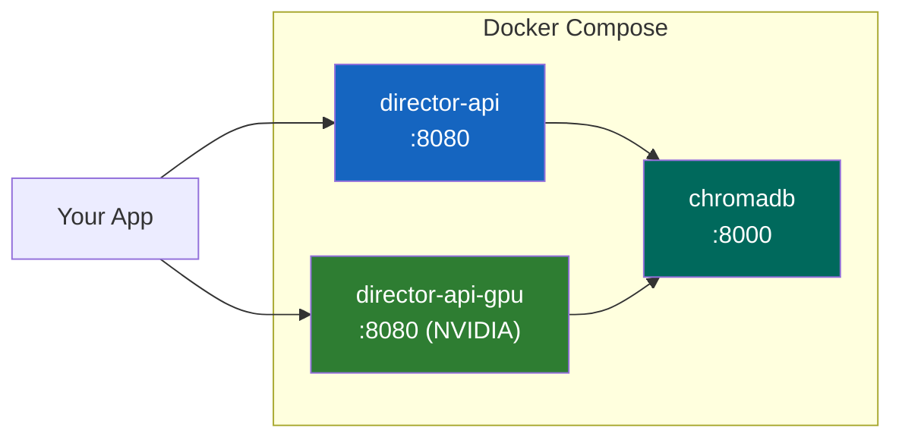

# Docker Deployment



## Build locally

Pre-built images are not yet published to a registry. Build from the included Dockerfiles:

```bash
# CPU-only (heuristic scoring, ~200 MB)
docker build -t director-ai .
docker run -p 8080:8080 director-ai

# GPU-enabled (ONNX CUDA, FactCG model baked in, ~5 GB)
docker build -f Dockerfile.gpu -t director-ai:gpu .
docker run --gpus all -p 8080:8080 director-ai:gpu
```

## Docker Compose

```bash
docker compose up                    # CPU
docker compose --profile gpu up      # GPU (NVIDIA)
docker compose --profile full up     # CPU + ChromaDB
```

The GPU service requires the NVIDIA Container Toolkit:

```yaml
# docker-compose.yml (gpu profile)
director-api-gpu:
  build:
    context: .
    dockerfile: Dockerfile.gpu
  profiles: ["gpu"]
  ports:
    - "8080:8080"
  environment:
    - DIRECTOR_USE_NLI=true
    - DIRECTOR_ONNX_PATH=/app/models/onnx
    - DIRECTOR_METRICS_ENABLED=true
  deploy:
    resources:
      reservations:
        devices:
          - driver: nvidia
            count: 1
            capabilities: [gpu]
```

## GPU image (Dockerfile.gpu)

Three-stage build: install deps → export ONNX model → runtime.

```
Stage 1 (builder):     pip install .[server,nli] + onnxruntime-gpu + torch CUDA
Stage 2 (model-build): export_onnx() → /models/onnx/
Stage 3 (runtime):     copy from stages, set env vars, healthcheck
```

The ONNX model is exported at build time (deterministic startup, no
HuggingFace downloads at runtime). Environment defaults:

- `DIRECTOR_USE_NLI=true`
- `DIRECTOR_ONNX_PATH=/app/models/onnx`
- `ORT_ENABLE_ALL=1` (graph optimization)

## Multi-replica GPU scaling

```bash
docker compose --profile gpu up --scale director-api-gpu=3
```

Each replica loads its own ONNX session. With the Ada GPU (0.9 ms/pair),
3 replicas handle ~3,000 pairs/second.

## Verify

```bash
curl localhost:8080/v1/health
# {"status":"ok","nli_loaded":true,"model":"FactCG-DeBERTa-v3-Large"}

curl -X POST localhost:8080/v1/review \
  -H 'Content-Type: application/json' \
  -d '{"prompt":"What is 2+2?","response":"4."}'
```

## CPU-only image (Dockerfile)

For development or heuristic-only scoring:

```dockerfile
FROM python:3.12-slim
WORKDIR /app
RUN pip install --no-cache-dir director-ai[server]
EXPOSE 8080
CMD ["uvicorn", "director_ai.server:app", "--host", "0.0.0.0", "--port", "8080"]
```

## Resource requirements

| Image | Size | RAM | GPU VRAM | Latency |
|-------|------|-----|----------|---------|
| CPU (`latest`) | ~200 MB | 256 MB | — | <0.1 ms (heuristic) |
| GPU (`gpu`) | ~5 GB | 2 GB | 1.2 GB | 14.6 ms/pair (ONNX CUDA) |
