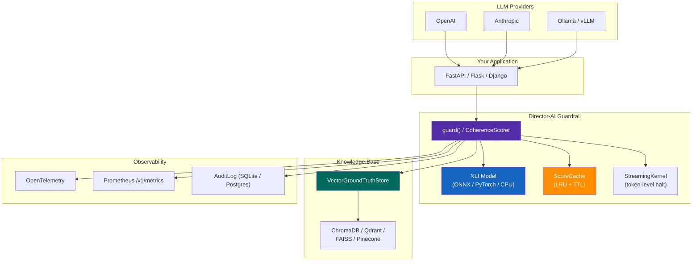

# Production Deployment Guide

## Architecture



## Recommended Setup

```bash
pip install director-ai[nli,vector,embeddings,openai]
```

```python
from director_ai import guard, CoherenceScorer, VectorGroundTruthStore, ChromaBackend

# Production vector store with persistent storage
backend = ChromaBackend(
    collection_name="prod_facts",
    persist_directory="/data/chroma",
    embedding_model="BAAI/bge-large-en-v1.5",
)
store = VectorGroundTruthStore(backend=backend)

# Ingest your knowledge base
store.ingest(your_documents)

# Create scorer with caching and NLI
scorer = CoherenceScorer(
    threshold=0.6,
    soft_limit=0.7,
    use_nli=True,
    nli_model="lytang/MiniCheck-DeBERTa-L",
    ground_truth_store=store,
    cache_size=2048,
    cache_ttl=600,
    nli_quantize_8bit=True,
    nli_device="cuda",
)

# Optional: enable injection detection on every review()
scorer.enable_injection_detection(
    injection_threshold=0.7,
    baseline_divergence=0.4,
)
```

## Scaling

### Horizontal: Multiple Workers

```bash
uvicorn director_ai.server:app --workers 4 --host 0.0.0.0 --port 8080
```

Each worker gets its own scorer instance. The NLI model is loaded once per worker via `lru_cache`.

### GPU Sharing

For multi-worker GPU sharing, load the model once and share via torch multiprocessing:

```python
scorer = CoherenceScorer(
    use_nli=True,
    nli_device="cuda:0",
    nli_torch_dtype="float16",
    nli_quantize_8bit=True,
)
```

8-bit quantization reduces VRAM from ~1.5GB to ~400MB per model.

### Score Caching

Enable caching to reduce NLI inference by 60-80% in streaming workloads:

```python
scorer = CoherenceScorer(
    cache_size=4096,
    cache_ttl=300,
)

# Monitor cache performance
print(f"Hit rate: {scorer.cache.hit_rate:.1%}")
```

## Resource Sizing

| Workload | CPU | RAM | GPU | Latency (measured) |
|----------|-----|-----|-----|--------------------|
| Heuristic only | 1 core | 256MB | None | <0.1 ms |
| **ONNX GPU batch** | 2 cores | 2GB | 1.2GB VRAM | **14.6 ms/pair** |
| PyTorch GPU batch | 2 cores | 2GB | 1.2GB VRAM | 19 ms/pair |
| ONNX GPU sequential | 2 cores | 2GB | 1.2GB VRAM | 65 ms/pair |
| PyTorch GPU sequential | 2 cores | 2GB | 1.2GB VRAM | 197 ms/pair |
| ONNX CPU batch | 4 cores | 2GB | None | 383 ms/pair |
| MiniCheck (GPU) | 2 cores | 1GB | 400MB VRAM | ~60 ms |
| + bge-large embeddings | +1 core | +500MB | +200MB VRAM | +5 ms |

## Monitoring

### Prometheus Metrics

```python
from director_ai.core.metrics import metrics

# Built-in metrics exposed at /v1/metrics and /v1/metrics/prometheus
print(metrics.prometheus_format())
```

Available metrics:

| Metric | Type | Description |
|--------|------|-------------|
| `director_ai_reviews_total` | counter | Total review requests |
| `director_ai_reviews_approved` | counter | Approved reviews |
| `director_ai_reviews_rejected` | counter | Rejected reviews |
| `director_ai_halts_total` | counter | Safety kernel halts (by reason) |
| `director_ai_coherence_score` | histogram | Score distribution |
| `director_ai_review_duration_seconds` | histogram | Review latency |
| `director_ai_active_requests` | gauge | In-flight requests |

### Health Check

```python
@app.get("/health")
def health():
    return {
        "status": "ok",
        "nli_loaded": scorer._nli and scorer._nli.model_available,
        "cache_hit_rate": scorer.cache.hit_rate if scorer.cache else None,
        "cache_size": scorer.cache.size if scorer.cache else 0,
    }
```

## Continuous Batching (ReviewQueue)

For API servers under concurrent load, enable server-level request accumulation.
The queue collects incoming `/v1/review` requests and flushes them as a single
`review_batch()` call, reducing GPU kernel launches from 2*N to 2 per flush window (when NLI is available).

```python
from director_ai.core.config import DirectorConfig
from director_ai.server import create_app

config = DirectorConfig(
    review_queue_enabled=True,
    review_queue_max_batch=32,
    review_queue_flush_timeout_ms=10.0,
)
app = create_app(config)
```

Environment variable override:

```bash
DIRECTOR_REVIEW_QUEUE_ENABLED=1 \
DIRECTOR_REVIEW_QUEUE_MAX_BATCH=64 \
DIRECTOR_REVIEW_QUEUE_FLUSH_TIMEOUT_MS=20 \
uvicorn director_ai.server:app --host 0.0.0.0 --port 8080
```

Session-bound requests (with `session_id`) bypass the queue automatically.

### Throughput Comparison

| Mode | GPU Kernels | Per-Pair Latency | Use Case |
|------|-------------|------------------|----------|
| `review()` serial | 2 per pair | 14.6 ms (ONNX GPU) | Single requests |
| `review_batch()` coalesced | 2 total | ~14.6 ms amortised | Batch API (`/v1/batch`) |
| ReviewQueue (10ms flush) | ~2 per window | 10-20 ms p95 | High-concurrency API |

## Security

- Store API keys in environment variables, not config files
- Use `DirectorConfig._REDACTED_FIELDS` for safe serialization
- Enable `InputSanitizer` to filter prompt injection attempts
- Audit all rejections via `AuditLogger`

## Production Checklist

Before going live, verify each item:

- [ ] **NLI model enabled** — set `use_nli=True` (heuristic-only misses subtle contradictions)
- [ ] **Persistent vector store** — configure ChromaDB or Qdrant (`vector_backend="chroma"`, `chroma_persist_dir="/data/chroma"`)
- [ ] **Score caching** — set `cache_size` and `cache_ttl` to reduce NLI inference load
- [ ] **Audit logging** — set `audit_log_path="audit.jsonl"` to enable `AuditLogger`
- [ ] **Prometheus scraping** — configure your monitoring to scrape `/v1/metrics/prometheus`
- [ ] **CORS origins** — set `cors_origins` to your domain (not `*`)
- [ ] **Rate limiting** — set `rate_limit_rpm=60` (or appropriate limit) to prevent abuse
- [ ] **API key auth** — set `api_keys=["your-key"]` to require `X-API-Key` header
- [ ] **Correlation IDs** — `X-Request-ID` headers are automatic; log them for tracing
- [ ] **Tenant isolation** — set `tenant_routing=True` if serving multiple customers
- [ ] **Regression test** — run `python -m benchmarks.regression_suite` and confirm all assertions pass
- [ ] **Streaming oversight** — if using WebSocket `/v1/stream`, enable `streaming_oversight` for real-time halt
