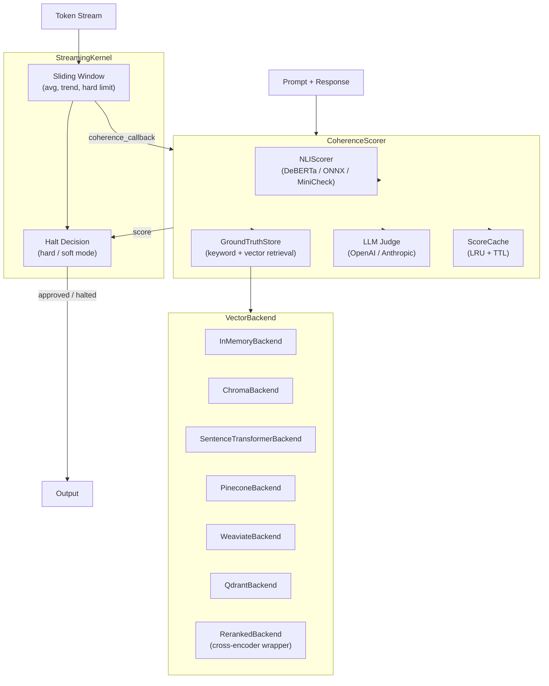

# Architecture

## Component Overview



## Data Flow

1. **Prompt arrives** at `CoherenceScorer.review(prompt, response)`
2. **Cache check**: if `(prompt, response)` was recently scored, return cached result
3. **Logical divergence**: NLI scores `(prompt, response)` for contradiction probability
4. **Factual divergence**: `GroundTruthStore.retrieve_context(prompt)` fetches KB facts, then NLI scores `(context, response)`
5. **Composite score**: `coherence = 1 - (W_LOGIC * H_logical + W_FACT * H_factual)`
6. **LLM judge** (optional): if NLI confidence is low (or `hybrid` mode), escalate to LLM-as-judge and blend scores
7. **Gate**: `approved = coherence >= threshold`

## Dual-Entropy Formula

The coherence score combines two independent divergence signals:

```
coherence = 1.0 - (W_LOGIC * H_logical + W_FACT * H_factual)
```

| Constant | Default | Description |
|----------|---------|-------------|
| `W_LOGIC` | 0.6 | Weight for logical divergence (NLI contradiction) |
| `W_FACT` | 0.4 | Weight for factual divergence (RAG retrieval) |

LLM judge blending (when activated):

| Constant | Value | Description |
|----------|-------|-------------|
| `LLM_JUDGE_NLI_WEIGHT` | 0.7 | NLI score weight in blend |
| `LLM_JUDGE_LLM_WEIGHT` | 0.3 | LLM judge weight in blend |
| `LLM_JUDGE_AGREE_DIVERGENCE` | 0.2 | Divergence when LLM says YES |
| `LLM_JUDGE_DISAGREE_DIVERGENCE` | 0.8 | Divergence when LLM says NO |

## Streaming Oversight

`StreamingKernel` processes tokens one-by-one with three halt mechanisms:

1. **Hard limit**: immediate halt if any token's coherence < `hard_limit`
2. **Window average**: halt if sliding window mean < `window_threshold`
3. **Downward trend**: halt if coherence drops > `trend_threshold` over `trend_window` tokens

Soft-halt mode (`halt_mode="soft"`) finishes the current sentence before halting (50-token safety cap).

## Vector Backend ABC

All vector backends implement three methods:

```python
class VectorBackend(ABC):
    def add(self, doc_id: str, text: str, metadata: dict | None = None) -> None: ...
    def query(self, text: str, n_results: int = 3) -> list[dict]: ...
    def count(self) -> int: ...
```

`VectorGroundTruthStore` wraps any backend and falls back to keyword matching when vector search returns no results.
