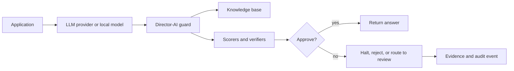

<!-- SPDX-License-Identifier: AGPL-3.0-or-later -->
<!-- Commercial license available -->
<!-- Copyright (c) Concepts 1996-2026 Miroslav Sotek. All rights reserved. -->
<!-- Copyright (c) Code 2020-2026 Miroslav Sotek. All rights reserved. -->
<!-- ORCID: 0009-0009-3560-0851 -->
<!-- Contact: www.anulum.li | protoscience@anulum.li -->
<!-- Director-Class AI - Product Overview -->

# Product Overview

Director-AI is a real-time factual-coherence guard for LLM applications. It
checks generated answers against governed facts, retrieved evidence, and
structured verification rules before those answers become user-visible
decisions.

The core product question is simple:

> Can this model answer be trusted enough to show, stream, store, route, or act
> on?

Director-AI answers that question with an auditable verdict, a score, and the
evidence that drove the decision.

## What It Is For

Director-AI is built for teams that already use LLMs in workflows where a wrong
claim has operational cost:

| Use case | What Director-AI protects | Primary value |
|---|---|---|
| Customer support | Policy, refund, warranty, and account answers | Fewer unsupported claims reaching customers |
| Regulated research | Scientific, medical, legal, or financial summaries | Evidence-linked rejection of unsupported claims |
| RAG assistants | Answers grounded in a private knowledge base | Traceable retrieval plus coherence scoring |
| Streaming chat | Token streams shown as they are generated | Mid-stream halt before a bad answer completes |
| Agent workflows | Tool outputs, handoffs, and multi-step traces | Per-step checks before downstream action |
| Evaluation pipelines | Batch scoring of prompt/response datasets | Regression gates and labelled feedback loops |
| Enterprise governance | Tenant-safe audit trails and compliance reports | Reviewable evidence for risk, quality, and controls |

It does not replace moderation, access control, data governance, or domain
expert review. It adds a factual-coherence control plane that can be combined
with those systems.

## How It Works

Director-AI can run in-process, behind an HTTP proxy, as FastAPI middleware, as
a REST/gRPC service, or inside integration adapters.

The default production pattern has four layers:

1. **Grounding**: bring governed facts through a key-value store, vector store,
   document ingestion pipeline, or customer runtime package.
2. **Scoring**: combine logical contradiction, retrieval evidence, rules,
   embeddings, NLI models, and optional structured verification.
3. **Control**: choose what happens on failure: raise, log, attach metadata,
   halt a stream, route to a review queue, or reject an HTTP response.
4. **Evidence**: emit scores, retrieved facts, halt reasons, audit records, and
   optional compliance reports.

## Application Lanes

### Builder Lane

Use this when adding protection to an existing app.

- Start with [Quickstart](../quickstart.md).
- Wrap an SDK client with [`guard()`](../api/guard.md).
- Add facts inline or through [KB ingestion](kb-ingestion.md).
- Pick a failure mode: raise, metadata, log, reject, or review.

### Platform Lane

Use this when exposing the guard as shared infrastructure.

- Deploy the [REST server](../api/server.md) or [gRPC server](../api/grpc.md).
- Put the [proxy](../deployment/production.md) in front of compatible clients.
- Add API keys, rate limits, metrics, audit logs, and deployment runbooks.
- Use [Runtime Boundaries](runtime-boundaries.md) to decide which optional
  runtimes belong in production.

### Evaluation Lane

Use this when proving that a configuration is good enough for a domain.

- Build labelled prompt/response sets.
- Run [batch processing](../api/batch.md) and threshold sweeps.
- Use [online calibration](online-calibration.md) for human feedback loops.
- Store benchmark evidence before making domain-specific performance claims.

### Enterprise Lane

Use this when selling, piloting, or operating in a governed organisation.

- Use [Enterprise](enterprise.md), [Compliance Reporting](compliance-reporting.md),
  and [Production Checklist](../deployment/checklist.md).
- Keep customer-specific claims scoped to customer data and acceptance criteria.
- Use the Customer Model Factory public core to package evidence, deployment
  manifests, rollback data, and runtime configuration.

## Market Value

The practical value is not that Director-AI is another chatbot wrapper. The
value is that it gives organisations a controllable guard layer between model
output and business consequence.

Director-AI can reduce:

- unsupported customer-facing claims;
- manual review load for routine factual checks;
- failed RAG evaluations caused by stale or missing evidence;
- risk from streamed hallucinations shown before post-hoc moderation runs;
- integration work required to reuse one guard policy across multiple LLM
  providers, frameworks, and deployment targets.

It can increase:

- evidence quality in regulated AI workflows;
- confidence that a new model, prompt, or KB version did not regress;
- portability across local, cloud, proxy, REST, and SDK integration modes;
- customer trust by making rejection reasons inspectable.

The repository is the open core and public evidence surface. Commercial
deployments can add customer-specific data mappings, tuning packages,
deployment recipes, sector playbooks, and acceptance evidence under a separate
agreement.

## Evidence Boundaries

Director-AI documentation is intentionally conservative about performance and
market claims:

- public benchmark numbers must point to committed artefacts or published
  benchmark methodology;
- customer-specific claims require customer-specific data and approval criteria;
- optional GPU, Rust, ONNX, gRPC, Go, Julia, Lean, and WASM paths are additive,
  not required for the Python quickstart;
- 100% line coverage is not treated as proof of quality by itself. The project
  prioritises high honest coverage, meaningful module-specific tests, and
  evidence-bearing integration checks.

## Start Here

| Reader | First page | Outcome |
|---|---|---|
| Evaluator | [Quickstart](../quickstart.md) | Score and guard a response in minutes |
| Buyer | [Why Director-AI](why-director-ai.md) | Understand the business problem and alternatives |
| Market reviewer | [Guardrail Landscape](guardrail-landscape.md) | Compare factuality, safety, streaming, and audit guardrail categories |
| Developer | [API Reference](../api/index.md) | Choose the right API surface |
| RAG engineer | [KB Ingestion](kb-ingestion.md) | Ground responses in private facts |
| Operator | [Production Guide](../deployment/production.md) | Deploy, monitor, and audit the service |
| Enterprise reviewer | [Evaluation Onboarding](onboarding.md) | Plan a scoped pilot with evidence gates |
