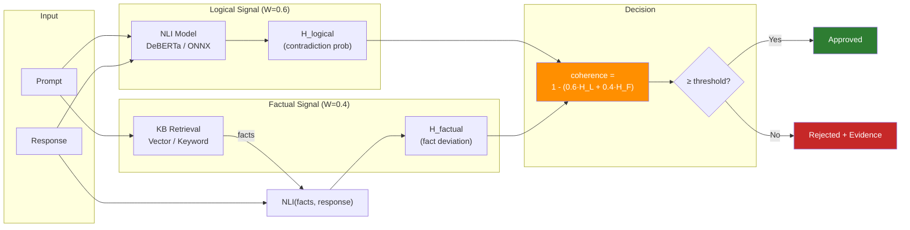

# Scoring

## How Coherence Scoring Works



Director-AI computes a composite coherence score from two independent signals:

```
coherence = 1.0 - (W_LOGIC × H_logical + W_FACT × H_factual)
```

| Signal | Weight | Source | Measures |
|--------|--------|--------|----------|
| **H_logical** | 0.6 | NLI model (DeBERTa) | Contradiction probability between prompt and response |
| **H_factual** | 0.4 | RAG retrieval | Deviation from ground-truth knowledge base |

The score is in [0.0, 1.0]. Higher = more coherent.

## Thresholds

| Parameter | Default | Purpose |
|-----------|---------|---------|
| `threshold` | 0.5 | Below this = rejected |
| `soft_limit` | `threshold + 0.1` | Between threshold and soft_limit = warning zone |

```python
scorer = CoherenceScorer(threshold=0.5, soft_limit=0.65)
approved, score = scorer.review(query, response)

if not approved:
    print("Rejected — below threshold")
elif score.warning:
    print("Warning — low confidence, consider verification")
else:
    print("Approved")
```

## NLI Backends

### Heuristic (default, no GPU)

Word-overlap scoring. Fast (<1ms) but limited to vocabulary-level detection.

```python
scorer = CoherenceScorer(use_nli=False)
```

### FactCG-DeBERTa-v3-Large (recommended)

75.6% per-dataset mean BA on AggreFact. Uses instruction template + SummaC source chunking.

```python
scorer = CoherenceScorer(use_nli=True)
```

| Backend | Latency | Accuracy |
|---------|---------|----------|
| ONNX GPU batch | 14.6 ms/pair | 75.6% BA |
| PyTorch GPU batch | 19 ms/pair | 75.6% BA |
| PyTorch GPU sequential | 197 ms/pair | 75.6% BA |
| ONNX CPU batch | 383 ms/pair | 75.6% BA |

### Embedding scorer (no GPU needed)

~65% balanced accuracy at 3ms/pair on CPU. Good for screening before NLI.

```python
scorer = CoherenceScorer(scorer_backend="embed")
# requires: pip install director-ai[embed]
```

### Rules engine (zero ML, <1ms)

8 configurable rules (entity grounding, numeric consistency, negation flip, etc.). Guardrails AI-style explicit control. Ships in the base package.

```python
scorer = CoherenceScorer(scorer_backend="rules")
# no extra install needed
```

### MiniCheck (lighter alternative)

72.6% balanced accuracy. Lower VRAM (~400MB vs ~1.5GB).

```python
scorer = CoherenceScorer(
    use_nli=True,
    nli_model="lytang/MiniCheck-DeBERTa-L",
)
```

### LiteScorer (CPU-only heuristic baseline)

Word overlap + length ratio + negation heuristics. <0.5 ms/pair, no dependencies.

```python
scorer = CoherenceScorer(scorer_backend="lite")
```

### Distilled NLI Lite

The `nli-lite` backend is the Lite Scorer v2 distillation track. It is available
as an experimental backend for local student artefacts and readiness testing,
but public accuracy or latency claims require a held-out evaluation packet,
ONNX export evidence, quantized latency evidence, and the validator gate in
`tools/validate_lite_scorer_v2_plan.py`.
The current evidence placeholder is `benchmarks/lite_scorer_v2_evidence_packet.toml`;
all evidence statuses remain `pending` until a trained student artefact is
evaluated.

After training a student artefact, measure it with
`tools/eval_lite_scorer_v2.py`, then record the evidence packet with
`tools/record_lite_scorer_v2_evidence.py`. The evaluator calculates held-out
balanced accuracy, threshold, and latency percentiles. The recorder hashes the
student, teacher, and ONNX artefacts, can consume the evaluator JSON output via
`--eval-result`, writes the measured values, and re-runs the Lite Scorer v2
validator before keeping the packet.

The reproducible command plan is defined in
`benchmarks/lite_scorer_v2_run_manifest.toml` and emitted by
`tools/plan_lite_scorer_v2_run.py`. The planner prints train, ONNX export,
held-out evaluation, and evidence-recording argv arrays only; it does not mark
the evidence packet as recorded or make any public score claim.

## Customizing Weights

Adjust the balance between logical and factual signals:

```python
# Fact-heavy (for KB-grounded use cases)
scorer = CoherenceScorer(w_logic=0.3, w_fact=0.7)

# Logic-heavy (for free-form reasoning)
scorer = CoherenceScorer(w_logic=0.8, w_fact=0.2)

# Summarization (factual only, no logic duplication)
scorer = CoherenceScorer(w_logic=0.0, w_fact=1.0)
```

Constraint: `w_logic + w_fact` must equal 1.0.

## Score Caching

Enable caching to avoid redundant NLI inference (60-80% cost reduction in streaming):

```python
scorer = CoherenceScorer(
    cache_size=2048,
    cache_ttl=300.0,
)

# Monitor cache
print(f"Hit rate: {scorer.cache.hit_rate:.1%}")
print(f"Size: {scorer.cache.size}")
```

## Batch Scoring

Score multiple pairs in 2 GPU forward passes (when NLI is available):

```python
items = [
    ("What is 2+2?", "The answer is 4."),
    ("Capital of France?", "Paris is in Germany."),
]
results = scorer.review_batch(items)
```

## Chunked NLI

For long documents, sentence-level scoring catches localized hallucinations:

```python
divergence = scorer._nli.score_chunked(
    premise="Paris is the capital of France. The Eiffel Tower is in Paris.",
    hypothesis="Berlin is the capital of France. The Eiffel Tower is in Berlin.",
)
```

Max-aggregation: the worst per-sentence contradiction drives the final score.

## Next Steps

- [Threshold Tuning](threshold-tuning.md) — domain-specific calibration
- [Streaming Halt](streaming.md) — token-level oversight
- [KB Ingestion](kb-ingestion.md) — populate the factual signal
