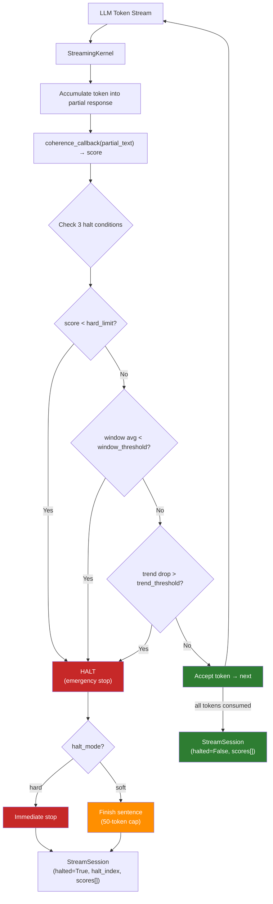

# Streaming Halt

!!! warning "Experimental — not a production gate yet"
    The token-level streaming halt is **opt-in and under active calibration.**
    On our own false-halt benchmark (`benchmarks/streaming_false_halt_bench.py`,
    135 grounded passages) it cannot yet separate hallucinated from correct
    streaming text without a high false-halt rate: the coherence scores of
    correct and incorrect partial text overlap, so any threshold that catches
    the hallucinations also halts a large fraction of correct answers. The
    production-validated path is **response-level scoring** (`/v1/review`,
    benchmarked on LLM-AggreFact). Do not rely on the streaming halt as a
    production safety gate until this is resolved.

## Overview

`StreamingKernel` monitors coherence by re-scoring the accumulated text
after each token (or every N-th token with `score_every_n`). Scoring is
sentence-level re-evaluation of the full accumulated output, not
independent per-token analysis. When coherence degrades, generation is
halted. Three independent halt mechanisms:

1. **Hard limit** — any single token below threshold
2. **Sliding window** — rolling average drops below window threshold
3. **Downward trend** — coherence drops by more than a delta over N tokens

## Architecture



The caller supplies the `coherence_callback` — typically a closure that accumulates tokens, calls `scorer.review()`, and returns the score. The kernel only decides *when to halt*; the caller decides *how to score*.

## How NLI Premise/Hypothesis Are Constructed

When `use_nli=True` on the scorer:

1. **Premise** = the prompt text, or the top-k retrieval results from `GroundTruthStore` / `VectorGroundTruthStore` if a KB is configured.
2. **Hypothesis** = the accumulated response text so far (all tokens joined).
3. The NLI model (DeBERTa) scores the entailment probability P(premise entails hypothesis).
4. The divergence score is `1.0 - entailment_probability` — higher means more hallucination risk.

With chunked NLI (`scorer.score_chunked()`):

- Both premise and hypothesis are split into sentence-level chunks.
- All (premise_chunk, hypothesis_chunk) pairs are scored.
- The final score uses **max aggregation** across pairs — the worst contradiction in any pair drives the score.
- This catches localized hallucinations that would be diluted in a full-text comparison.

## Basic Usage

```python
from director_ai import StreamingKernel

kernel = StreamingKernel(
    hard_limit=0.4,
    window_size=10,
    window_threshold=0.55,
    trend_window=5,
    trend_threshold=0.15,
    soft_limit=0.6,
)

session = kernel.stream_tokens(token_generator, coherence_callback)

if session.halted:
    print(f"Halted: {session.halt_reason}")
    print(f"Safe output: {session.output}")
else:
    print(f"Approved: {session.output}")
```

## on_halt Callback

```python
def handle_halt(session):
    print(f"Halted at token {session.halt_index}")
    # Log, alert, switch to fallback

kernel = StreamingKernel(on_halt=handle_halt)
```

## Async Streaming

```python
from director_ai import AsyncStreamingKernel

kernel = AsyncStreamingKernel(
    hard_limit=0.4,
    on_halt=handle_halt,
    soft_limit=0.6,
)

session = await kernel.stream_to_session(async_token_gen, coherence_fn)
```

## Pre-Sampling Inference Server Hooks

`InferenceServerHook` is the adapter boundary for vLLM, TGI, and
llama.cpp deployments that want a decision before a candidate token is
accepted. The hook is stdlib-only; server packages call `check()` from
their own logits or token-filter callback and then apply the returned
payload.

```python
from director_ai import InferenceHookRequest, build_inference_server_hook


def coherence_fn(text: str) -> float:
    return scorer.review(prompt, text).score


hook = build_inference_server_hook(
    "vllm",
    coherence_fn,
    hard_limit=0.4,
)

decision = hook.check(
    InferenceHookRequest(
        server="vllm",
        accumulated_text="The measured value is ",
        candidate_token="grounded",
        token_id=42,
        request_id="req-123",
    ),
    logits=[0.0] * 100,
)

if not decision.allow:
    emit(decision.safety_event.to_dict())
    apply_server_payload(decision.server_payload)
```

On a halt, the hook returns masked logits when logits are supplied, the
server-specific action payload, blocked token ids when known, and a
tenant-safe `SafetyEvent` with `hook_scope="inference_server"`.

Predictive pre-halt decisions can be applied through the same server boundary.
Pass a `PreHaltSteeringDecision` from the trajectory preflight controller to
`steer()`. `proceed` preserves logits, `escalate` applies a finite negative
logit bias to the candidate token while allowing sampling to continue, and
`halt` uses the same hard block path as `check()`.

```python
steering_decision = prehalt.evaluate(
    verdict,
    risk_envelope=risk_envelope,
    policy_id="policy.prehalt.regulated",
)

decision = hook.steer(
    InferenceHookRequest(
        server="vllm",
        accumulated_text="The measured value is ",
        candidate_token="candidate",
        token_id=42,
        request_id="req-123",
    ),
    steering_decision,
    logits=[0.0] * 100,
)

apply_server_payload(decision.server_payload)
```

The pre-halt safety event carries calibrated risk, confidence bounds, policy
identity, server name, and token id when known. It does not carry prompt text or
candidate text.

## Threshold Tuning by Domain

| Domain | hard_limit | window_threshold | trend_threshold | window_size | Rationale |
|--------|-----------|-----------------|----------------|-------------|-----------|
| General | 0.4 | 0.50 | 0.15 | 10 | Balanced — catches obvious hallucinations without over-halting |
| Medical | 0.5 | 0.60 | 0.10 | 8 | Strict — medical misinformation is high-risk |
| Finance | 0.5 | 0.55 | 0.12 | 8 | Strict — numerical claims must be grounded |
| Legal | 0.45 | 0.55 | 0.12 | 10 | Moderate-strict — citations and precedent matter |
| Creative | 0.3 | 0.40 | 0.20 | 15 | Loose — creative writing tolerates divergence |

See the [Threshold Tuning Guide](threshold-tuning.md) for detailed tuning methodology.

## Debug Mode

Enable `streaming_debug=True` to get per-token diagnostic snapshots:

```python
kernel = StreamingKernel(
    hard_limit=0.4,
    window_size=10,
    streaming_debug=True,
)

session = kernel.stream_tokens(token_gen, coherence_cb)

for snap in session.debug_log:
    print(
        f"token {snap['index']}: "
        f"coherence={snap['coherence']:.3f} "
        f"window_avg={snap['window_avg']:.3f} "
        f"trend_drop={snap['trend_drop']:.3f} "
        f"accumulated={snap['accumulated_tokens']}"
    )
```

Each `TokenEvent` also gets a `debug_info` dict with the same fields. Use this to diagnose why a halt triggered or to tune thresholds on your data.

**Fields in each debug snapshot:**

| Field | Type | Description |
|-------|------|-------------|
| `index` | int | Token position in stream |
| `coherence` | float | Raw coherence score for this token |
| `window_avg` | float | Current sliding window average |
| `trend_drop` | float | Coherence delta over trend window |
| `accumulated_tokens` | int | Total tokens processed so far |

## False-Halt Rate

Measured with `benchmarks/streaming_false_halt_bench.py` on 135 factually correct passages (heuristic mode, `use_nli=False`):

| Metric | Value |
|--------|-------|
| Passages tested | 135 |
| False halts | 6 |
| False-halt rate | **4.4%** |
| Avg coherence | 0.459 |
| Synthetic bad-passage halt precision | 14.3% |
| Synthetic bad-passage halt recall | 33.3% |
| Token-of-halt accuracy, 8-token window | 0.0% |

All 6 false halts are trend-triggered on borderline score trajectories
(trend drop barely exceeding 0.30 threshold). NLI mode produces higher
coherence scores and is expected to have a lower false-halt rate.
The heuristic benchmark now reports halt precision, halt recall, and
token-of-halt accuracy on a small labelled bad-passage smoke set. Treat those
rows as halt-quality diagnostics, not as a hallucination benchmark or a
customer-domain guarantee.

The regression suite (`benchmarks/regression_suite.py`) asserts
`false_halt_rate < 5%` on every CI run.

To reproduce:

```bash
python -m benchmarks.streaming_false_halt_bench
```

With NLI enabled (requires `pip install director-ai[nli]`):

```bash
python -m benchmarks.streaming_false_halt_bench --nli
```

## Structured Halt Evidence

When a `scorer` is passed to `stream_tokens()`, halt events include a `HaltEvidence` object with the top-K contradicting chunks and NLI scores:

```python
session = kernel.stream_tokens(
    token_generator,
    coherence_callback,
    scorer=scorer,
    top_k=3,
)

if session.halt_evidence_structured:
    ev = session.halt_evidence_structured
    print(f"Reason: {ev.reason}")
    print(f"Score: {ev.last_score:.3f}")
    print(f"Action: {ev.suggested_action}")
    if ev.trace_attribution:
        trace = ev.trace_attribution
        print(f"Token: {trace.token_offset}")
        print(f"Path: {trace.scorer_path}")
    if ev.counterfactual_diagnostic and ev.counterfactual_diagnostic.best_change:
        change = ev.counterfactual_diagnostic.best_change
        print(f"Fact source: {change.fact_source}")
        print(f"Required delta: {change.required_score_delta:.3f}")
    for chunk in ev.evidence_chunks:
        print(f"  - {chunk.text[:80]} (distance={chunk.distance:.3f})")
```

Each `TokenEvent` on halt also carries a `halt_evidence` field with the same `HaltEvidence` object. Its `trace_attribution` field records the fact source, retrieval path, scorer path, token offset, threshold, and halt margin. Its `counterfactual_diagnostic` field answers which single retrieved fact branch would have prevented the halt.

When OpenTelemetry is enabled, the same halt fields are exported as
`stream.halt_cause.*` and `stream.counterfactual.*` attributes on
streaming spans. Raw token text and raw fact text are not written to
spans.

## Trace Explorer

The `[ui]` extra includes a Trace Explorer tab in the Gradio wizard.
Paste JSON from a `StreamSession`, agent trace, swarm trace, or halt
evidence payload to render a timeline with scope, event type, halt
state, score, hook, reason, attribution, and counterfactual detail.

```python
import json

from director_ai.ui.config_wizard import build_trace_explorer

summary, rows, detail = build_trace_explorer(
    json.dumps(
        {
            "halted": True,
            "halt_reason": "hard_limit",
            "events": [
                {"index": 0, "token": "The", "coherence": 0.92},
                {
                    "index": 1,
                    "token": " claim",
                    "coherence": 0.31,
                    "halted": True,
                    "halt_reason": "hard_limit",
                },
            ],
        },
    ),
)
```

The pure helper returns Markdown summary text, table rows for the UI,
and a JSON detail object. This keeps trace rendering testable without
launching Gradio.

## StreamSession Properties

| Property | Type | Description |
|----------|------|-------------|
| `output` | str | Safe partial output (up to halt point) |
| `halted` | bool | Whether generation was stopped |
| `halt_index` | int | Token index where halt occurred |
| `halt_reason` | str | Which mechanism triggered |
| `avg_coherence` | float | Mean coherence across all tokens |
| `min_coherence` | float | Lowest coherence observed |
| `warning_count` | int | Tokens in soft warning zone |
| `duration_ms` | float | Total processing time |
| `debug_log` | list[dict] | Debug snapshots (only when `streaming_debug=True`) |

## Limitations

- **Accumulated-text scoring, not per-token**: Each coherence score
  reflects the full accumulated output re-evaluated against the premise.
  Individual tokens don't have independent scores.
- **No retraction**: Halting stops future tokens from being generated,
  but tokens already delivered to the client cannot be retracted.
  Applications that need full rollback should buffer output until a
  sentence boundary passes scoring.
- **Scoring granularity depends on the NLI backend**: Heuristic mode uses
  word overlap (~0.1 ms/call), NLI mode runs the full DeBERTa pipeline
  (~15-50 ms/call). Use `score_every_n > 1` or `adaptive=True` for
  production latency budgets.
- **Hosted API constraints**: When using OpenAI/Anthropic providers, the
  scorer re-runs the full NLI pipeline on the accumulated text. There is
  no server-side per-token scoring.
