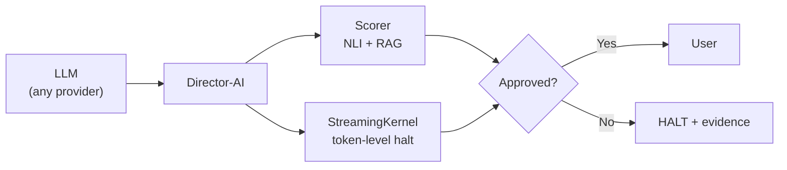

# Director-AI

**Real-time LLM hallucination guardrail** — NLI + RAG fact-checking with token-level streaming halt.

```bash
pip install director-ai
```

## Architecture



## What It Does

Director-AI intercepts LLM outputs and scores them for factual coherence against your knowledge base in real-time. When hallucinations are detected, it halts generation mid-stream — before the user sees incorrect information.

## Key Features

- **Token-level streaming halt** — catches hallucinations as they form, not after
- **Custom knowledge grounding** — bring your own facts via RAG
- **NLI scoring** — DeBERTa/MiniCheck contradiction detection
- **Evidence on rejection** — every halt explains *why* with retrieved context
- **Graceful fallback** — retrieval or disclaimer modes instead of hard stops
- **SDK interceptors** — 2-line integration with OpenAI/Anthropic SDKs
- **Framework integrations** — LangChain, LlamaIndex, LangGraph, Haystack, CrewAI
- **8 domain presets** — medical, finance, legal, creative, customer support, and more

## Quick Example

```python
from director_ai import guard
from openai import OpenAI

client = guard(
    OpenAI(),
    facts={"refund_policy": "Refunds within 30 days only"},
    threshold=0.6,
)

response = client.chat.completions.create(
    model="gpt-4o-mini",
    messages=[{"role": "user", "content": "What is the refund policy?"}],
)
```

## Unique Positioning

| Feature | Director-AI | NeMo Guardrails | Guardrails-AI | LLM-Guard |
|---------|:-----------:|:---------------:|:-------------:|:---------:|
| Mid-stream halt | Yes | No | No | No |
| Custom KB RAG | Yes | Partial | No | No |
| Token-level | Yes | No | No | No |
| NLI scoring | Yes | No | No | Partial |
| Evidence return | Yes | No | No | No |

## License

AGPL-3.0 for open source / research. Commercial licensing available at [anulum.li](https://www.anulum.li).
