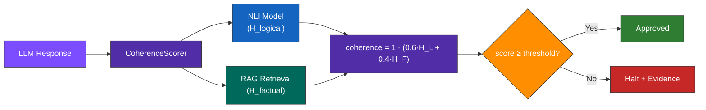

# Director-AI

**Real-time LLM hallucination guardrail** — NLI + RAG fact-checking with token-level streaming halt.

<span class="version-badge">v3.9 — New: VerifiedScorer, document ingestion API, mode selector, ColBERT</span>

[](https://pypi.org/project/director-ai/)
[]()
[](https://github.com/anulum/director-ai/blob/main/LICENSE)
[](https://pypi.org/project/director-ai/)

| | |
|---|---|
| **2-Line Integration** — Wrap any LLM SDK client with `guard()`. Works with OpenAI, Anthropic, Bedrock, Gemini, Cohere. [Quickstart &rarr;](quickstart.md) | **Token-Level Halt** — Catches hallucinations as they form, mid-stream, before the user sees incorrect information. [Streaming &rarr;](guide/streaming.md) |
| **Custom KB Grounding** — Bring your own facts via RAG. ChromaDB, FAISS, Qdrant, or in-memory backends. [KB Ingestion &rarr;](guide/kb-ingestion.md) | **75.8% Balanced Accuracy** — FactCG-DeBERTa-v3-Large NLI model. 14.6 ms/pair ONNX GPU. SBOM on every release. [Scoring &rarr;](guide/scoring.md) |

## Install

```bash
pip install director-ai
```

## Quick Example

```python
from director_ai import guard
from openai import OpenAI

client = guard(
    OpenAI(),
    facts={"refund_policy": "Refunds within 30 days only"},
    threshold=0.6,
)

response = client.chat.completions.create(
    model="gpt-4o-mini",
    messages=[{"role": "user", "content": "What is the refund policy?"}],
)
```

If the LLM hallucinates, `guard()` raises `HallucinationError` with the coherence score and contradicting evidence.

## How It Works


```mermaid
graph LR
    LLM["LLM Response"]:::input --> SC["CoherenceScorer"]:::core
    SC --> NLI["NLI Model<br/>(H_logical)"]:::nli
    SC --> RAG["RAG Retrieval<br/>(H_factual)"]:::rag
    NLI --> SCORE["coherence = 1 - (0.6·H_L + 0.4·H_F)"]:::core
    RAG --> SCORE
    SCORE --> GATE{score ≥ threshold?}:::gate
    GATE -->|Yes| APPROVE["Approved"]:::approve
    GATE -->|No| HALT["Halt + Evidence"]:::halt
    classDef input fill:#7c4dff,stroke:#333,color:#fff
    classDef core fill:#512da8,stroke:#333,color:#fff
    classDef nli fill:#1565c0,stroke:#333,color:#fff
    classDef rag fill:#00695c,stroke:#333,color:#fff
    classDef gate fill:#ff8f00,stroke:#333,color:#fff
    classDef approve fill:#2e7d32,stroke:#333,color:#fff
    classDef halt fill:#c62828,stroke:#333,color:#fff
```

## Competitive Positioning

| Feature | Director-AI | NeMo Guardrails | Guardrails-AI | LLM-Guard |
|---------|:-----------:|:---------------:|:-------------:|:---------:|
| Mid-stream halt | **Yes** | No | No | No |
| Custom KB RAG | **Yes** | Partial | No | No |
| Token-level scoring | **Yes** | No | No | No |
| NLI contradiction detection | **Yes** | No | No | Partial |
| Evidence on rejection | **Yes** | No | No | No |
| 5 SDK integrations | **Yes** | 1 | 1 | 0 |
| 6 framework integrations | **Yes** | 1 | 1 | 0 |

## Paths Forward

| Path | Time | What You Get |
|------|------|-------------|
| [Quickstart](quickstart.md) | 2 min | Score a response, guard an SDK client |
| [Why Director-AI](guide/why-director-ai.md) | 5 min | Problem statement, decision matrix, cost comparison |
| [Tutorials](tutorials.md) | 30 min | 16 Jupyter notebooks from basics to production |
| [API Reference](api/index.md) | — | Every public class and function |
| [Production Guide](deployment/production.md) | 15 min | Scaling, caching, monitoring, Docker |
| [Domain Cookbooks](cookbook/legal.md) | 10 min | Legal, medical, finance, support recipes |
| [Glossary](glossary.md) | — | 35 terms defined and cross-linked |

## Obtain

```bash
pip install director-ai            # base
pip install director-ai[nli]       # + NLI model (recommended)
pip install director-ai[server]    # + REST API server
pip install director-ai[all]       # everything
```

PyPI: [pypi.org/project/director-ai](https://pypi.org/project/director-ai/)
| Source: [github.com/anulum/director-ai](https://github.com/anulum/director-ai)
| Docs: [anulum.github.io/director-ai](https://anulum.github.io/director-ai/)

## Feedback & Bugs

- **Bug reports**: [GitHub Issues](https://github.com/anulum/director-ai/issues/new?labels=bug)
- **Feature requests**: [GitHub Issues](https://github.com/anulum/director-ai/issues/new?labels=enhancement)
- **Security**: [SECURITY.md](https://github.com/anulum/director-ai/blob/main/SECURITY.md)
- **Commercial inquiries**: [anulum.li](https://www.anulum.li)

## Used By

*Early adopter logos coming soon. [Get in touch](https://www.anulum.li/contact.html) to be featured.*

## Contributing

See [CONTRIBUTING.md](https://github.com/anulum/director-ai/blob/main/CONTRIBUTING.md) for code style, test requirements, and PR workflow.

## License

AGPL-3.0 for open source / research. [Commercial licensing](licensing.md) available at [anulum.li](https://www.anulum.li).

---

*Maintained by [Miroslav Sotek](https://orcid.org/0009-0009-3560-0851) at [Anulum](https://www.anulum.li). Current release: v3.9.0.*
