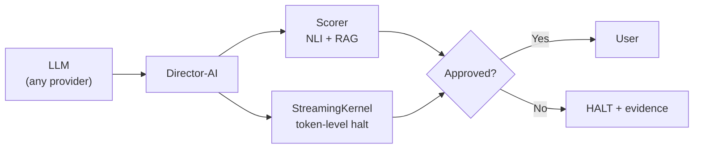

# Director-AI

**Real-time LLM hallucination guardrail** — NLI + RAG fact-checking with token-level streaming halt.

```bash
pip install director-ai
```

## Architecture


```mermaid
graph LR
    LLM["LLM<br/>(any provider)"] --> D["Director-AI"]
    D --> S["Scorer<br/>NLI + RAG"]
    D --> K["StreamingKernel<br/>token-level halt"]
    S --> V{Approved?}
    K --> V
    V -->|Yes| U["User"]
    V -->|No| H["HALT + evidence"]
```

## What It Does

Director-AI intercepts LLM outputs and scores them for factual coherence against your knowledge base in real-time. When hallucinations are detected, it halts generation mid-stream — before the user sees incorrect information.

## Key Features

- **Token-level streaming halt** — catches hallucinations as they form, not after
- **Custom knowledge grounding** — bring your own facts via RAG
- **NLI scoring** — DeBERTa/MiniCheck contradiction detection
- **Evidence on rejection** — every halt explains *why* with retrieved context
- **Graceful fallback** — retrieval or disclaimer modes instead of hard stops
- **SDK interceptors** — 2-line integration with OpenAI/Anthropic SDKs
- **Framework integrations** — LangChain, LlamaIndex, LangGraph, Haystack, CrewAI
- **8 domain presets** — medical, finance, legal, creative, customer support, and more

## Quick Example

```python
from director_ai import guard
from openai import OpenAI

client = guard(
    OpenAI(),
    facts={"refund_policy": "Refunds within 30 days only"},
    threshold=0.6,
)

response = client.chat.completions.create(
    model="gpt-4o-mini",
    messages=[{"role": "user", "content": "What is the refund policy?"}],
)
```

## Unique Positioning

| Feature | Director-AI | NeMo Guardrails | Guardrails-AI | LLM-Guard |
|---------|:-----------:|:---------------:|:-------------:|:---------:|
| Mid-stream halt | Yes | No | No | No |
| Custom KB RAG | Yes | Partial | No | No |
| Token-level | Yes | No | No | No |
| NLI scoring | Yes | No | No | Partial |
| Evidence return | Yes | No | No | No |

## Obtain

```bash
pip install director-ai
```

PyPI: [pypi.org/project/director-ai](https://pypi.org/project/director-ai/)
| Source: [github.com/anulum/director-ai](https://github.com/anulum/director-ai)

See [Installation](installation.md) for extras and GPU setup.

## Feedback & Bug Reports

- **Bug reports**: [GitHub Issues](https://github.com/anulum/director-ai/issues/new?labels=bug)
- **Feature requests**: [GitHub Issues](https://github.com/anulum/director-ai/issues/new?labels=enhancement)
- **Security vulnerabilities**: see [SECURITY.md](https://github.com/anulum/director-ai/blob/main/SECURITY.md)
- **Discussion**: [GitHub Discussions](https://github.com/anulum/director-ai/discussions)
- **Commercial inquiries**: [anulum.li](https://www.anulum.li)

All feedback is accepted in English.

## Contributing

See [CONTRIBUTING.md](https://github.com/anulum/director-ai/blob/main/CONTRIBUTING.md) for:

- Code style (ruff, type hints on public API)
- Test requirements (pytest, 90% coverage gate)
- PR workflow (squash merge, CI must pass)
- Preflight checks (`make preflight`)
- Licensing (AGPL-3.0, CLA)

## API Reference

Full reference documentation for the external interface:

- [Core API](api/core.md) — `CoherenceScorer`, `guard()`, `review()`
- [Scorer](api/scorer.md) — scoring backends (NLI, lite, hybrid, rust)
- [Streaming](api/streaming.md) — `StreamingKernel`, token-level halt
- [Vector Store](api/vector-store.md) — knowledge base backends
- [Config](api/config.md) — `DirectorConfig` options
- [Input Sanitizer](api/sanitizer.md) — prompt injection defense

## Maintenance

Director-AI is actively maintained by [Miroslav Sotek](https://orcid.org/0009-0009-3560-0851) at [Anulum](https://www.anulum.li). Current release: v3.0.0 (March 2026). See [CHANGELOG](changelog.md) and [ROADMAP](https://github.com/anulum/director-ai/blob/main/ROADMAP.md).

## License

AGPL-3.0 for open source / research. Commercial licensing available at [anulum.li](https://www.anulum.li).
