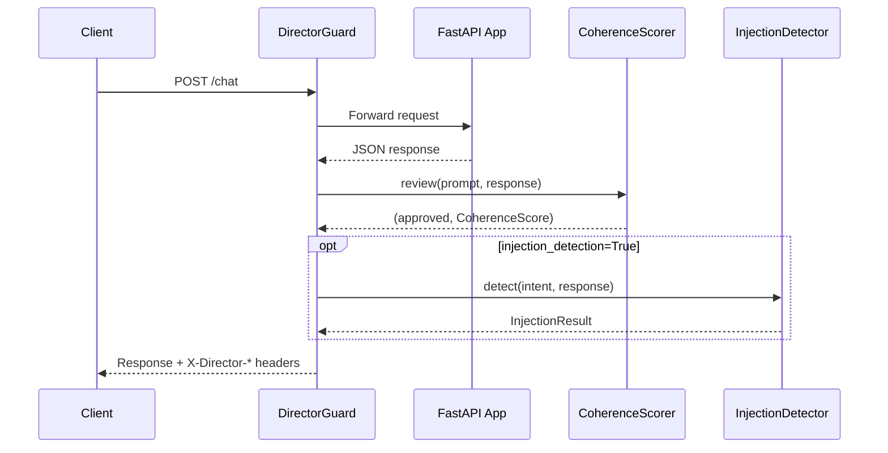

# FastAPI Middleware

ASGI middleware that adds hallucination scoring and injection detection to JSON responses.



## Setup

```python
from director_ai.integrations.fastapi_guard import DirectorGuard

app.add_middleware(
    DirectorGuard,
    facts={"refund": "within 30 days", "hours": "9am-5pm EST"},
    threshold=0.6,
    on_fail="warn",
)
```

## With Injection Detection

```python
app.add_middleware(
    DirectorGuard,
    facts={"refund": "within 30 days"},
    injection_detection=True,
    injection_threshold=0.7,
    on_fail="reject",  # 422 on hallucination or injection
)
```

## Parameters

| Parameter | Type | Default | Description |
|-----------|------|---------|-------------|
| `threshold` | `float` | `0.6` | Coherence threshold |
| `facts` | `dict` | `None` | Key-value facts for ground truth |
| `store` | `GroundTruthStore` | `None` | Pre-built store (overrides facts) |
| `use_nli` | `bool` | `None` | Enable NLI model |
| `paths` | `list[str]` | `None` | URL paths to score (`None` = all POST) |
| `on_fail` | `str` | `"warn"` | `"warn"` (headers only) or `"reject"` (422) |
| `injection_detection` | `bool` | `False` | Enable injection detection |
| `injection_threshold` | `float` | `0.7` | Injection risk threshold (0.0-1.0) |

## Response Headers

Always added when prompt and response are extractable:

| Header | Description |
|--------|-------------|
| `X-Director-Score` | Coherence score (0.0000-1.0000) |
| `X-Director-Approved` | `true` / `false` |

Added when `injection_detection=True`:

| Header | Description |
|--------|-------------|
| `X-Director-Injection-Risk` | Combined injection risk (0.0000-1.0000) |
| `X-Director-Injection-Detected` | `true` / `false` |

## Rejection Mode

With `on_fail="reject"`, the middleware returns HTTP 422 when hallucination or injection is detected:

```json
{
  "error": {
    "message": "Injection detected by Director-AI",
    "type": "injection_detected",
    "injection_risk": 0.85,
    "threshold": 0.7
  }
}
```

## Request Format

The middleware extracts prompts from OpenAI-compatible message arrays:

```json
{
  "messages": [
    {"role": "system", "content": "You are a helpful assistant."},
    {"role": "user", "content": "What is the refund policy?"}
  ]
}
```

The system prompt (first `role: system` message) is used for intent construction in injection detection.

## Full API

::: director_ai.integrations.fastapi_guard.DirectorGuard
