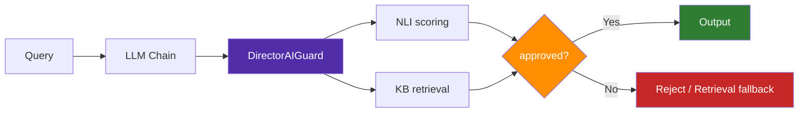

# LangChain

```bash
pip install director-ai[langchain]
```



## Usage

```python
from director_ai.integrations.langchain import DirectorAIGuard

guard = DirectorAIGuard(
    facts={"capital": "Paris is the capital of France."},
    threshold=0.6,
    raise_on_fail=False,
)

# As a chain step
result = guard.invoke({
    "query": "What is the capital of France?",
    "response": "The capital of France is Berlin.",
})

print(result["approved"])  # False
print(result["score"])     # ~0.35
```

## In a Chain

```python
from langchain_openai import ChatOpenAI

llm = ChatOpenAI(model="gpt-4o-mini")
chain = llm | guard
result = chain.invoke("What is the capital of France?")
```
