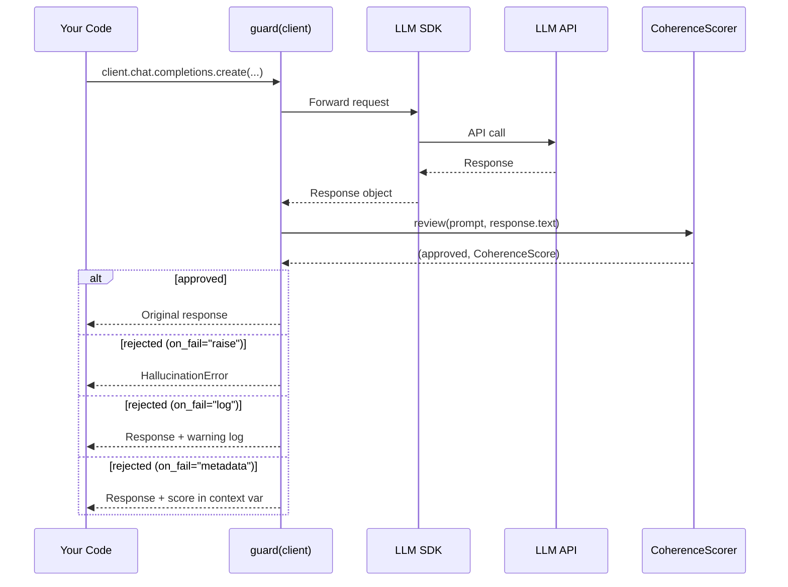

# SDK Guard

2-line integration that wraps an existing LLM SDK client with coherence
scoring. The guard supports chat-completions-compatible, message API, cloud-runtime, generate-content, Mistral, Cohere, and Pydantic AI SDK shapes.



## OpenAI

```python
from director_ai import guard
from openai import OpenAI

client = guard(
    OpenAI(),
    facts={"refund": "within 30 days", "hours": "9am-5pm EST"},
    threshold=0.6,
    on_fail="raise",  # "raise" | "log" | "metadata"
)

# Works exactly like normal — hallucinations are caught transparently
response = client.chat.completions.create(
    model="gpt-4o-mini",
    messages=[{"role": "user", "content": "What is the refund policy?"}],
)
```

## Anthropic

```python
from director_ai import guard
import anthropic

client = guard(
    anthropic.Anthropic(),
    facts={"refund": "within 30 days"},
)

message = client.messages.create(
    model="claude-sonnet-4-20250514",
    max_tokens=1024,
    messages=[{"role": "user", "content": "What is the refund policy?"}],
)
```

## Mistral

```python
import os

from director_ai import guard
from mistralai import Mistral

client = guard(
    Mistral(api_key=os.environ["MISTRAL_API_KEY"]),
    facts={"refund": "within 30 days"},
    threshold=0.6,
    on_fail="raise",
)

response = client.chat.complete(
    model="mistral-large-latest",
    messages=[{"role": "user", "content": "What is the refund policy?"}],
)
```

## Pydantic AI

```python
from director_ai import guard
from pydantic_ai import Agent

agent = guard(
    Agent("openai:gpt-4o-mini"),
    facts={"refund": "within 30 days"},
    threshold=0.6,
    on_fail="raise",
)

result = agent.run_sync("What is the refund policy?")
print(result.output)
```

`guard()` currently scores Pydantic AI `run_sync()` and `run()` results by
reading the returned `.output` value. Streaming runs should be guarded with
`StreamingKernel` until an explicit `run_stream()` adapter is added.

## Failure Modes

| Mode | Behavior |
|------|----------|
| `on_fail="raise"` | Raises `HallucinationError` |
| `on_fail="log"` | Logs warning, returns response |
| `on_fail="metadata"` | Stores score in context var, returns response |

## Retrieving Scores

```python
from director_ai import guard, get_score

client = guard(OpenAI(), facts={...}, on_fail="metadata")
response = client.chat.completions.create(...)

score = get_score()
if score and not score.approved:
    print(f"Low coherence: {score.score:.3f}")
```

## Injection Detection

Enable output-side prompt injection detection on any guarded client:

```python
client = guard(
    OpenAI(),
    facts={"refund": "within 30 days"},
    injection_detection=True,
    injection_threshold=0.7,
    on_fail="raise",
)
```

When injection is detected, the failure mode mirrors hallucination handling:

| Mode | Behaviour |
|------|-----------|
| `on_fail="raise"` | Raises `InjectionDetectedError` |
| `on_fail="log"` | Logs `Injection detected (risk=0.xxx)` warning |
| `on_fail="metadata"` | Stores score in context var (check `cs.injection_risk`) |

The `score()` function also supports injection detection:

```python
from director_ai import score
cs = score(prompt, response, injection_detection=True)
print(cs.injection_risk)  # 0.0–1.0 or None
```

## Streaming Support

Streaming is automatically guarded with periodic coherence checks every 8 tokens:

```python
stream = client.chat.completions.create(
    model="gpt-4o-mini",
    messages=[...],
    stream=True,
)
for chunk in stream:  # Raises if coherence drops
    print(chunk.choices[0].delta.content, end="")
```
