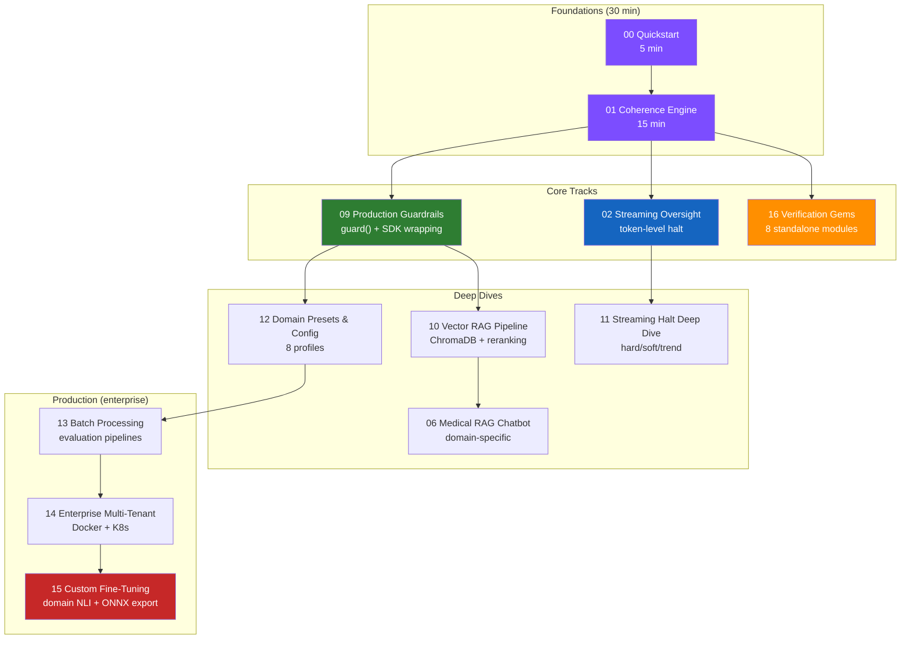

# Tutorials

Interactive Jupyter notebooks covering Director-AI from first principles to production deployment. Every notebook runs in Google Colab with zero local setup.

## Learning Path



---

## Getting Started

Start here. These two notebooks teach the core concepts in under 30 minutes.

| # | Notebook | What You Learn | Time | Colab |
|---|----------|----------------|------|-------|
| 00 | [Quickstart](https://github.com/anulum/director-ai/blob/main/notebooks/quickstart.ipynb) | Install, score, guard, stream, presets | 5 min | [](https://colab.research.google.com/github/anulum/director-ai/blob/main/notebooks/quickstart.ipynb) |
| 01 | [Coherence Engine](https://github.com/anulum/director-ai/blob/main/notebooks/01_coherence_engine.ipynb) | CoherenceScorer, SafetyKernel, CoherenceAgent, dual-entropy formula | 15 min | [](https://colab.research.google.com/github/anulum/director-ai/blob/main/notebooks/01_coherence_engine.ipynb) |

---

## Core Features

Deep dives into the four pillars of Director-AI.

| # | Notebook | What You Learn | Time | Colab |
|---|----------|----------------|------|-------|
| 09 | [Production Guardrails](https://github.com/anulum/director-ai/blob/main/notebooks/09_production_guardrails.ipynb) | `guard()` for OpenAI / Anthropic / Bedrock / Gemini / Cohere, failure modes, streaming guards | 20 min | [](https://colab.research.google.com/github/anulum/director-ai/blob/main/notebooks/09_production_guardrails.ipynb) |
| 10 | [Vector RAG Pipeline](https://github.com/anulum/director-ai/blob/main/notebooks/10_vector_rag_pipeline.ipynb) | Semantic retrieval, ChromaDB, pluggable backends, reranking, multi-tenant KB | 25 min | [](https://colab.research.google.com/github/anulum/director-ai/blob/main/notebooks/10_vector_rag_pipeline.ipynb) |
| 11 | [Streaming Halt Deep Dive](https://github.com/anulum/director-ai/blob/main/notebooks/11_streaming_halt_deep_dive.ipynb) | Hard limit, sliding window, trend detection, async, per-token visualization | 20 min | [](https://colab.research.google.com/github/anulum/director-ai/blob/main/notebooks/11_streaming_halt_deep_dive.ipynb) |
| 12 | [Domain Presets & Config](https://github.com/anulum/director-ai/blob/main/notebooks/12_domain_presets_and_config.ipynb) | 8 profiles, env vars, YAML, backends, strict mode, multi-GPU, LLM-as-judge | 15 min | [](https://colab.research.google.com/github/anulum/director-ai/blob/main/notebooks/12_domain_presets_and_config.ipynb) |

---

## Domain Applications

Real-world integrations and domain-specific patterns.

| # | Notebook | What You Learn | Time | Colab |
|---|----------|----------------|------|-------|
| 02 | [Streaming Oversight](https://github.com/anulum/director-ai/blob/main/notebooks/02_streaming_oversight.ipynb) | StreamingKernel basics, token-by-token monitoring | 10 min | [](https://colab.research.google.com/github/anulum/director-ai/blob/main/notebooks/02_streaming_oversight.ipynb) |
| 03 | [Vector Store](https://github.com/anulum/director-ai/blob/main/notebooks/03_vector_store.ipynb) | VectorGroundTruthStore, InMemoryBackend, fact ingestion | 10 min | [](https://colab.research.google.com/github/anulum/director-ai/blob/main/notebooks/03_vector_store.ipynb) |
| 05 | [SSGF Geometry](https://github.com/anulum/director-ai/blob/main/notebooks/05_ssgf_geometry.ipynb) | Self-similar geometry foundation concepts | 10 min | [](https://colab.research.google.com/github/anulum/director-ai/blob/main/notebooks/05_ssgf_geometry.ipynb) |
| 06 | [Medical RAG Chatbot](https://github.com/anulum/director-ai/blob/main/notebooks/06_medical_rag_chatbot.ipynb) | Healthcare-specific guardrails, high thresholds, evidence citations | 20 min | [](https://colab.research.google.com/github/anulum/director-ai/blob/main/notebooks/06_medical_rag_chatbot.ipynb) |
| 07 | [LangChain Integration](https://github.com/anulum/director-ai/blob/main/notebooks/07_langchain_integration.ipynb) | CoherenceCallbackHandler, chain integration, output parsing | 15 min | [](https://colab.research.google.com/github/anulum/director-ai/blob/main/notebooks/07_langchain_integration.ipynb) |
| 08 | [Provider Adapters](https://github.com/anulum/director-ai/blob/main/notebooks/08_provider_adapters.ipynb) | OpenAI, Anthropic, Bedrock, Gemini, Cohere adapter patterns | 10 min | [](https://colab.research.google.com/github/anulum/director-ai/blob/main/notebooks/08_provider_adapters.ipynb) |

---

## Verification & Analysis

Standalone analysis modules — no NLI model required. All stdlib-only.

| # | Resource | What You Learn | Time | Colab |
|---|----------|----------------|------|-------|
| 16 | [Verification Gems](https://github.com/anulum/director-ai/blob/main/notebooks/16_verification_gems.ipynb) | All 8 gems: numeric, reasoning, temporal, consensus, conformal, feedback loops, agentic, REST API | 15 min | [](https://colab.research.google.com/github/anulum/director-ai/blob/main/notebooks/16_verification_gems.ipynb) |
| — | [Guide: Verification Gems](guide/verification-gems.md) | Full parameter reference for all 8 gems | 15 min | — |
| — | [Example: verification_gems_demo.py](https://github.com/anulum/director-ai/blob/main/examples/verification_gems_demo.py) | Runnable demo of all 7 standalone verification modules | 5 min | — |

**CLI quick start:**

```bash
director-ai verify-numeric "Revenue grew 50% from \$100 to \$120"
director-ai verify-reasoning "Step 1: A is true. Step 2: Therefore B."
director-ai temporal-freshness "The CEO of Apple is Tim Cook"
director-ai check-step "Find revenue data" "search" "revenue Q3"
```

**REST quick start** (with server running):

```bash
curl -X POST http://localhost:8080/v1/verify/numeric \
  -H "Content-Type: application/json" \
  -d '{"text": "Revenue grew 50% from $100 to $120."}'
```

---

## Enterprise & Production

Scale, evaluate, fine-tune, and deploy.

| # | Notebook | What You Learn | Time | Colab |
|---|----------|----------------|------|-------|
| 04 | [End-to-End Benchmark](https://github.com/anulum/director-ai/blob/main/notebooks/04_end_to_end_benchmark.ipynb) | Full benchmark suite, latency profiling, accuracy metrics | 15 min | [](https://colab.research.google.com/github/anulum/director-ai/blob/main/notebooks/04_end_to_end_benchmark.ipynb) |
| 13 | [Batch Processing & Evaluation](https://github.com/anulum/director-ai/blob/main/notebooks/13_batch_processing_and_evaluation.ipynb) | BatchProcessor, evaluation pipelines, claim attribution, regression gates | 20 min | [](https://colab.research.google.com/github/anulum/director-ai/blob/main/notebooks/13_batch_processing_and_evaluation.ipynb) |
| 14 | [Enterprise Multi-Tenant](https://github.com/anulum/director-ai/blob/main/notebooks/14_enterprise_multi_tenant.ipynb) | Tenant isolation, REST/gRPC servers, Docker, Kubernetes, monitoring | 25 min | [](https://colab.research.google.com/github/anulum/director-ai/blob/main/notebooks/14_enterprise_multi_tenant.ipynb) |
| 15 | [Custom Fine-Tuning](https://github.com/anulum/director-ai/blob/main/notebooks/15_custom_fine_tuning.ipynb) | JSONL data prep, validation, training, anti-forgetting, ONNX export, REST API | 30 min | [](https://colab.research.google.com/github/anulum/director-ai/blob/main/notebooks/15_custom_fine_tuning.ipynb) |

---

## Prerequisites

All notebooks run on **Python 3.11+** with `pip install director-ai`.

Notebooks requiring optional extras note this in their first cell:

| Extra | Install | Notebooks |
|-------|---------|-----------|
| NLI scoring | `pip install director-ai[nli]` | 01, 04, 06, 09–15 |
| Vector store | `pip install director-ai[vector]` | 10, 14 |
| Fine-tuning | `pip install director-ai[finetune]` | 15 |
| Server | `pip install director-ai[server]` | 14 |
| gRPC | `pip install director-ai[grpc]` | 14 |

## Running Locally

```bash
git clone https://github.com/anulum/director-ai.git
cd director-ai
pip install -e ".[dev,nli]"
jupyter lab notebooks/
```
